# 컴퓨터 네트워크 (한양대학교 이석복 교수님)

## 13강 네트워크 계층5

### Distance Vector

최단거리 경로를 리커시브하게 구한다.

Dx(Y) = 최단경로((인접한 노드까지의 거리)+D인접한노드(Y))  
이때  
D인접한노드(Y) = 최댄경로(인접한노드에서인접한노드까지의 거리 + D인접한노드의인접한노드(Y))

재귀적으로 호출된다.

이웃으로부터 이웃한 노드의 거리의 배열, 즉 distance vector를 반환받는다. 
받은 distance vector를 기반으로 (자신의 값이 하나라도 업데이트 되면) 이웃한 노드들에게 자신의 distance vector를 전달한다.  

#### Distance vector 업데이트

- 최초 

x 

| |x|y|z|
|---|---|---|---|
|x|0|4|50|
|y||||
|z||||

y 

| |x|y|z|
|---|---|---|---|
|x||||
|y|4|0|1|
|z||||

z

| |x|y|z|
|---|---|---|---|
|x||||
|y||||
|z|50|1|0|

- X distance vector 업데이트
1) X distance vector에 y, z의 벡터를 받음.

| |x|y|z|
|---|---|---|---|
|x|0|4|50|
|y|4|0|1|
|z|50|1|0|

2) 해당 벡터를 바탕으로 재계산함

dx(y)=min[c(x,y) + dx(y), c(x,z) + dz(y)]

| |x|y|z|
|---|---|---|---|
|x|0|**4**|50|
|y|4|0|1|
|z|50|1|0|

dx(z)=min[c(x,z) + dx(z), c(x,y) + dy(z)]

| |x|y|z|
|---|---|---|---|
|x|0|4|**5**|
|y|4|0|1|
|z|50|1|0|

- 1차 업데이트 완료
x

| |x|y|z|
|---|---|---|---|
|x|0|4|5|
|y|4|0|1|
|z|50|1|0|

y

| |x|y|z|
|---|---|---|---|
|x|0|4|50|
|y|4|0|1|
|z|50|1|0|

z
| |x|y|z|
|---|---|---|---|
|x|0|4|50|
|y|4|0|1|
|z|5|1|0|

- 업데이트
1) x distance vector에 y, z의 벡터를 보냄
x

| |x|y|z|
|---|---|---|---|
|x|0|**4**|**5**|
|y|4|0|1|
|z|**5**|**1**|0|

2) 이웃으로부터 새로운 값이 들어온 경우 새로 계산을 진행
x

| |x|y|z|
|---|---|---|---|
|*x*|*0*|*4*|**5*|
|y|4|0|1|
|z|5|1|0|

3) 변화된 값이 없으므로 이웃 노드에게 전달하지 않고 종료. 

위와 같은 과정을 이웃노드로부터 distance vector를 전달받고 업데이트 되는 경우 반복. 업데이트가 없는 경우 종료.

자기 자신의 링크 코스트가 바뀐 경우에도 최단값을 계산하여 이웃에게 distance vector를 넘겨줌.

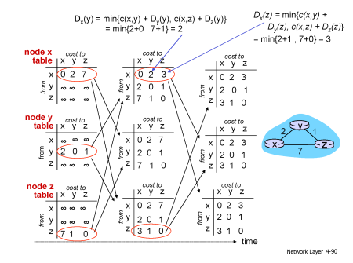  

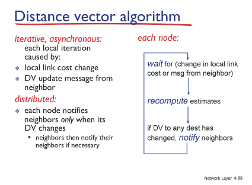  

#### Count Infinity Problem
분산되어 처리되기 때문에 직관적이지 않을 수 있다.

가령 y-x로 가는 경로가 4에서 50으로 변경된다면?

50 : 51(50+1)을 비교하는 것이 아니라

50 : 6(5+1)을 비교하게 된다.

즉 전체 노드의 상태를 통해 계산하는 것이 아니라, 부분적인 Distance Vector를 기반으로 진행된다. 

결국 z랑 y랑 6, 7, 8, 9, ... 50까지 동기화를 한다. 

revere를 막기 위한 가장 좋은 방법은 상대방이 넘겨준 Vector Distance를 이용하여 경로를 계산했다면, 상대방에게 넘겨줄 때에는 해당 경로를 무한으로 하여 posioned reverse하는 것이다. 기말고사에 나옴 ㅇㅇ. 

문제 해결을 위해서는 z-y-z로 가는 길을 y에게는 '5'가 아닌 'inf'로 알려줘야 한다. (y가 해당 경로가 자신을 거쳐가는 경로임을 알 수 있도록.)

| |x|y|z|
|---|---|---|---|
|x|0|4|*|
|y|4|0|1|
|z|INF|1|0|

이렇게 하면  x-y를 연결하는 경로가 높아질 때
  
| |x|y|z|
|---|---|---|---|
|x|0|4|*|
|y|**100**|0|1|
|z|INF|1|0|
  
dy(x) = min(100 + 0, 1+INF)  
dy(x) = 100  

단 한 번의 계산으로 안정화가 진행된다.   

한편 업데이트가 몇번 더 계산되면 x,y경로는 x-z-y = 51로 안정화가 될 것이다.  

### 요약
Link State Vector는 각 네트워크에서 네트워크 내부에 있는 링크를 처리할 때 사용함.  

Distance Vector - 네트워크 간의 링크를 처리할 할 때 사용.   

그런데 해당 방식을 쓰도록 어떻게 강제할까...?

## 14강 네트워크 계층6

### 라우팅 알고리즘과 계층적 라우팅(hierarchical routing)

#### AS(Autonomous systems)
  

- 자치적인 시스템 : 각 각의 네트워크를 의미. 자치권을 가진 도메인. 모든 AS는 각각 고유의 번호(ASNs)를 가지고 있다(mit는 3번, bbn(군수업체)이 1번).  
- intra-AS : AS 내부에서 동작하는 라우팅 (RIP, OSFP)
- inter-AS : AS 간에 동작 (BGP)

intra-AS는 최단경로, 최소코스트를 목적으로 한다.  
inter-AS라우팅은 최단경로 뿐 아니라 정치적인 목적, 사회적 상황 등이 반영된다.  

#### 네트워크 간의 관계

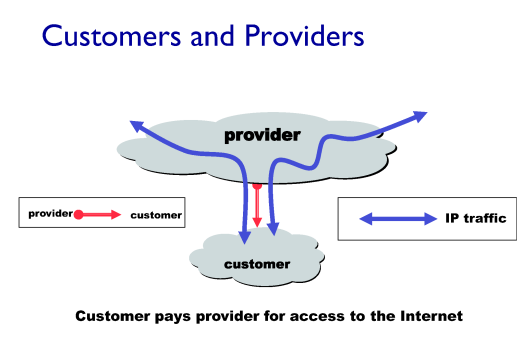  

ISP를 운영하는 데에는 많은 돈이 필요하다.  
AS 사이에는 Provider와 Customer가 존재하며, Provider가 갑이다.  

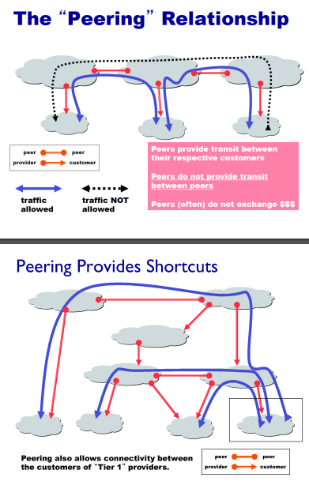

비슷한 체급끼리 만나면 (가령 kt와 sk가 만나면) peer 관계가 성립한다.   
KT와 AT&T가 만나면 Provider-Customer 관계가 형성된다. (상대적인 판단. 돈의 논리.)  
위 사진에서 검은색 점선 트래픽은 허용되지 않는다. 금전적인 대가가 없으므로. 이를 구현하는 것이 BGP. 

#### BGP를 통한 inter-netwrok relationships의 구현
Boder Gateway Protocol.  
AS사이의 경계에서 작용하는 프로토콜  

금전적인 대가가 아닌 각 AS간의 정책에 따른(policy-based) 라우팅.  

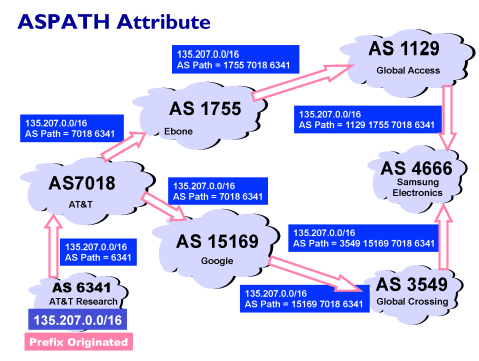  
각각의 AS가 자신의 프리픽스를 전달(advertise)함.  

AS Path에 각각의 AS를 추가함.  

이를 통해 삼성 전자는 2개의 AS Path를 반환받게 됨.  

삼성 전자는 본인의 정책에 따라 두 개의 AS Path를 정할 수 있음.  
(Enforce order of route preference - customer > peer > provider)  

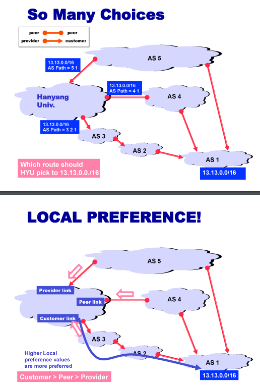 
위 예시에서 한양대학교는 자신이 갑의 위치에 있는 경로를 선택하게 된다.(최저 비용, 본인이 provider인 경로)  

즉 
1) AS 내부에서는 최단경로로 빠져나간다.  
2) 외부에서는 꼭 최단 경로는 아니다.  

##### 요약
Intra는 최단경로
Inter는 Policy-based 경로
시험에 안나와요.ㅇㅇ

## 15강 링크 레이어
### 링크 레이어
링크 레이어의 적용단위는 'Frame'  

패킷을 서버까지 보내고 싶을 때에, 결국 서버에 던지는게 아니라 GWR(gateway router)에 던진다.  

그리고 GWR까지의 경로는 한 사용자의 패킷만 전달하는 것이 아니라,  
여러개의 사용자가 연결된 '채널'이며,  
전달하는 것이 아니라 '파장'으로 GWR까지 보내는 패킷이 다른 사용자에게도 전파된다.  
  
패킷 신호가 섞이는 것을 Collision이 일어나면 신호를 알아들을 수 없게 된다.  

이처럼 공유하고 있는 채널에서 어떻게 충돌을 막고 메시지를 전달할 수 있을까?  

즉 링크레이어는 충돌을 방지하고, 충돌을 해결하는 역할을 한다.  

#### 링크 레이어의 작동 원리

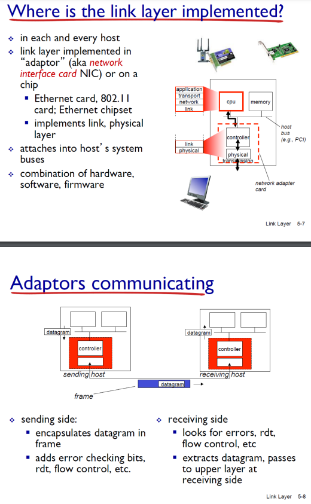 

네트워크 인터페이스로 IP패킷이 전달됨.

**링크의 타입**
1. Point-to-point
2. broadcast (shred wire or medium) : 매체는 브로드캐스트하게 전파되는 특징이 있다.

#### MAC(Muliple Access Protocol)
동시에 여러개의 채널이 접속할 수 있도록 컨트롤해주는 프로토콜

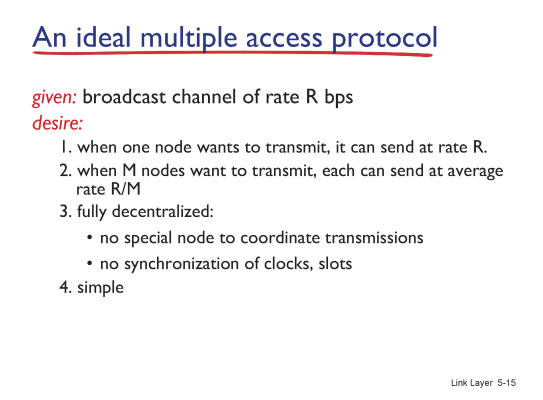 

R bps라고 할 때에
1. 한 노드에 데이터를 전송할 때에는 R bps를 모두 사용
2. N개의 노드일 때에는 R/M bps를 사용
3. 분산처리
4. 단순화

이를 구현하기 위해 100개가 넘는 것이 있었으나, 대표적인 3개..

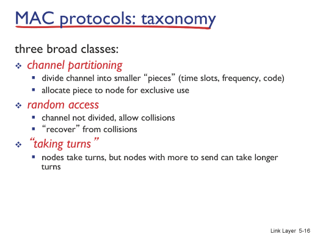   

##### TDMA time division multiple access
자기의 순서, 각 시간에만 사용할 수 있는 것.
단, 자원이 낭비됨.

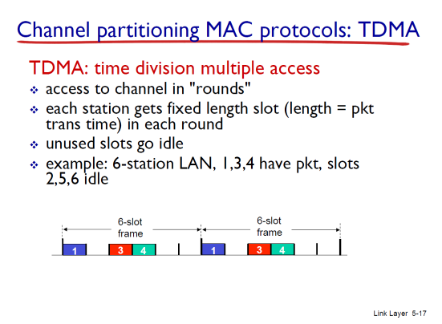  

##### FDMA frequency division multiple access
각자의 주파수에 맞춰서 전송.
자원이 낭비됨.  

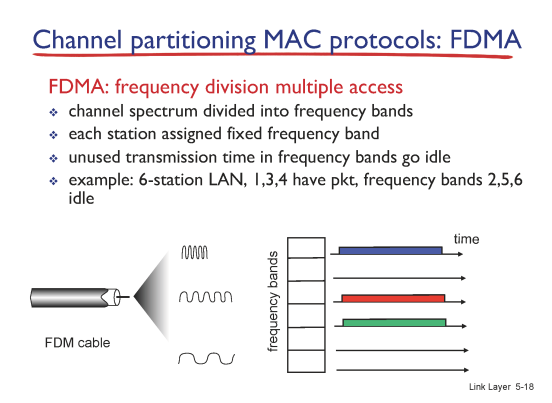  

##### Random access protocols
보내고자 할 데이터가 있을 때에 보내는 것.  
충돌이 발생함.  
이러한 충돌을 어떻게 방지하고, 충돌이 발생했을 때 어떻게 처리할 것인가?  

ALOHA : 랜덤 액세스 방식 중 가장 최초로 만들어진 것 1970년대, 하와이 대학.  
(하와이가 섬이라서, 섬끼리 통신을 해야하는 데, 무선으로 통신해야 하는 상황에서 Brodcast를 하다보니 ALOHA가 만들어짐.  )
  
CSMA : ALOHA를 개선한 방식.  

##### CSMA (Carrier sense multiple access)
Listen before transmit : 말하기 전에 듣는다.  

다른 사람이 전송을 하고 있다면 전송을 하지 않고 대기한다.  
(다른 사람을 방해하지 마!)  
  
그런데도 충돌이 일어나는 경우는..? 전송이 끝나서 channel sensed idle 된 상황에서 2명 이상의 사람이 메시지를 transmit 동시에 진행하는 경우.  

##### CSMA Collisions

