# 컴퓨터 네트워크 (한양대학교 이석복 교수님)

## 13강 네트워크 계층5

### Distance Vector

최단거리 경로를 리커시브하게 구한다.

Dx(Y) = 최단경로((인접한 노드까지의 거리)+D인접한노드(Y))  
이때  
D인접한노드(Y) = 최댄경로(인접한노드에서인접한노드까지의 거리 + D인접한노드의인접한노드(Y))

재귀적으로 호출된다.

이웃으로부터 이웃한 노드의 거리의 배열, 즉 distance vector를 반환받는다.
받은 distance vector를 기반으로 (자신의 값이 하나라도 업데이트 되면) 이웃한 노드들에게 자신의 distance vector를 전달한다.

#### Distance vector 업데이트

- 최초

x

|     | x   | y   | z   |
| --- | --- | --- | --- |
| x   | 0   | 4   | 50  |
| y   |     |     |     |
| z   |     |     |     |

y

|     | x   | y   | z   |
| --- | --- | --- | --- |
| x   |     |     |     |
| y   | 4   | 0   | 1   |
| z   |     |     |     |

z

|     | x   | y   | z   |
| --- | --- | --- | --- |
| x   |     |     |     |
| y   |     |     |     |
| z   | 50  | 1   | 0   |

- X distance vector 업데이트

1. X distance vector에 y, z의 벡터를 받음.

|     | x   | y   | z   |
| --- | --- | --- | --- |
| x   | 0   | 4   | 50  |
| y   | 4   | 0   | 1   |
| z   | 50  | 1   | 0   |

2. 해당 벡터를 바탕으로 재계산함

dx(y)=min[c(x,y) + dx(y), c(x,z) + dz(y)]

|     | x   | y     | z   |
| --- | --- | ----- | --- |
| x   | 0   | **4** | 50  |
| y   | 4   | 0     | 1   |
| z   | 50  | 1     | 0   |

dx(z)=min[c(x,z) + dx(z), c(x,y) + dy(z)]

|     | x   | y   | z     |
| --- | --- | --- | ----- |
| x   | 0   | 4   | **5** |
| y   | 4   | 0   | 1     |
| z   | 50  | 1   | 0     |

- 1차 업데이트 완료
  x

|     | x   | y   | z   |
| --- | --- | --- | --- |
| x   | 0   | 4   | 5   |
| y   | 4   | 0   | 1   |
| z   | 50  | 1   | 0   |

y

|     | x   | y   | z   |
| --- | --- | --- | --- |
| x   | 0   | 4   | 50  |
| y   | 4   | 0   | 1   |
| z   | 50  | 1   | 0   |

z
| |x|y|z|
|---|---|---|---|
|x|0|4|50|
|y|4|0|1|
|z|5|1|0|

- 업데이트

1. x distance vector에 y, z의 벡터를 보냄
   x

|     | x     | y     | z     |
| --- | ----- | ----- | ----- |
| x   | 0     | **4** | **5** |
| y   | 4     | 0     | 1     |
| z   | **5** | **1** | 0     |

2. 이웃으로부터 새로운 값이 들어온 경우 새로 계산을 진행
   x

|     | x   | y   | z     |
| --- | --- | --- | ----- |
| _x_ | _0_ | _4_ | \*_5_ |
| y   | 4   | 0   | 1     |
| z   | 5   | 1   | 0     |

3. 변화된 값이 없으므로 이웃 노드에게 전달하지 않고 종료.

위와 같은 과정을 이웃노드로부터 distance vector를 전달받고 업데이트 되는 경우 반복. 업데이트가 없는 경우 종료.

자기 자신의 링크 코스트가 바뀐 경우에도 최단값을 계산하여 이웃에게 distance vector를 넘겨줌.


#### Count Infinity Problem

분산되어 처리되기 때문에 직관적이지 않을 수 있다.

가령 y-x로 가는 경로가 4에서 50으로 변경된다면?

50 : 51(50+1)을 비교하는 것이 아니라

50 : 6(5+1)을 비교하게 된다.

즉 전체 노드의 상태를 통해 계산하는 것이 아니라, 부분적인 Distance Vector를 기반으로 진행된다.

결국 z랑 y랑 6, 7, 8, 9, ... 50까지 동기화를 한다.

revere를 막기 위한 가장 좋은 방법은 상대방이 넘겨준 Vector Distance를 이용하여 경로를 계산했다면, 상대방에게 넘겨줄 때에는 해당 경로를 무한으로 하여 posioned reverse하는 것이다. 기말고사에 나옴 ㅇㅇ.

문제 해결을 위해서는 z-y-z로 가는 길을 y에게는 '5'가 아닌 'inf'로 알려줘야 한다. (y가 해당 경로가 자신을 거쳐가는 경로임을 알 수 있도록.)

|     | x   | y   | z   |
| --- | --- | --- | --- |
| x   | 0   | 4   | \*  |
| y   | 4   | 0   | 1   |
| z   | INF | 1   | 0   |

이렇게 하면 x-y를 연결하는 경로가 높아질 때

|     | x       | y   | z   |
| --- | ------- | --- | --- |
| x   | 0       | 4   | \*  |
| y   | **100** | 0   | 1   |
| z   | INF     | 1   | 0   |

dy(x) = min(100 + 0, 1+INF)  
dy(x) = 100

단 한 번의 계산으로 안정화가 진행된다.

한편 업데이트가 몇번 더 계산되면 x,y경로는 x-z-y = 51로 안정화가 될 것이다.

### 요약

Link State Vector는 각 네트워크에서 네트워크 내부에 있는 링크를 처리할 때 사용함.

Distance Vector - 네트워크 간의 링크를 처리할 할 때 사용.

그런데 해당 방식을 쓰도록 어떻게 강제할까...?

## 14강 네트워크 계층6

### 라우팅 알고리즘과 계층적 라우팅(hierarchical routing)

#### AS(Autonomous systems)

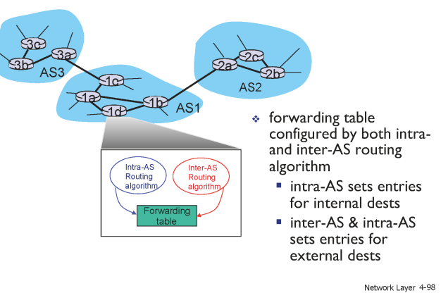

- 자치적인 시스템 : 각 각의 네트워크를 의미. 자치권을 가진 도메인. 모든 AS는 각각 고유의 번호(ASNs)를 가지고 있다(mit는 3번, bbn(군수업체)이 1번).
- intra-AS : AS 내부에서 동작하는 라우팅 (RIP, OSFP)
- inter-AS : AS 간에 동작 (BGP)

intra-AS는 최단경로, 최소코스트를 목적으로 한다.  
inter-AS라우팅은 최단경로 뿐 아니라 정치적인 목적, 사회적 상황 등이 반영된다.

#### 네트워크 간의 관계


ISP를 운영하는 데에는 많은 돈이 필요하다.  
AS 사이에는 Provider와 Customer가 존재하며, Provider가 갑이다.


비슷한 체급끼리 만나면 (가령 kt와 sk가 만나면) peer 관계가 성립한다.  
KT와 AT&T가 만나면 Provider-Customer 관계가 형성된다. (상대적인 판단. 돈의 논리.)  
위 사진에서 검은색 점선 트래픽은 허용되지 않는다. 금전적인 대가가 없으므로. 이를 구현하는 것이 BGP.

#### BGP를 통한 inter-netwrok relationships의 구현

Boder Gateway Protocol.  
AS사이의 경계에서 작용하는 프로토콜

금전적인 대가가 아닌 각 AS간의 정책에 따른(policy-based) 라우팅.

  
각각의 AS가 자신의 프리픽스를 전달(advertise)함.

AS Path에 각각의 AS를 추가함.

이를 통해 삼성 전자는 2개의 AS Path를 반환받게 됨.

삼성 전자는 본인의 정책에 따라 두 개의 AS Path를 정할 수 있음.  
(Enforce order of route preference - customer > peer > provider)


위 예시에서 한양대학교는 자신이 갑의 위치에 있는 경로를 선택하게 된다.(최저 비용, 본인이 provider인 경로)

즉

1. AS 내부에서는 최단경로로 빠져나간다.
2. 외부에서는 꼭 최단 경로는 아니다.

##### 요약

Intra는 최단경로
Inter는 Policy-based 경로
시험에 안나와요.ㅇㅇ

## 15강 링크 계층 1

### 링크 레이어

링크 레이어의 적용단위는 'Frame'

패킷을 서버까지 보내고 싶을 때에, 결국 서버에 던지는게 아니라 GWR(gateway router)에 던진다.

그리고 GWR까지의 경로는 한 사용자의 패킷만 전달하는 것이 아니라,  
여러개의 사용자가 연결된 '채널'이며,  
전달하는 것이 아니라 '파장'으로 GWR까지 보내는 패킷이 다른 사용자에게도 전파된다.

패킷 신호가 섞이는 것을 Collision이 일어나면 신호를 알아들을 수 없게 된다.

이처럼 공유하고 있는 채널에서 어떻게 충돌을 막고 메시지를 전달할 수 있을까?

즉 링크레이어는 충돌을 방지하고, 충돌을 해결하는 역할을 한다.

#### 링크 레이어의 작동 원리


네트워크 인터페이스로 IP패킷이 전달됨.

**링크의 타입**

1. Point-to-point
2. broadcast (shred wire or medium) : 매체는 브로드캐스트하게 전파되는 특징이 있다.

#### MAC(Muliple Access Protocol)

동시에 여러개의 채널이 접속할 수 있도록 컨트롤해주는 프로토콜


R bps라고 할 때에

1. 한 노드에 데이터를 전송할 때에는 R bps를 모두 사용
2. N개의 노드일 때에는 R/M bps를 사용
3. 분산처리
4. 단순화

이를 구현하기 위해 100개가 넘는 것이 있었으나, 대표적인 3개..


##### TDMA time division multiple access

자기의 순서, 각 시간에만 사용할 수 있는 것.
단, 자원이 낭비됨.


##### FDMA frequency division multiple access

각자의 주파수에 맞춰서 전송.
자원이 낭비됨.


##### Random access protocols

보내고자 할 데이터가 있을 때에 보내는 것.  
충돌이 발생함.  
이러한 충돌을 어떻게 방지하고, 충돌이 발생했을 때 어떻게 처리할 것인가?

ALOHA : 랜덤 액세스 방식 중 가장 최초로 만들어진 것 1970년대, 하와이 대학.  
(하와이가 섬이라서, 섬끼리 통신을 해야하는 데, 무선으로 통신해야 하는 상황에서 Brodcast를 하다보니 ALOHA가 만들어짐. )

CSMA : ALOHA를 개선한 방식.

##### CSMA (Carrier sense multiple access)

Listen before transmit : 말하기 전에 듣는다.

다른 사람이 전송을 하고 있다면 전송을 하지 않고 대기한다.  
(다른 사람을 방해하지 마!)

그런데도 충돌이 일어나는 경우는..? 전송이 끝나서 channel sensed idle 된 상황에서 2명 이상의 사람이 메시지를 transmit 동시에 진행하는 경우.

##### CSMA Collisions

propagation delay로 인해 프레임을 보낼 때에 Listen before Transmit을 해도 충돌이 나는 상황.
(두번째 노드 t0에, 네번째 노드 t1가 조용하니까 Transmit을 한 상황)

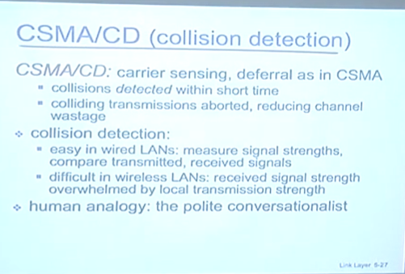  
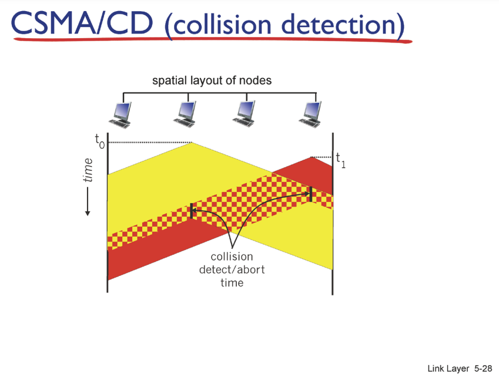

1. 프레임을 한번에 다 전송하면 충돌이 커진다. CSMA/CD에서는 충돌을 감지하면 양쪽 노드에서 전송을 중단하여 collisions 범위를 줄인다.

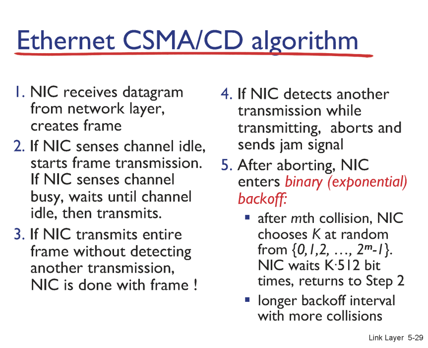

2. 충돌을 중단한 후에, binary로 랜덤 선택 후 선택한 시간만큼 backoff(대기) 후 전송한다.
   첫번째 충돌 : 0, 1 중에 무작위로 선택  
   두번째 충돌 : 0, 1, 2, 3 중에 무작위로 선택  
   세번째 충돌 : 0, 1, 2, 3, 4, 5, 6, 7 중에 무작위로 선택

결국 propagation delay는 빛의 속도로 고정되어 있음에도, 사람이 많을 때에 delay가 발생하는 이유는 이러한 random access 프로토콜의 backoff 때문이다.

사람이 많은 경우  
충돌이 없는 TDMA, FDMA는 주파수를 꽉 채워서 보낼 수 있어서 유리하다.  
Random Access Protocols는 충돌 방지를 위한 back-off이 발생하여 불리하다.

#### taking turns

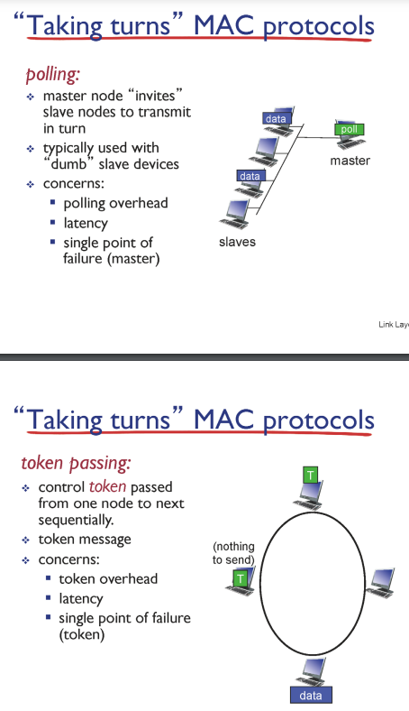  
polling 방식 : mastar가 slaves에게 각각 순서를 부여하는 것  
token passing : 보낼 것이 없을 때에는 Token을 보내고, 보낼게 있을 때에는 data를 보내는 방식. 데이터를 전달받으면 보낼 데이터가 없는 사용자들에게 브로드캐스트.

taking turns 방식의 단점은 single point of failure (마스터 프로세스가 다운될 때, 토큰이 유실될 때 등)

### 요약

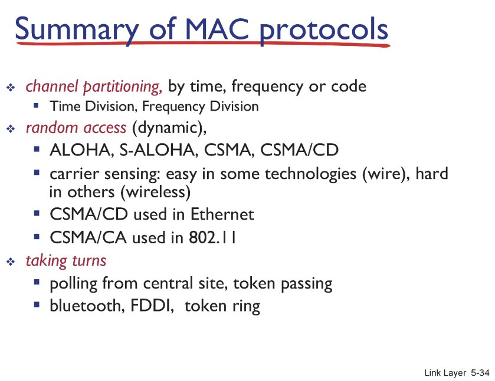
channel partitioning : 충돌이 발생하지 않는 방식. TDMA(사용가능한 시간을 분배), FDMA(주파수별로 분배)  
Random access : 동적이며 충돌 발생. CSMA/CD(유선 Ethernet)- 충돌 발생시 지수적으로 증가하는 back-off만큼 무작위 대기, CSMA/CS(무선 802.11)  
Taking turns : 보낼 데이터가 없음을 서로 주고받는 방식. single point of failure 발생. bluetooth

## 16강 링크 계층 2

### 이더넷 Ethernet

로컬 환경(LAN)에서 사용하는 프로토콜.

Switch가 각 spoke를 이어준다.

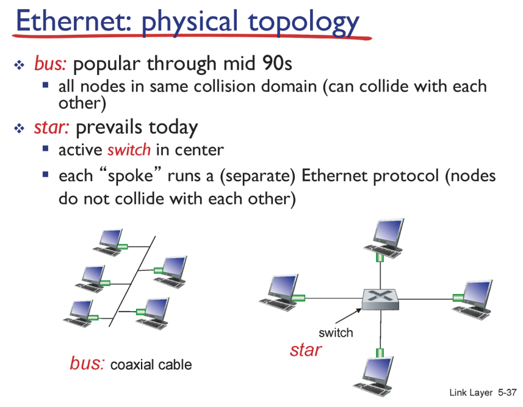

#### 이더넷의 프레임

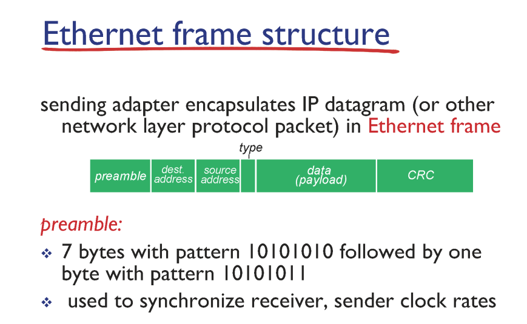

crc는 에러 체킹

type는 데이터의 타입 (대부분 ip)

#### 이더넷에서의 CSMA/CD

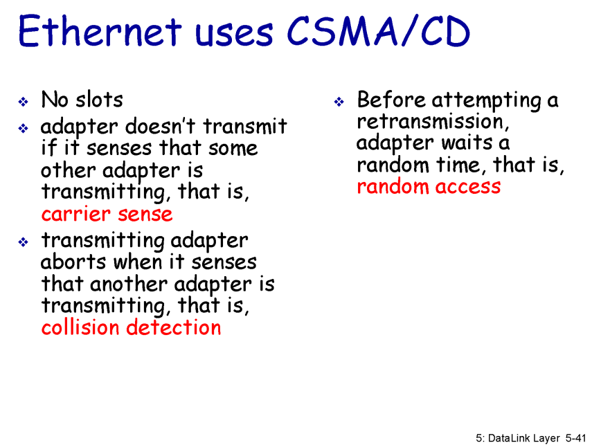

TCP에서의 재전송 : 센더와 리시버 프로세스 간에 양방향으로 소통하면서 유실되면 재전송.  
CSMA/CD에서의 재전송 : collision이 발생했다고 판단(CD)되면 일방적으로 재전송. 즉 CD가 안되면 무조건 유실없이 GWR로 전송되었다고 판단한다.(유선 케이블 상황이니까 유실이 없음. 링크레이어 피드백 없음.)

##### 이더넷 Minimum Frame Size - 64byte


5-43p : 만약에 Collision이 발생했는데 Collision이 발생한다면 어떻게 하는가? CSMA/CD는 MAC Layer에서 ACK를 사용하지 않는데?  
위 그림 상황에서 A가 조금 더 길게 말했으면, D가 조금 더 빨리 말했으면, Collision Detection 하지 않았을까...?

-> 이더넷의 minimum frame size : 64byte. 64byte를 해야만 위와 같은 상황(Collision detection에 실패하는 상황)이 발생하지 않는다.)

##### 이더넷 Standards

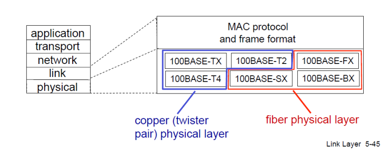  
이더넷의 케이블의 Speeds가 10gbps인가 100mbps인가 케이블의 종류가 구리인가 광섬유인가 등등

#### MAC addresses

링크 레이어와 MAC는 동일하니까 혼용해서 사용하겠음.  
Frame의 Header에는 MAC Address라는 48비트 짜리가 있음.  
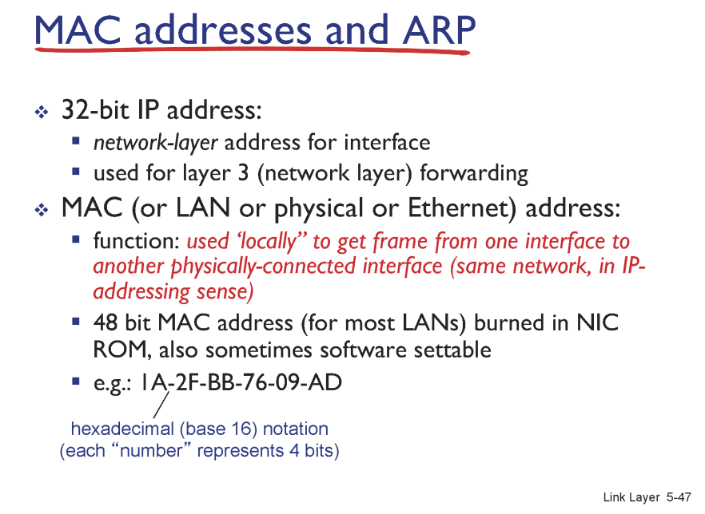

앞의 24비트는 제조회사, 뒤의 24비트는 고유넘버.

구글이라는 프로세스를 지칭할 때에,  
호스트 네임 : www.google.com  
주소 : IP주소  
주민번호 : MAC Address

호스트 네임 바꿀 수 있나? 바꿔(개념적인 이름)  
주소 바꿀 수 있나? 바꿔(물리적인 주소)  
주민번호 바꿀 수 있나? 못바꿔.

MAC Address는 LAN카드, 인터페이스 그 자체를 의미함.

MAC Address를 변경한다는 것은 실제로는 Source를, 인터페이스의 위치를 위조하는 것이다. (해킹)

### ARP (Address Resolution Protocol)

(https://hororolol.tistory.com/317)

#### Addressing: same LAN

[ARP 1 (ARP, RARP)](https://m.blog.naver.com/PostView.naver?isHttpsRedirect=true&blogId=song_sec&logNo=220243424386)

DHCP를 이용해 패킷에 쓸 GWR의 IP주소를 알게 됨.  
그럼 프레임에 쓸 GWR의 MAC Address는 어떻게 알까?

ARP Table에 GWR의 IP와 MAC Address, TTL이 매칭되어 있다. TTL이 지나면 ARP Table을 업데이트 한다.

ARP Request를 Broadcast (Source는 내 MAC Address, 도착지는 BROADCAST. ARP Request를 수신하면 수신한 쪽에서 MAC Address와 TTL을 Source에 전달한다.)


1. Target IP로 ARP Table을 참조해서 Target MAC를 작성하여 프레임을 생성한다.
2. Target MAC이 없는 경우 ARP Requset를 같은 서브넷에 브로드캐스트하여 Target IP를 전달한다.
3. ARP Reply를 이용하여 ARP Table을 업데이트한 후, Target MAC를 작성하여 프레임을 생성한다.

## 17강 링크 계층 3

### ARP protocol

#### Addressing: routing to another LAN

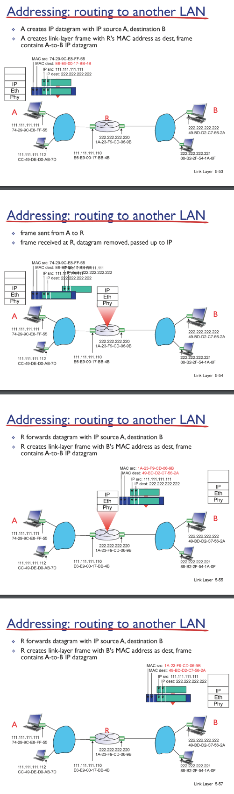

A에서 B로 전송, R는 두 서브넷 사이를 잇는 라우터

A에서 Fowrding Table 룩업해서 목적지 찾고, ARP Table룩업해서 목적지 찾고, CSMA/CD로 Tansmit before listen 하다가 Transmit

이때, 실제로는 Fowrding Table 만들기 위해 Routing하면서 ARP Table도 같이 만듬. ㅇㅇ 단, ARP Table의 TTL이 사라지면 ARP Table만 따로 Broadcast하여 업데이트 하므로 개념적으로는 구분해야 함.

### Switches

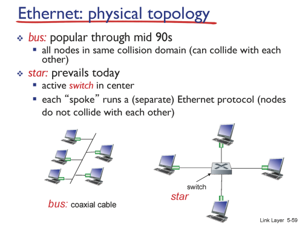

collision domain을 분리시켜줌.

Switch는 MAC도 없고 LAN도 없고 아무것도 없음. 그저 Spoke 입장에서는 Link가 조용하다고 느끼게 됨.

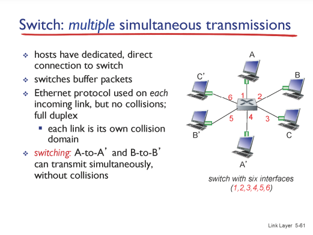

따라서 A와 B는 본인이 원하는때에 Frame을 Transmit함.
목적지가 A`'`, B`'`였다면 둘을 동시에 전달함.

목적지가 A와 B의 목적지가 둘 다 C`'`였다면, Switch에서 순차적으로 처리함.

#### Switch Table

그렇다면 Switch가 자신이 보낼 목적지를 어떻게 알까?
Switch forwarding table이 있다.

포워딩 테이블은 라우팅 알고리즘으로 했는데,  
Switch Talbe은 Self-Learning을 통해서 만든다.


1. A에서 A`'`으로 항햐는 프레임을 받았으면,  
   A가 Switch에 물려잇구나 하고 Switch Table에 추가.

2. 받은 프레임을 Switch에서 본인에게 물려있는 모든 패킷에 Flood. (A`'`이 Switch에 물려있는지 없는지를 모르니까...)

3. 만일 다른 Sender가 A에 전송을 하고 싶다면, Switch Table을 Look-up해서 전송.

즉 Sender가 Switch Table에 있으면 추가,
Receiver가 Switch Table에 있으면 Look-up하여 전송, 없으면 Flood.
두 과정을 반복.

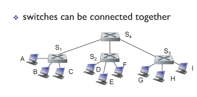  
스위치는 계층화하여 연결이 가능.

스위치는 단순히 Collision을 방지해주는 역할을 할 뿐, 네트워크 레이어에서는 스위치의 존재를 모른다.

계층화된 상태에서 Self-Learning.
(위 사진에서 스위치 끼리 연결된 포트가 0, Process들이 연결된 포트가 왼쪽부터 1, 2, 3이라고 할 때에)

1. C -> I 일때,  
   S1의 테이블

```
C : 3
```

Flood가 이루어짐,  
S4, S2, S3의 테이블

```
C : 0
```

2. I -> C 로 응답함.

S3의 테이블

```
C : 0
I : 3
```

S4

```
C : 0
I : 2
```

S2

```
C : 0
I : 0
```

S1의 테이블

```
C : 3
I : 0
```

Switch와 공유기의 차이는?
공유기는 링크, 네트워크, 트랜스포트, 앱까지 있고, 앱에 있는 NAT와 DHCP, DNS를 이용해 공유기를 작동시키는 것.  
즉 DHCP와 NAT를 가진 작은 GWR이라고 볼 수 있다.

Switch는 여러 회선을 연결할 수 있는 기계로, 공유기에 Switch를 꽂을 수 있다.  
공유기에 공유기를 꽂으면? 공유기에서 공유기로 가는 것은 Routing이고, 두개의 MAC은 다르다.  
공유기에 Switch를 꽂으면? 같은 서브넷임. Switch는 특정 포트로 받아서 특정 포트로 내보내는 역할만 함.

즉 Host가 증가할 때에, Router를 증가시키면 Subnet이 증가하고, Switch를 증가시키면 같은 Subnet에서 링크레이어만 늘어난다.

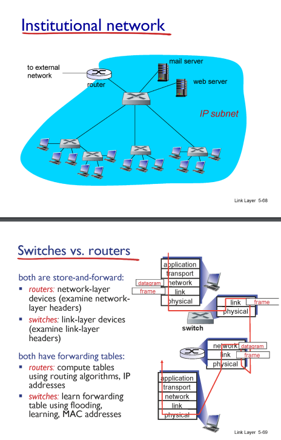

#### Data Center network

데이터 센터는 Host가 엄청나게 많다. 땅값도 싸고 냉각이 쉬운 콜롬비아의 강 근처 등에 위치한 거임.  
그러면 이 엄청나게 많은 Host를 연결하는 방식이?  
Switch임.

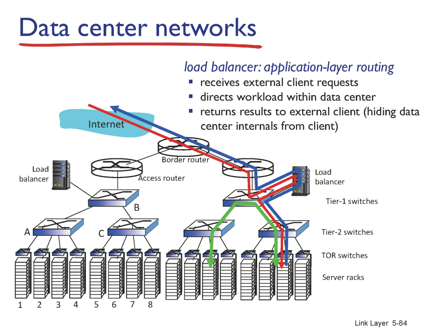
