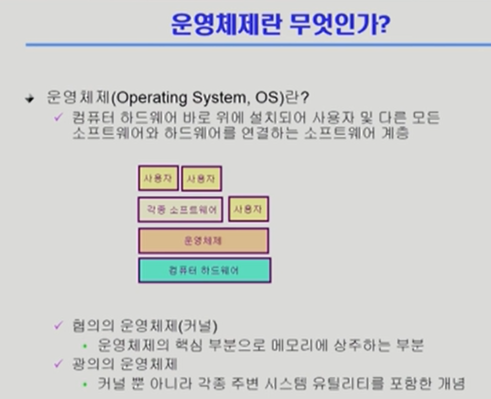

# week 1

## OT

운영체제는 복잡하다. 내가 운영체제라고 생각하고 수업을 들으면 좋다.  
운영체제란 무엇인가?

## Chapter 1. Introduction to Operating Systems

### 1.1 운영체제란?

컴퓨터 하드웨어 바로 위에 설치되어 사용자 및 다른 모든 SW와 HW를 연결하는 SW 계층

컴퓨터의 운영체제를 통해 간접적으로 하드웨어를 관리하고 활용할 수 있다.

협의의 OS(커널) : OS의 핵심 부분으로 메모리에 상주하는 부분  
(운영체제의 핵심적인 부분. 부팅을 한 후에 메모리에 상주하고 있음. 전공자의 입장에서의 운영체제.)  
광의의 OS : 커널 뿐 아니라 각종 주변 시스템 유틸리티를 포함한 개념  
(운영체제의 유틸리티들, 부가적인 기능들을 모두 포함한 것. 소프트웨어이기 때문에 항상 메모리에 상주하지는 않는다. )

**운영체제의 목적**

1. 컴퓨터 시스템의 **자원(프로세서, 기억장치, 입출력 장치 등)을 효율적으로 관리** -> 주어진 자원으로 최대한의 성능을 내도록 & 사용자 간의 형평성 있는 자원 분배
2. 컴퓨터 시스템을 편리하게 사용할 수 있는 환경 제공 -> 동시 사용자, 프로그램들이 각각 독자적 컴퓨터에서 수행되는 것과 같은 환상 제공 (아주 짧은 간격으로 여러개의 프로그램을 전환하며 실행하는 등) (하드웨어 자원에 직접적으로 접근하지 않고도 하드웨어 자원에 접근할 수 있도록 함. **하드웨어를 직접 다루는 복잡한 부분을 운영체제가 대행**)

효율성은 전체적인 성능을 위해 자원을 서로 다르게 배분.  
형평성은 프로세스가 진행될 수 있도록 최소한의 자원은 배분.

### 1.2 운영체제의 분류

동시 작업 가능 여부

1. 단일 작업(single tasking) : 한 번에 하나의 작업만 처리 (과거, 혹은 특수목적... ms-dos, 엘리베이터)
2. 다중 작업(multi tasking) : 동시에 두 개 이상의 작업 처리 (현대적인 운영체제. 유닉스, ms, 스마트TV 등)

사용자 수 (여러명이 동시에 접근해서 사용할 수 있는지)

1. 단일 사용자(single user) : MS-DOS, MS Windows (물론 윈도우즈도 서버를 열면 여러명이 접근할 수 있긴 하다.)
2. 다중 사용자(multi user) : UNIX, NT server

처리 방식

1. 일괄 처리(batch processing) : 작업 요청을 일정량 모아 한꺼번에 처리, 작업이 완전 종료될 때까지 기다려야 함 (Punch Card를 모아서 처리하던 방식. 작업이 완전히 종료되어야만 결과를 확인할 수 있음. )
2. 시분할 방식(time sharing) : 현대 OS 방식, 여러 작업을 수행할 때 컴퓨터 처리 능력을 일정한 시간 단위로 분할하여 사용(interactive한 방식. 여러명이 실행을 하면 1, 4, 7 / 2, 5, 8 등으로 시간을 잘게 나누어서 각각의 사용자들이 interactive하게 느낌.)
3. 실시간(Realtime OS) : 정해진 시간 안에 어떠한 일이 반드시 종료됨이 보장되어야 하는 실시간 시스템을 위한 OS(예 : 원자로/공장 제어, 미사일 제어, 반도체 장비) -> Hard realtime system & Soft realtime system

-> 현재 배우는 OS : 다중 작업 & 다중 사용자 & 시분할 방식

1.3 운영체제 예시
유닉스(UNIX)

코드 대부분을 C언어로 작성
높은 이식성, 최소한의 커널 구조
복잡한 시스템에 맞게 확장 용이
프로그램 개발에 용이
다양한 버전 : Linux(소스 코드 공개), SunOS, System V, Solaris 등
DOS

MS사에서 1981년 IBM-PC를 위해 개발
단일 사용자용 운영체제, 메모리 관리 능력 한계(주기억장치 : 640KB)
MS Windows

다중 작업용 GUI 기반 운영체제
Plug and Play, 네트워크 환경 강화
DOS용 응용 프로그램과 호환성 제공

## 2 컴퓨터 시스템 구조
컴퓨터 : cpu, 메모리
io기기 - 컴퓨터 키보드 프린터

이때 디스크는 io기기로도, 컴퓨터로도 분류될 수 있다.  

레지스터 : 메모리보다 더 빠르게 사용할 수 있는 것
모드빗 : 운영체제인지 어플리케이션인지 판단
인터럽트 라인 : 인스트럭션 하나가 실행되면 주소값이 증가하고 다음 사이클 인스트럭션 진행하고 이런 역할만 하고 있어요. 파일을 했는지 끝냈는지 등을 판단하는 역할.  

CPU는 계속에서 빠르게 일을 한다. 나머지 메모리나 컨트롤러가 cpu에 일을 계속 던지고, cpu는 인터렉티브하게 빠르게 반응하고 일한다.   

만약 메모리에 있는 프로그램이 무한루프를 도는 프로그램이라면? 그리하여 io작업 없이 cpu를 사용한다면..?

'타이머' : 특정 프로그램이 cpu를 독점하는 것을 막기 위함.   
운영체제가 cpu를 가지고 있다가 사용자 프로그램에 넘겨주는데, 이때 타이머를 할당한다. (보통은 수십밀리세컨드 만큼 cpu를 넘겨준다. 셋팅된 시간이 끝나면 타이머가 cpu에 인터럽트를 건다. cpu는 인스트럭션을 한 번 실행할 때마다 인터럽트 라인을 확인한다. 운영체제는 사용자프로그램으로부터 cpu를 뺏지 못한다.(cpu에 인스터럭션을 줄 수 없어서) 그래서 처음부터 타이머 인터럽션을 준다.)

모드빗이 0일 때에는 아무거나 실행하며 1이 되고,
인터럽션이 되면 0이 되고
0이 되면 운영체제가 실행되고...

메모리는 원칙적으로 CPU만 접근을 하고

각 IO디바이스는 버퍼를 이용해서 메모리에 접근

이때 키보드 등은 입력을 할 때마다 cpu를 인터럽트한다. 그래서 DMA가 필요하다. 

DMA - 직접 메모리에 접근할 수 있는 컨트롤러...IO장치에서 넘어올 때에, 로컬 버퍼에서 들어오는 내용을 DMA가 메모리로 복사해줌. 