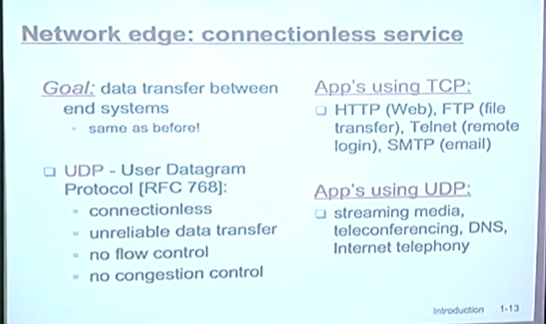

# 1강 introduction
1p 

컴퓨터 네트워크 기본

최초의 인터넷이 4대의 컴퓨터로 시작했는데…

9p
20-30년이 지난 지금의 모습…
시작은 미미했으나. 하나의 우주다.
노드 갯수를 셀 수가 없다. 엄청나게 많다. 그 갯수또한 계속 팽창하고 있다구… 

이 개념의 그림에서 우리는 가장자리에 있다. 웹서버와 서버들도 가장자리에 가깝다. 

그럼 가운데에 있는 애들은 누구냐? 여러분들이 배울 라우터가 가운데에 위치할 것이다. 데이터를 받아서 전달해주는 단순한 기능을 하는 애들이 라우터.

10p
인터넷의 구성 요소
네트워크 엣지 : 가장자리에 위치하는 녀석들. 랩탑, 데스크탑, 어플리케이션 등 Applications and hosts


네트워크 코어 : 가운데에 위치하는 애들 . 라우터들이 연결되어 있음. (라우터 기호는 동그랗게 표시한다.)

네트워크 링크는 유선도 있고 부선도 있고 다양하다.

11p
클라이언트는 자기가 원할 때 밑에 연결해서 웹서버로 부터 정보를 가져오는 그런 녀석. 웹브라우저 등은 다 클라이언트지
서버라는 애는 24시간 연결되어 있어서 클라이언트로부터 요청을 받아주는 것.


P2p는 담시간에.


네트워크 엣지에 있는 클라이언트와 서버가 서로간에 의사소통을 하는데 클라이언트 입장에서 의사소통을 주고 받는데… 통신 서비스를 사용해서 데이터를 주고 받을 거 아냐? 인터넷이 제공하는 통신 서비스에 대해서 간략하게 이야기 해볼께.

12p
데이터 통신, 트랜스미션 서비스가 두가지가 있더. 첫번째는 커넥션 오리엔티드 서비스.


흔히 들어본 TCP라고 하는 것이 커넥션 오리엔티드 서비스를 제공하는 통신 방법이다.

TCP는 사용자에게 뭘 제공해주냐면,
여기 써있는대로
릴라이어블 - 신뢰성 있는, 이걸 사용해서 보내면 보낸 그대로 유실되지 않고 가는 것이다. 인오더 바이트는 메시지를 보낸 순서 그대로 지키면서 도착지 서버까지 도달하는 것이다. 
두번째는 플로우 컨트롤. 무슨 이야기나면 센더가 리시버한테 데이터를 전송을 하는데 센더가 보내는 속도가 있을거 아니야. 그 속도를 알맞게 조절해주는 것. 안정기가 박주훈한테 데이터를 전달하는데 안정기가 슈퍼컴퓨터고 박주환 컴퓨터가 286이다. 슈퍼컴이 데이터를 막 쏴도 286이 못받겠지? 리시버가 받는 속도에 맞추어서 보내주어야 한다. 데이터 뿐만 아니라 일반적으로도 정보를 전달함에 있어서 받아들이는 사람의 속도에 맞춰서 전달해야지, 나도 여러분들에게 컴공과 3학년 학부생 속도에 맞춰서 전달하는 거지.. 안그럼 뛰쳐 나가겠지.. 초등학생이었으면 더 느리게 전달했을 거야. 리시버에 맞춰서 전달해줘야해. 
그리고 또 하나 컨제션 컨트롤은 뭐냐면, 286을 슈퍼컴으로 바꿨어. 그럼 슈퍼컴 속도로 보낼가? 아니지. 회선이 가늘다고 해봐. 회선이 터져나가겠지? 네트웍이 받을 수 있는 능력치 만큼으로 보내줘야 한다고. 이런 것들이 TCP라 불리는 서비스야. 여러분들이 클라이언트로서 네트웍을 사용하려고 하는데 TCP를 이용하면 이런 기능들이 제공이 되는거야. 흔히 웹브라우징을 하자나 그럼 당연히 이걸 쓰겠지?  


그리고 또 다른 하나의 서비스는 UDP라고 불리는 커넥션 리스 서비스가 있어요. 하나씩 봅시다. 커넥션리스, 커넥션이 없단 뜻이야. 그리고 언릴라이어블 노커넥션컨트롤...그러니까 무슨 소리야? 아무 서비스도 없단 뜻이지? 그러니까 걍 데이터 유실돼도 돼 하면 이걸 쓰면 돼. 중간에 데이터 터져나가든 관계없이 걍 나는 내맘대로 보낸다 하면 이걸 스면 돼.  
프로젝트 할때 소켓프로그래밍 할때 이거 선택해서 쓸 수 있다고. 

그러면 야, 얘는 좋은거 다 해주는데 udp는 암껏도 안해주네? 이걸 쓸 이유가 있나? 빨라? 왜? 안윤근이 어려운 얘기를 했는데, 개념적으로 접근했을때, udp는 아무것도 안해주는데 얘가 어떻때 쓸라고 필요한가.. 속도가 빠르다는걸 이렇게 받아들이면 돼, 받아들이는 속도랑 관계없이 걍 들이부으면 되지. 100기가 바이트 박 쏘는거야. 유실 되겠지만 자기 마음대로 보낼 수 있다는게 장점이겠지. 대신 도착한다는 보장이 없기 때문에...그래서 이 속도는 의미 없는 장점일 수 있지 왜냐하면 다 유실되니까..  
그러면 어떤 경우에 쓸까? 릴라이어블하지 않을 때에는 걍 udp 쓰면 돼. 가장 좋은거 음성전화 같은거... 인터넷 전화. 이런 경우에는 오디오 패킷이 몇개 유실돼어도 감지를 못해. 그럴땐 걍 udp쓰면 된다고. 실시간 오디오 같은 경우에는 사람들 귀가 민감하지 않으니까.

대부분의 경우 TCP쓰겠지? 네이버 같은거.. 기사 유실되고 중간중간 안보이면 안되잖아. 뭔가 신뢰성이 필요 없고 그럴 때에는 udp를 스면 되는거고..  

우편 시스템도 비슷하잖아. 미국에 있는 친구한테 편지 쓰고, 편지 봉투에 담았어... 패킷 이라는 용어를 많이 쓸텐데, 편지 봉투랑 똑같은거야. 편지지, 편지봉투 담겨있지? 여러분들이 미국에사는 친구한테 편지를 적고, 편지 봉투에다가 딱 담아서 어떡하지? 우체통에 딱 집어넣죠? 가는데, 100% 간다는 보장 있냐? 도착 안할 수도 있지? 이런게 udp야. 그런데 편지봉투에다가 돈을 넣어 그러면 우체통에 넣을거야? 아니지? 등기로 보낼거지? 등기가 TCP 개념이지. 신뢰성있게 해주고 뭔가 개런티를 해주잖아. 근데 등기가 좋은데, 등기의 단점이 뭐야? 비싸지? 비용을 지불하잖아. 마찬가지야 TCP가 제공해주는게 많지만 비용이 들어. 이 비용이란 컴퓨팅 리소스 네트워킹 리소스가 드는거야. 해주는 일이 많은 만큼 뭔가 비용이 들어 현실세계랑 똑같아. 자원을 소모한다고. 그래용  

tcp udp가 기본적인 통신 서비스에요. 그래서 웬만하면 tcp 사용한다고 보면 돼. 영화 다운받는데 udp 쓰면 되겠어? 

 13p
 데이터그램 프로토콜, http 프로토콜, 프로토콜. 전부 다 프로토콜이야. 그럼 프로토콜이 뭐냐.

 14p
 박주환이랑 전화통화를 하는데, 저녁에 시간되는지를 물어보고 싶은거야. 전화 받자마자 저녁에 시간되냐? 하지 않지? 실제로는 안녕하세요? 여보세요? 하잖아. 이게 뭐냐면 둘 사이에 이야기하는 암묵적인 약속, 방식이라고. 기본적으로 같은 언어를 사용해야 할거고, 그 이상 뭔가 둘 사이에 이야기하는 관습이나 약속이 있어야 할거야. 그게 바로 프로토콜이야. 대화의 어떤 약속이죠. 그리고 기계들 사이에도 그런 약속이 필요하다고. 어떤 특정 웹페이지를 줘!가 핵심적인 메시지지만 그 이전에 무언가를 한다고. 메시지를 주고받기 전에 서로간의 준비동작. 단순한게 그렇게 생각하면 돼. 우리들도 그런 암묵적인 프로토콜이 있다고. '나는 그친구랑 프로토콜이 안맞아서 말이 안통해' 그런 이야기 많이 쓰지..?안쓰니? 회사가면 쓸거야. 합이 맞아야지. 프로토콜이 안맞으면 얘기가 안통해요. 결국엔 프로토콜이 맞는 사람끼리 뭉치는거야. 프로토콜이 안맞으면 통신이 안돼. TCP는 TCP끼리, UDP는 UDP끼리.   

 TCP는 신뢰성있는 통신 서비스를 제공하는 방식이고, UDP는 신뢰성 없는.. HTTP는 하이퍼텍스트를 받아오는 방식이고. 모두 '방식'인거야... 결국 어떤 방식으로 얘기할지를 약속하지 않으면 대화가 안통한다구.

 15p
 그럼 네트워크 코어 보자. 코어는 결국 라우터끼리 얽히고 섥힌 집합이야. 우리가 생각해봐야 할게. 데이타를 출발지에서 목적지까지 전달을 하는데 라우터가 어던 방식으로 전달을 하냐. 사실 어떤 메시지를 전달하는 방식에는 크게 두가지가 있다구. 서킷 스위칭 패킷 스위칭. 미리 얘기해두면 인터넷에서는 패킷 스위칭을 사용을 해. 그럼 왜? 서킷 스위치라는 것은 ㅜ머냐면

 17p 출발지에서 목적지까지 가는 길을 예약해놓고 특정 사용자를 위한 망을 예약해준거야. 예전 유선전화망이 이렇게 했다구. 이게 서킷 스위칭이야. 어떤 유저를 위해서 길을 딱 해놨단 얘기야. 이게 라우터를 통째로 주는게 아니라 절반은 누구 유저한테 절반은 누구 유저한테 이런 식으로 유저를 위해서 길을 딱 해놨단 얘기야. 왜 서킷이냐면 이 길이 다 서킷이야 서킷.

 18 인터넷에서 사용하는 것은 패킷 스위칭이야. 유저들이 보내는걸 패킷단위로 받아서 유저들이 받는 방향으로 전송, 던져주는게 패킷 스위칭이에여. 그림에 잘 나와있네. 라우터에 들어와서 목적지로 쭉쭉 나가면 돼요. 이해 되죠? 받아서 받는 대로 순서대로 아웃풋으로 보내주고 이게 다라구. 뭔지 알았져? 별거 아니야. 자원 예약하는 그런거 없이.

 19 그럼 과연 어떤 장단점이 있길래 인터넷에서는 패킷스위칭을 선택했는가.

 20 요 예를 보면 돼. 나가는게 1MBPS라고 칩니다. 초당 1메가 비트를 뿜어내는 캐이블인거야. 이걸 밴드위스라고 하는데. 이게 크면 클수록 성능이 좋겠지? 엉 그래여. 여기에 유저들이 물려있는데 이걸 서킷스위치 방식이라고 해봅시가. 각 유저는 100kbps 를 한다고 가정을 해보자. 그럼 이걸 서킷스위칭으로 하면 몇명까지 수용할수 있지? 10명가지 최대 지원할 수 있겠지? 왜 아웃고잉 링크는 1mbps니까 10개로 까지 나눌 수 있잖아. 이해되여? 그르칭?

 패킷스위칭은? 몇명가지 가능해? 그런 개념이 없지? 그냥 들어오는대로 막 보내니까 10명 딱 예약해두는게 아니니까 그냥 맘대로 들어와라 이거지. 그러니까 이거는 제약이 없는거야. 그런데 제약이 없다곤 하지만 10명 이상 몰리면 문제는 될거 아냐. 그렇져?...여기서 중요한건 뭐냐면 실제로 인터넷을 사용하는 패턴을 생각해보자고. 전화는 전화를 사용하는 동안 안쉬고 말하지? 그런데 인터넷은 어떻게해. 네이버 들어가서, 접속하고, 기사 클릭하고, 데이터를 주고 받고...계속 클릭해? 아니지? 기사 그냥 읽지? 그 다음 클릭하고, 그다음 또 기사 읽고.. 한참 기사 읽다가... 이렇게 되는 거잖아.이렇게 멍하니 정보를 주고받지 않는 시간이 훨씬 길지? 그렇겠지? 이런데 이걸 딱 10명에게 나눠주면 어떻겠어? 낭비되는 거지?  

 ps로 가면 10명이 동시에 정확하게 몰리지만 않는다면 동시에 겹쳐서 하지 않고 분산되니까 제약없이 사용할 수 있단말야. 인터넷 사용 패턴엔 이게 적합하겠지? 더 많은 사람들이 사용할 수 있다구.  

 결국에는 확률이 중요한데. 예를 들면 35명의 유저가 인터넷을 사용할 때에 10명이상 동시에 접속할 확률이 0.0004라고. 굉장히 낮단 얘기야. 이해 돼여? 대부분의 경우 사람들이 몰리지만 않는다면 좋은 거라고, 보다 많은 사람들에게 제공해줄 수 있으니까. 이해 되져? 근데? 모든 일에는 장점만 있을 수 없듯이. ps를 사용하면 많은 사람을 포용할 순 있는데, 그 대신 문제는 뭐냐면? 운이 나블 때에는 문제가 생길 순 있지... 겪었지 얼마전에/ 겪었지?(수강신청 얘기인듯) 그때는 차라리 Cs였으면 더 좋았을 걸... 몰리면 어쩔 수 없다고.  

 26. 패킷 스위칭이면 생기는 문제들 : 즉 다시 말하면 딜레이나 로스 같은 얘기인데. 봅시다. 여기... 요 라우터를 좀 보세요. 요걸 라우터라고 생각해볼거야. 패킷이 다음 라우터에 도착할 때까지 얼마나 시간지연 걸리는지 생각해보면, 새로운 패킷을 받았어. 받았으면 해야할 일 뭐야? 목적지가 어디인가 확인해서 아웃고잉 링크 보내는 일 해야 하잖아? 목적지가 어디인가 봐야한다고. 그게 바로
 27. 프로세스 딜레잉이에여. 알맞은 아웃고잉 엣지로 보내야 하는데, 만약에 지금 여기서 들어오는 속도가 여기 나가는 링크 밴드위스보다 더 컸어. 그럼 어케되겠어. 빠져 나가는 속도보다 들어오는 속도가 더 많았다. 그러면 어케돼? 여기 막 줄이 쭉 생기겠지? 그래서 이런 애들... 처리를 해줘야 할 거 아냐. 만약에 아무런 저장공간 없이 들어오는 애들 나가게만 한다? 글머 다 터지고 유실되겠지. 들어오는 속도가 더 빠를 경우를 대비해서 임시로 저장해놔야 하잖아? 그래서 임시 버퍼를, 혹은 큐라고 불리는 저장장소가 라우터에 존재하는 거야. 이 줄이 생길텐데. 그래서..이해 돼여? 그래서 버퍼 혹은 큐 라는 공간이 필요한데... 일로 나가야 하는데 많약에 이런 애들이 줄 서 있어. 그러면 맨 뒤에 갖다붙여서 대기시키는거지..그래서 제일 처음 패킷을 받으면 패킷을 검사하고, 검사한 다음 아웃고잉 엣지에 뿜어내야 하는데, 큐에 다른 애들 있으면 자기 순서 될 대까지 뒤에서 기다린다고. 이 기다리는 시간이 바로 '큐딩 딜레이'야.  검사하는 시간이 프로세스 딜레이고, 아웃고잉 엣지로 뿜어내야하는데 큐에 애들이 기다리고 있으면 맨 뒤에서 기다리는 이 시간이 바로 큐잉 딜레이.. 그래서 쭉 기다렸다. 맨 앞에 섰어. 이제 나가면 되지?
 28. 이 나가는 순간에 걸리는 딜레이가 또 있어. 뭐냐면 내가 큐 제일 앞에 섰다고. 나야. 내 패킷. 내가 나가면 되는데 패킷은 데이터, 즉 비트의 집합이라고. 첫번재 비트부터 마지막 비트까지 순서대로 링크로 쭉 빠져 나가는거야. 처음부터 마지막까지 다 뿜어져 나가야 겠지? 트랜스미션 딜레이라는 것의 정의는 처음 뿜어져 나간 시간부터 마지막까지 뿜어져나가는 시간이에요. 이 트랜스미션 딜레이는 쉽게 이렇게 정이된다도. 패킷 크기를 링크 밴드위스로 나눈 것. 파이프가 가늘면 양동이의 물을 다 부을 때까지 오래걸리지? 근데 파이크가 이따만하면 촥 부으면 끝이지? 이게 트랜스미션 딜레이야. 그리고 마지막 딜레이가 프로퍼게이션 딜레이. 패킷의 마지막 부분가지 다 올라와서, 이 마지막 비트가 도달하는 시간인데, 이 시간은 순수하게 무슨 시간이겠지? 이건 빛의 속도야. 빛의 속도라고. 전자기파. 결국에는 이 링크 길이를 빛의 속도로 나눈 거라고. 그러니까 이게 단순히 길면 딜레이가 긴거고, 링크가 짧으면 짧은거고.. 빛의 속도는 건들 수 없지. 라우터에서 패킷을 처음 최초에 받았을 때 패킷 검사하고, 큐에서 자기차례 될 때까지 기다리는 시간, 파이프에서 온전이 빠져나가는 시간, 그리고 마지막이 통과한 후 도착할 때까지의 프로퍼게이션... 프로퍼게이션은 신의 영역이니까 어쩔 수 없다고 치고.. 하나하나 딜레이를 줄이면 되는건데, 자 첫번째 딜레이 어떻게 줄일 수 있을가?  프로세싱 딜레이.. 어 그렇지! 라우터 하나 새로 사.  프로세싱 딜레이 줄이려면 라우터 성능을 개선하면 프로세싱 딜레이가 줄어들거고. 트랜스미션 딜레이는 어떻게 하면 될까? 밴드위스를 확 늘려버려. 케이블 공사 해버려. 그러면 트랜스미션 딜레이가 확 줄겠죠. 그러니까 케이티 같은 곳이 대규모 공사를 하는거야. 그렇다면 큐잉 딜레이는 어떻게 하면 되지? 줄이 커지면 커질수록 딜레이가 많아지고, 줄면 줄어드는 거잖아. 이걸 조절이 가능 해? 큐잉 딜레이야 말로 제일 골치아픈 녀석이라고. 늘어나고 줄어들고는 누가 조절하는거야? 우리들이 다. 우리들 모두가 막 접속하면서 종합적으로 기여하는 거지? 새벽시간에는 여기가 텅 비어있을 거고, 오후 2시에는 인터넷 많이하고.. 쫙 늘어날거고... 결국 사람들의 인터넷 사용 패턴이니까 건들 수가 없을 거라고.. 사람들이 순번제로 나눠가면서 인터넷 사용하지 않는 이상 어쩔 수 없는 거라고. 톨게이트라고 보면 되. 하이패스로 바궈 하면 프로세싱 딜레이 줄어들겠지? 그러고 나서 차선 늘려. 8차선 10차선으로 늘려! 했는데도 추석때 막히지? 그건 어쩔 수가 없는거지. 결국 이 네트워크 딜레이 문제들은 저 큐잉 딜레이에서 대부분 발생하는 거고. 정보 통신실 옆에 그런거 있던데 그... 네트워크 모니터링 보면 막 이케이케 그래프가 한다고. 이 꺾은선들이 뭐야? 다 네트워크 접속 량이라고. 이게 네트워크 다이나믹, 그래프 변동의 근원이기도 하고. 그러면 큐의 크기는 얼마나 될가? 큐의 크기. 그럼 질문을 다르게 해서, 혹시나 떨굴까봐 큐르 받치고 있잖아. 큐의 크기가 무한대일까? 그러지ㅣㄴ 않겠지. 큐보다 많을 때에는 더 많이 들어올 수도 있겠지? 큐 크기보다 더 많이 들어왔어 그러면 어케. 그러면....방법이 없어. 새로 들어온 애는 계속 버리는거야. 계속 버리는 거고. 그사이에 빠져 나가면 그렇게 또 받다가... 큐보다 넘치면 걍 다 버려야해 어쩔 수 없잖아. 그래서 사용자가 몰리다 몰리다 보면 패킷 유실이 일어나는 거라고. 큐에 들어가지 못하고. 최소한 큐에는 들어가면 지연은 될 지언정 접속이 될 수 있는데. 인터넷에서 발생되는 패킷 유실의 90%는 큐에서 떨어져 나가는 거야. 요즘에는 링크에서 유실이 잘 안생겨요 요즘에는 링크가 워낙 발달해서. 어쩔수 없잖아. 이해 되지? 그래서 봐. 새벽 시간에 막 혼자서 무선인터넷을 해. 학교에서. 그러면 속도 좋지? 그런데 학생들이 많아진다, 그러면 속도가 느려진다고. 큐가 길어져서. 그러다가 너무 많아지면 패킷이 유실되면서 난리가 나는 거야. 여기서 흥미로운 얘기를 더 해보면, 이렇게 뭐 에이에서 D로 보내는데 중간에는 결국에는 라우터들이 쭉 있다고 했자나. 라우터들은 여기에 이케이케 큐가 있는 거고. 그렇게 쳐봐. 그러면은 여기서 이렇게 보내는데, 큐에서 좀 들어있었어. 큐에서 좀 대기하고 있다가 빠져나가고.. 대기하고 빠져나가고 대기하고 빠져나가고 하니까 딜레이가 생기는거야. 새벽시간에는 여기 큐가 다 텅 비어있으니까 쭉~ 빠져나가고... 그러는거지. 그런데 낮에는 최악의 경우에는 대기하고, 대기하고, 대기하고 하다가 중간에 큐가 꽉 차있었어. 그러면 드랍된다고. 기껏 대기하면서 다 와서 드랍되고..  이해되져? 공간이 없는데 어떡해. 버려야지. 그런데 생각해보면 아까 우리 인터넷은 TCP아니면 UDP 제공해준다고 했지? 그러면 어? TCP는 릴라이어블하다고 했는데. 내가 보낸 패킷이 무조건 저기에 100% 도착하게 해주는거 아니야? TCP는 어떻게 이 패킷 로스들을 막아? 어. 결국에는 방법이 없어. 유실된 패킷을 재전송을 해야하는데 결국에는 유실이 일어나기 마련이야. 패킷 유실이 될 때 재전송을 하는 옵션이 두가지 있었겠지. 누가 재전송 할거냐. 첫번째는 패킷 유실이 일어나기 직전 라우터가 재전송해주는 방법이 있을 거고, 아니면 처음부터 다시 보낸사람이 재전송하는 방법이 있었겠지. 인터넷은 어떤 옵션일까? 얘가 재전송한다 1번, 라우터다 2번.. 답은 1번.. 인터넷은, TCP라고 불리는 애는 보내는 사람과 도착하는 사람 두 곳에 위치해서 모든것을 관장하는 거야. 라우터들은 노브레인... 아무것도 안하고, 양 네트워크 엣지에 맨 양 끝에 네트워크 인텔리전스가 집약되어 있고. 라우터들은 전달전달 전달만 해요. 왜 이렇게 했냐면 얘네들, 라우터들은 이미 할 일 많다고, 엄청나게 빠른 속도로 단순하게 빨리빨리 전달하는 것 만으로도 할 일이 많고 그 단순 작업이 극대화 되어 있고, 나머지 기능은 양 끝 엣지에 몰아넣어놨어. 인터넷 디자인을 보면 엣지에다가 다 몰아넣어놓고, 여기 라우터는 dumb core라고 불러. 아무 기능이 없어. 이게 현재의 인터넷 디자인 이에요. 어떻게 동작하는지는 다음 시간부터 계층 얘기하면서 할거구... 질문 있나여? 그러면 홈워크 원은 이런거에 관련된 내용이라서 강의자료 보고 교과서 보면서 해보도록 해요. 여기까지 하겠습니다.

#2 인트로덕션 2
지난주에 얘기했던게 인터넷 역사 간단하게 이야기 하고, 목요일에 여러가지 얘기를 했었는데 그중에 가장 중요했던건 인터넷에서 제공하는 전송서비스가 현재 두가지 있다는 얘기 했었고, TCP와 UDP라는 이야기 했어요. TCP는 기능 있고 UDP는 아무 기능 없고, 인터넷은 패킷으로, 패킷은 비트들이고 라우터를 거치면서 항상 비트들이 한묶음으로 같이 다닌다구 했어요. 그래서 이러한 패킷들이 중간에 라우터들을 거쳐서 가는데, 라우터에서 패킷을 거쳐서 알맞은 방향으로 보내주기 때문에, 라우터에 물려있는 많은 사용자들이 라우터를 공유해서 사용할 수 있는 것인데, 패킷의 문제점이 뭐냐면 동시에 라우터에 패킷을 보낼 경우에 문제가 발생한다구 했었죠? 어쩔 수 없이 이 큐에 패킷이 쌓이게 된다구 했었어. 패킷이 쌓이게 되면 쌓이다 쌓이다가 큐라는 버퍼 공간보다 들어오는 패킷수가 많아버리면 결국에는 걔네들을 담을 수가 없잖아. 그러면 패킷 유실이 일어난다. 패킷 손실의 90% 이상이 큐에서 발생하고 링크에서는 거의 일어나지 않는다고 했어요. 라우터에서 패킷이 거쳐갈 때 생기는 딜레이에 대해서 얘기 했었지? 총 4가지의 딜레이. 라우터에서 패킷을 처음 받았을 때 검사하는 시간 프로세싱 딜레이(패킷을 검사한다는 것은 최종 목적지가 어디이고 어느 라우터로 보낼지 등을 이야기 하는거야.) 그리고 그 목적지에 맞는 아웃고링 링크로 보내야 하는데 그 때 큐에서 기다리는 시간 큐잉 딜레이. 그리고 큐에서 뿜어져 나와서 하나의 링크에 온전하게 올리는 시간이 트랜스미션 딜레이, 그 다음 목적지, 다음 라우터까지 가는 시간이 프로퍼게이션 딜레이라고 했어요. 원과제 하다보면 이런 문제가 나오지? 
29. Caravan analogy. 비유적으로 해놓은거야. 차들이 한거번에 다녀야한대. 이건 패킷이랑 유사한거야. 톨게이트는 라우터라고 보면 되고, 거리는 이렇게 되어 있다. 시속100km은 프로퍼게이션 딜레이라고 보면 돼요. 그리고 차량 한대가 딱 넘어가는데 12초. 이거는 트랜스미션 타임이라고 보면 돼요. 2분동안 통과해서 1시간 후에 도착하니까 62분. 숫자가 중요한게 아니라 요 상황에서 12초 쉬의 상황이 어떻게 돼? 첫 비트는 통과했지? 프로퍼게이트가 실제로는 어떻게 돼? 빛의 속도지? 실제 패킷이 지나가는 상황을 보게 되면 패킷의 앞부분은 통과하자마자 이지 다음 톨게이트에 가있겠지. 뒷부분 패킷이 올 때까지 앞부분 패킷은 기다리고 있다고. 이게 패킷 스위칭이야.
    
2 아웃라인
1. 오늘부터 해서 어플리케이션 레이어에 대해서 한주반 정도 이야기를 할거야. 우리가 한 학기 동안 네트웍 계층들에 대해서 쭉 이야기하기 시작 할텐데 이런 계층 그림은 하두 많이 볼거야. 맨 위에 어플리케이션 / 그 밑에 트랜스 포트 그 밑에 네트워크 그 및에 링크 그 밑에 피지컬 레이어 이렇게 있어요. 우리는 위에서 부터 차례차례 내려오기 시작할거야. 어플리케이션, 트랜스포트, 네트워크, 링크, ...각 레이어는 개념적인거고 그 안에 프로토콜들이 있다고. 앱에서 유명한거 HTTP, 프랜스포트에선 TCP, 네트워크에선 IP, 링크에선 유명한거 많이 있어. 와이파이 lte 이더넷 이런거 많다고. 이번 시간에는 HTTP 얘기 할거야.
2. 네트웍 앱들. 그냥 프로그램이지? 많이 프로그래밍 해봤잖아. C프로그램 딱 하면 실행 하잖아. os 배웠죠? 결국엔 프로세스라고. 네트웍 기능이 있는 프로세스. 웹 브라우저가 네트웍 기능이 있는 프로세스라고.
3. 컴공 전공이니까 이런 프로그램들을 만들고 할거라고, 이 사이에 라우터들이 있다는걸 인지는 하지만 라우터를 신경쓸 필요가 전혀 없어. 단순히 반대편에 있는 프로세스만 신경쓰겠지. 결국 앱으로 프로세스와 프로세스간의 통신을 하는거고, 그 사이 네트웍이 어떻게 생겼는지는 전혀 신경쓸 필요가 없어요. 네트웍 계층은 클라이언트와 서버, 이런 네트웍 엣지에만 존재하는거고, 라우터에는 네트웍 레이어까지만 존재하고 앱이 없다고. 앱과 같이 지능적인 것들은 네트웍 엣지에서만 동작을 하는 거라고. 어플리케이션 레이어 하면서 ip니 tcp 같은 얘기가 나와도 부담갖지 말라고 나중에 배울거니까.
4. 어플리케이션은 어버와 클라이언트에서 동작을 하는데, 서버는 항상 24시간 동작을 해야 하고, 서버는 퍼머넌트한 ip주소를 가져야해. ip주소는 걍 넘어가고, 네트워크 상 모든 컴퓨터는 자기 주소를 가지고 있어야 하는데 그거 ip주소라고, 그렇게만 알구 있어. 서버는 고정된 ip가 있어야 하고 클라이언트는 고정된 ip가 없어도 된다. 당연한 얘기겠지? 제가 3공학관 401호에 고정되어 있어야 여러분들이 찾아올거 아니야 그 개념이에여. 
5. 결국에는 클라이언트 프로세스와 서버 프로세스와의 의사소통, 통신이라고 했어요. 여러분들 os나 시스템 프로그래밍 배울때 인터프로세스 통신이라고 들어봤지? 프로세스가 있고 프로세스가 있는데 그 사이에 데이터 주고받을 일이 있을거 아니야 파이프라던지 그런거,  os가 시스템 콜드, 인터페이스를 만들어 놨다고. 이야기 들어봤지? 우리가 얘기하는건 다른 컴퓨터와의 프로세스 통신이지? 이거랑 별 차이 없어. 프로세스가 컴퓨터 내부에 2개 존재하는거랑 다른 컴퓨터에 프로세스가 존재하는거랑 그 차이라고. 컴퓨터 내부에 있는 프로세스가 이 소켓이라고. 별거 아니에요. 소켓에 시스템 콜드 달려 있구..소켓에서 write하고 반대 소켓에서 read하고 그렇게 서로 양방향으로 왔다갔다 하는거야. 자. 컴퓨터 간에있는 프로세스들도 똑같아 전송하고 받고 왔다갔다... 그때 서로 연결되어 있어야 하잖아? 소켓의 주소를 알아야 한다고. 이 소켓을 인덱싱하는 주소의 역할을 하는 무언가가 인덱싱이 필요해 그게 바로 Ip Address와 포트 넘버의 컴비네이션이야. IP주소는 뭐라고 했냐면 네트워크상의 컴퓨터를 지칭하는 거라고 했었지. 랩탑 안에 프로세스 많잖아. 그게 컴퓨터고 컴퓨터 안에 또 프로세스 많다고 했잖아 그게 포트라고. 더 자세히 얘기하면 포트에 물린 소켓이 누구구나 하는 그런 이야기에요. 질문 있으면 암튼 하라구. 질문있으면 해여. // 암튼 인덱스가 아이피와 포트라고 했는데. 여러분들 컴퓨터에 프로그램 실행되고 있져? 그쵸 웹브라우저. 이 웹브라우저를 실행시키고 이 웹브라우저가 다른 어떤 컴퓨터의 프로세스와 연결이 된 상태잖아. 그래서 여러분들이 가령 네이버와 접속하고 싶다 그러면 이 프로세스에 해당하는 요 소켓을 입력해야 요기에 접속이 된다고. 어떻게 입력하니? www.naver.com이라고 입력한다고. 그런데 실제로는 어떻게 입력해야한다고? ip주소랑 소켓에 해당하는 포트넘버 80번을 입력해야 겠지. 777.666.80 이런식으로. 그런데 사람들이 외우기 싫잖아. 사람들을 위해서 알파뱃으로 대충 해놓은게 www.naver.com이고 이게 다음주에 배울 dns로 되겠지. 그러면 여러분들 포트넘버 입력 안했잖아. 입력 안하면 알아서 80번 넣어줘요. 지가 알아서. www.naver.com:80해도 똑같이 간다고. 너희들도 프로젝트 할때 원하는 포트에 동작시키면 된다고, 999포트 3000포트 맨 끝에 맘대로 포트 넘버 할 수 있다고. 일단 기본은 80번이라고 네이버는. 그런데 웹 서버를 운영하는 거의 모든 서버들이 포트를 80번으로 쓰고 있어 왜? 왜그럴까? 네이버 구글 아마존 등등 다 거의 모든 웹서버들이 그렇게 하고 있다고. 왜 80번인가가 아니라 왜 공통된 것을 쓸까? 같은 프로토콜? 맞는 답인데 더 직관적으로 이야기하면.. 서버는 뭐랬어? 항상 켜져 있고, 걔의 뭐가 일정해야해? 주소가 일정해야 겠지? 네이버든 다음이든 주소는 각각 틀리지? 주소를 해석해주는게 DNS지? DNS는 ip주소만 해석해주고 포트넘버는 해석 안해줘. 서버들이 포트넘버 다 달라봐. 그래서 포트넘버 같은 걸로 쓰자 이거야. 그래서 한양대든 고려대든 상관 없지만 컴공교수면 3공학관 401호에 있자고 약속을 한거지. 구성훈 친구 얘기처럼 안그러면 다 포트넘버 만들어 줘야 겠지. 어플리케이션 하나만 더 얘기할게. 계층이라는 녀석은 하위 계층에서 상위 계층한테 어떠한 기능을 제공하는 거야. 여기 있는 기능을 상위 계층이 사용할 수 있게. 어플리케이션 하나만 더 얘기할게. 계층이라는 녀석은 이렇게 생각하면 돼, 하위 계층이 상위 계층이 사용할 수 있게 서비스를 제공하는거야. 어플리케이션 레이아웃 프로토콜들은 바로 트랜스포트 레이어에서 제공하는 기능들을 사용하는거야. 트랜스포트 레이어에서 제공하는 기능이 뭔지가 중요하겠지? 제공해주지 않는 서비스는 못쓰는 거고. 어플리케이션 개발자 입장에서 트랜스포트 레이어에서 어떤 것들을 제공했으면 좋겠다 라는 생각이 있을거잖아.
12. 그런 희망 사항들을 나열해본거야. 뭐냐면, 데이터 인터그리티, 데이터가 유실되지 않고 온전히 도착했으면 좋겠어요, 타이밍, 10ms에 목적지에 도착했으면 좋겠어요 같은 희망 시간, 쓰루풋, 내가 보내는 데이터가 어느 용량까지 한번에 보내질 수 있었으면 좋겠어요 그런거. 보안, 시큐리티. 안전했음 좋겠어요 그런 것들이 있는데, 트랜스포트 레이아웃에서 제공해주는 서비스는 오로지 한가지 밖에 없어요. 데이터 인테그리티. 온전히 목적지에 도착하는 서비스만 제공해주고 나머지는 제공해주지 않습니다 현재에는. 그래서 이 기능을 TCP라는 프로토콜이 제공을 해주고, udp는 그마저도 제공을 안해줘요. 현재는 그런 상황이야. 그래서 타이밍 스르풋 시큐리티가 필요하다.. 그러면 어플리케이션 레이어에서 알아서 해야지 현재에는.. 보안 같은거. 그래서 어플리케이션 단에서 난리치고 있지? 뭐 깔아라 저거 깔아라. 그래서 이런 것들.. 현재 TCP에서는 데이터 인테그리티 정도만 제공해준다.. 타이밍이랑 쓰루풋이랑 같은 얘기가 아니냐라는 자연스러운 질문이 나왔는데, 같은 얘기일까? 물론 둘이 밀접하게 연관되어 있긴 한데, 타이밍이라는 거는 내가 보낸 패킷이 아주 스트릭트한 시간 범위 안에 도착해야 한다는 이야기고, 쓰루풋이라는 거는 예를 들면 1초에 어느정도의 양이 지나가서 도달을 해야 한다는 얘기잖아. 그래서 여기 이 쓰루풋이라는 것을 이야기 할 때에는 요 패킷이 이 타이밍이라는 것을 맞출 필요는 없다고. 1기가 바이트가 쭉 딜레이되다가 0.99초에 도착을 해도 이건 1초에 1기가바이트야. 이 미묘한 차이를 이해해요? 쓰루풋은 양에 대한 이야기이고 타이밍은 개별 단위의 시간에 대한 이야기라구. 직관적으로 헷갈리면 타이밍은 음성전화 같은거. 음성 패킷이 도착하는 타이밍이 중요한거지? 예를들면 영화 다운로드를 받는다 이런거는 쓰루풋이 중요하지? 

15. 그래서 뭐이 간단한 슬라이드로 뭘 보여줬냐면 뭐 그냥 유명한 어플리케이션들, 얘네들이 어떤 트랜스포트 레이어 프로토콜을 사용하는지, 대부분은 TCP를 사용하겠죠? 그리고 이런 것들을 구현하는 어플리케이션 프로토콜을 적어둔거야. 
16. 가장 유명한거는 HTTP로 웹을 동작하는 것이기 때문에 HTTP에 대해 오늘 내일 얘기를 할 거에요. 
17. HTTP 뭐의 약자죠? 앞으로ㅓ 여러 프로토콜들이 나오게 될건데 가장 중요한 거는 약자에요. 이 약자의 의미를 이해하게 되면 동작 원리의 50%는 이해하는 거라고.
18.  HTTP. 프로토콜인데 뭔가 트랜스퍼한대 뭘 트랜스퍼? 하이퍼 텍스트를. 별거 아니네 끝. 하이퍼 텍스트가 뭐야. 텍스트는 텍스트인데 다른 링크를 연결하는 텍스트라는 거지. 이런 것들 파일들 다 텍스트잖아. 이렇게 연결. 이런 텍스트들을 전송하는 프로토콜이야. 워낙 단순해서 뭐 얘기할게 없어. 웹브라우저, 피씨, 다 웹서버에 접속하려는 거잖아. 내가 요청하는, 하이퍼텍스트 하나 주세요.. 리퀘스트, 리스폰스. 이 두가지 종류 밖에 없어. 끝. 끝. 이 리퀘스트는 내가 원하는 하이퍼텍스트 파일 이름. 반응은 서버에서 디스켓에서 읽어서 리스폰스에 담아서 주고 끝. 단순하죠? 단순해요 정말 단순한거야. 리퀘스트, 리스폰스. 이게 다야. 
19.  그런데 이 HTTP가 어플리케이션 레이어 프로토콜이기 때문에 트랜스포트 레이어 서비스를 사용하겠죠 그 중에서도 TCP 사용하겠지. TCP를 사용하기 때문에 얘네 둘 사이에 이런 리퀘스트 리스폰스 메시지 이전에 TCP 커넥션을 해줘야 한다고. 지금은 깊이는 몰라도 돼 이런 것들이 있다고 생각하면 돼. 그런데 HTTP는 TCP를 사용을 한다. 그렇기 때문에 HTTP 메시지가 교환되기 이전에 TCP 커넥션을 생성을 해야해요. 그렇게 알아둬. 
그리고 HTTP의 또 하나 특징이 뭐냐면, HTTP는 스테이트레스레. 상태가 없다는 얘기야. 뭔 애기냐. HTTP는 정말로 단순해서 리퀘스트에 해당하는 파일 리스폰스로 보내고 끝. 기억 안해. 전혀 상대방의 State를 기억하지 않아. 그리고 실제로 그래야 할거고. 그렇습니다.
20.  요 얘기만 하고 마칠게. HTTP는 TCP를 사용해서 요 위에서 주고받는다고 이야기 했는데. TCP 커넥션을 사용하는 방식에 따라서 두 가지로 나뉘어요. 퍼시스턴트 인지 논 퍼시스턴트 인지. 퍼시스턴드는 무너가 지속적이라는 얘기고 결국에는 뭐가 퍼시스턴트냐 아니냐. 그러니까 요 TCP 커넥션을 퍼시스턴트하게 사용할 건가 아닌가를 의미해요. 메시지를 주고 받고 TCP 커넥션을 끊으면 논퍼시스턴트고, 이 커넥션을 계속해서 재사용하면 그건 퍼시스턴트라고. 예를 들면 웹브라우저가 웹서버한테 얘를들면 네이버 기사를 읽고 오려고 하는데, 그 웹페이지에는 다른 오브젝트들이 여러개 달려있다고 쳐봐. 결국에는 메인페이지와 그림파일 10개를 가져와야하는데, 일단은 TCP 커넥션을 만들겠죠. 리퀘스트 하고, 리스폰스로 메인페이지 주고, TCP 커넥션 끊고, 그 다음 TCP 커넥션 다시 하고, 그림 주고, TCP커넥션 끄고. 그게 논퍼시스턴트에요. 반면에 TCP 커넥션 유지하면서 그림까지 계속 주면 퍼시스턴트.
21.  요기 URL 있죠. 이 서버에서 홈 쩜 인덱스라는 파일을 가져올거야. 파일을 요청해서 가져와서 웹브라우저에서 디스플레이를 할건데. 요 파일 오브젝트에는 10개의 그림파일이 또 레퍼런스가 되어 있대. 네이버 기사 같은거 생각하면돼. 결국엔 그림들을 또 읽어봐야 된다는 이야기야. 그러면 웹브라우저에서 이 서버로 접속해서 TCP 커넥션 연결해야하지? 그 다음 제일 처음에 TCP 커넥션 연결하는 과정이 있다고. 이거는 지금 여러분이 몰라도 돼요. 일단 TCP 커넥션을 연결하는 무언가가 왔다 갔다 했다고 생각하면 돼. 연결해줘, 알겠어 연결해주께. 이런게 왔다 갔다 하고 HTTP 리퀘스트, 리스폰스. 딱 보내는 거야 .그런데 논 퍼시스턴트 타입이지? 
22.  TCP 커넥션 끊는다고. 요 상태에서 요 클라이언트는 home.index 파일을 파싱을 한다고. 홈쩜인덱스 파일은 뭘 파싱을 해야해?  쭉 파싱을 한다고 파싱을 하는데 몇 개를 더 가져와야해?홈 쩜 인덱스 파일은 요롷게 생겼잖아.10개 정도가 그림 파일이라고, 여러분 이 파일 본 적 있지. HTML 본 적 있잖아. REF 해가지고 SRC 있잖아 이거 다 가져와야지. 그래서 서버가 지금 home.index를 일단 준거야. 그 다음 파싱을 쫙 해보니까 요 렌더링을 하려면 파일 하나 둘 요 파일을 다 필요하잖아. 그래서 HTTP 요청을 해야하는데 TCP 커넥션 끊겼죠? 그래서 다시 TCP 커넥션 연결하고 그림파일에 대한 리퀘스트 리스폰스.. 또 두번째 그림에 대한 리퀘스트 리스폰스..이해 돼여? 그런데 만약에 퍼시스턴트 HTTP를 썼다면 훨씬 수월하겠지? HTML 받고 이어서 그림파일 받고... 그리고 실제 웹브라우저에서는 퍼시스턴트를 디폴트로 사용해요. 여기는 교과서니까 이렇게 알려주려고 해둔거야.
23.  질문 있나여 질문? - 원하는 파일이 다 전송됐는지는 누가 판단하나여? 지금 같은 경우는 HTML 통해서 클라이언트가 판단을 하잖아여?.. - 지금 질문이 HTTP의 개념에서는 동일한데 TCP를 다시 만드느냐 아니냐의 그 차이거든여? 아 물론 질문이 뭔 얘기인지는 아는데 Non-Per가 언제 끝기는지를 기준으로 안다고 판단한거죠? 근데 그게 아니라 Non-Per는 리퀘스트 마다 커넥션을 끊는거야. // 아까 그림에서 4번에서 TCP 커넥션은 양쪽에서 같이 끊어야 끊겨. 그래서 이 4번은 서버 쪽에서 끊었다는 얘기야. //  퍼시스턴트 HTTP였으면 커넥션하고 HTML 받았고 그림 1번 리퀘스트하고 받고 2번 받고.. 그런데 실제로는 HTML 받고, 그림 10개 있는거 알잖아? 그럼 10개 쭉 연달아서 리퀘스트 하고 10개 쭉 리스폰스 받고 그런 파이프라인 방식과 퍼시스턴트 HTTP를 같이 쓴다구. 어짜피 내일 복습하면서 할거야. 

03. 어플리케이션 계층 1
2. 오늘 이야기 할 것은 소켓이 뭔지, 그리고 소켓이라는 거는 결국에는 os에서 제공하는 api의 일종이기때문에 다양한 펑션들이 있다고. 그리고 코딩스타일에 대해서 이야기하고 마칠게요. 그리고 굳이 참고서 볼 필요가 없는게 구글에 서치하면 소켓 관련돼서 웬만한 정보 다 찾을 수 있어.
3. 결국에는 어플리케이션, 프로그램 끼리의 통신이에요. 사용자들이 보는 거는 어플리케이션 프로세스거나, 개발자 입장에선 어플리케이션 프로그램이라고, 그래서 우리가 어플리케이션 내부를 보는 건 아니야. 구현을 건드리는 건 아니고 심지어는 그 내부를 알지도 못해. 순수한 개발자나 사용자 입장에서. 물론 이제 다음주부터는 내부로 들어가겠지 그러면 그건 전문가 입장이고. 우리는 서비스 들만 사용할 뿐이라고. os에서 제공하는 특수한 인터페이스를 사용해야해. 예를 들면 모니터에, 모니터 창에 디스플렝 ㅣ하고 싶다 그러면 어떻게 해야해? printf라는 인터페이스를 사용해서 쓰면 디스플레이 되듯이, 다른 컴퓨터에 보내고 싶으면 인터프리터로 메시지를 적어주면 가는거라고. OS에서 제공하는 api의 일종이야. 그 통신에서 사용되는 api를 소켓이라 부르는 거고. 또 한편으로는 OS가 제공해주는 것이기 때문에 os가 제공하는 것만 사용하는 거라고. 결국에는 트랜스포트 레이어에서 제공해주는 것을 사용하느 ㄴ거라고. 트랜스포트 레이어는 tcp와 udp.. 결국 어플리케이션은 소캣을 사용하되 tcp 아니면 udp의 소켓 둘 중 하나 골라야 한다고 어쩔 수 없이. 그래서 우리가 아에 소켓을 통해서 사용할 때에 종류 자체가 다른 거야. TCP 소캣과 UDP 소캣. 방식 자체가 다른 거야. 그런 개념이에요.
4. 그래서 소켓의 타입은 두가지가 있다. 소켓 스트리밍이라고 불리고, udp는 소캣 데이터그램이라고 그렇게 불려요. 외울 필요도 없고 그렇게 있다고만 알고 있어. 코드 쭉 보면 나오니까. 
5. 그래서 오늘 수업시간에는 소켓 관련된 펑션들과 api들을 볼게요.
6. 먼저 큰 그림을 볼게. tcp 웹 클라이언트와 웹서버를 볼게요. 웹서버가 소켓을 열어. 이 소켓은? tcp 그렇지. 그냥 펑션이야. api야. 물론 패러미터가 들어가겠지만 코드 보면 돼. 그 다음에 바이드. 특정 포트에 바인드 시키겠다는 거야 이 소켓을. 보통은 80번 포트로 포트 번호가 적히겠지. 리슨, 이 소켓을 리슨 용도로 쓰겠다는거고 듣고있는거잖아. 어셉트, 클라이언트로부터 무언가 받을 준비가 됐으니까 들어오라는 거지. 이 어셉트 상태에서 블락이 된다고. 리턴이 안돼. 가만히 있는다고. 언제까지? 클라이언트로부터 정보가 올 때까지. 그러고 나면 웹 브라우저에서 소캣 열어요. 그 다음 바로 커넥트. 어떤 서버의 프로세스로 커넥트 하는거야. 그러고나면 이 서버와 클라이언트 사이에 액션이 취해지면서 쿵짝쿵짝 진행이 되는거죠. 어셉트와 커넥트 사이에서 진행이 되는거에요. 이 둘사이에 단단한 연결고리가 형성이 되는 거에요. 그래서 이 이후로는 너무나 단순해. 둘 사이에 딱 맺어졌잖아. 그러면 우리가 클라이언트가 메시지를 쓰면 print되듯이, 클라이언트가 메시지를 쓰면 서버에서 마법처럼 튀어나오는데. 전 세계에 소켓이 엄청 많잖아. 그런데 이 클라이언트와 이 소켓은 서로 특별한 관계를 맺었기 때문에 이 소켓에서 뿅 튀어나오게 돼요. 리드 엔 write로 이어지게 되는 거지. 그게 바로 통신이 되는거야. 결국에는 이 앞에 나오는 소켓 셋업과정 있죠? 요 과정 자체가 생소한거지 막상 관계를 맺고나면 리드 엔 라이트로서 그거의 연속이야. 
7. 그래서 계속 먼가 진행되다가 할말이 다 됐으면 그냥 끝내면 되는거에요.
8. 그래서 api를 큰 그림으로 봤고 자세히 이야기해보면, 파마미터는 세계에요. 방금 봤던 애야. 그 다음 바인드라는 함수가 있어서 소켓에 맵핑을 하고, 역시나 파라미터가 세개인데, 소켓의 인덱스 아이디를 바인딩 하겠다. 그리고 리드, 어셉트 있는데 자세히 봅시다.
9. 소켓이라는 펑션이 소켓을 만드는 펑션인데. 두번째 파라미터가 중요해. 소켓을 생성할 때 어떤 소켓을 생성할지가 중요하다고. TCP를 할지 UDP를 할지가 중요하다고. 그리고 나서 여 앞에 들어가는 프로토콜 이런거는 그냥 컨벤션한 거라고 코드 보면 알어. 그렇다면 이 소켓 펑션이 성공적으로 수행됐다면 소켓을 위한 자료구조가 형성이 될거고, 그리고 이 소켓이라는 펑션의 리턴 값으로 뭐가 나오ㅁ냐면, 방금 생성한 소켓의 아이디가 인덱스 혹은 파일디스크립트불리는 소켓의 아이디가 형성이 돼요. 그래서 그 리턴값, 그 인덱스 값, 그 아이디 값을 가지고 계쏙 우리가 이 소캣을 지칭할 거라고. 이해 되죠? 자 바인드 펑션은 그 생성된 아이디를 가지고 특정 소켓에, 포트에 바인드하겠다라는거야. 자세히는 보면 되고, 
10. 리슨, 리슨 용도로 사용하고 리퀘스트가 들어오몇 최대 몇개까지 처리해주겠다, 백로그가 그 뜻이에요 백로그 10이면 10개까지 해주겠다. 
11. 어셉트. 다 준비동작이 끝났으니까 나는 클라이언트로부터 연결을 기다리겠다 이얘기에요. 중요한 파라미터가 두번재 파라미터에요. 어셉트라는 시스템 콜은, 펑션은, 블락하고 있다가 클라이언트로부터 컨넥션이 들어오면 그때부터 리턴이 돼. 반환이 돼. 이 두번째 파라미터에 클라이언트의 아이피와 포트넘버가 연결이 되는 거야. 여기에 이제 자동으로 저장이 돼.
12. 이거는 뭐 클라이언트 쪽인데 커넥트 밖에 없기 때문에 넘어 갑시다.
13. 서버에서 소켓 만들죠, TCP 소켓 만들고 바인드 하고 리슨 용도로 지정을 하고 커넥트를 어셉트하겠다는거야. 그러고 나면 블락하고 있다가 클라이언트에서 커넥션 리퀘스트를 보내면 쭉 실행이 되겠죠. 클라이언트도 소켓을 만들고 커넥트를 해요. 커넥트라는 것은 요 소켓을 서버의 소켓과 커넥트하겠다는 얘기인데, 상식적으로 요 커넥트의 파라미터로 뭐가 들어가냐면 서버의 주소와 포트넘버가 들어가겠지. 클라이언트는 왜 바인드라는 펑션을 쓰지 않을가? 바인드라는 것은 특정 포트를 특정 소켓에 바인드하겠다는 것인데, 클라이언트는 특정포트일 이유가 없잖아. 아무 남는 소켓 쓰면 되잖아. 서버는 80번이라고 지정을 하겠지만, 클라이언트는 무슨 포트인지 관계가 없다고. 굳이 바인드를 안쓴거야. 뭐 바인드 써도 돼. 근데 굳이 쓸필요가 없는거지? 그렇게하면 얘네 둘 사이에 커넥션이 형성이 됐다. 그 다음에는? 단순히 리드 앤 라이트다. 
14. 자 코드 봅시다. 서버 샘플코드야. 뭐 이렇게 주렁주렁 헤더파이들이 있고 서버는 자기의 포트로 80번이 아니라 3490 쓰나봐. 그러고 나서 최대 10개까지 처리하는거 생각하고 있는 것 같아.
15. 그리고 실제 코드가 나오는데 제일 처음에 소켓이죠? 그 다음 인풋 세개. 그 다음 TCO소켓 열었고, 생성이 됐으면 음수가 아니라 값이 나올 거고 그게 소켓아이디,파일디스크립터라고 했어. 이제부터는 그 소켓 아이디로 이 소켓을 지정하면 되겠지?
16. 그 다음 바인드. 특정 소켓, 방금 생성했던 이 소켓을 특정 포트와 맵핑을 시킨다는 개념이야. 이때 마이 어드레스는 뭐나면, 
17. 아직 본적 없는 이 스트럭처, 자료구조체인데, 이 구조체는 어떻게 생겼냐면, 요런 정보들이 있다고. 마이 어드레스 에다가 정보를 집어 넣어주는거야. 포트 집어넣어주고...이렇게 3490적어주고..이렇게 정보들 다 적어주면 내가 원하는 포트랑 내 어드레스에다가 이 소켓이 바인딩이 된다고.
18. 그리고 리슨, 난 리슨할거고 최대 10개까지 리슨 받겠다. 동시에 요청 받겠다 인거고.그리고 여기 보면 두번째게 클라이언트가 저장될 공간을 해준거야. 그러고 나면 여기에서 딱 멈춰 언제까지? 클라이언트의 요청이 들어올 때까지. 요청이 들어오고 나면 여기에 클라이언트 정보가 들어와. 예시에서는 클라이언트 정보를 찍어줬네.
19. 클라이언트에서는 소켓 생성하고, 두번재 파라미터가 중요하죠? 그 다음 소켓을 이렇게 지칭할거고, 그 다음 커넥트, 서버의 어던 프로세스와 커넥트를 할거다. 이때 여기에는 서버의 주소가 들어가겠지? 서버의 주소 적어둔거야. 끝이야 끝.
20. 그 다음에는 리드 앤 라이트 쭉 하는거야.
21. 여기 소켓파일디스크립트, 소켓 아이디를 가지고 쓰고자하는 메시지 여기에 쓰면, 수행이 되자마자 여기서 리드를 하는거고, 여기에서 라이트를 하면 클라이언트에서 또 리드를 하는거고, 그렇게 이후네느 쭉쭉 스트링 리드 앤 라이드 하는거라고. 참고 용으로 해둔거고 인터넷에서 검색에서 쭉쭉 보고 프로젝트 하면 수업시간에 이렇게 해줄 필요도 없지.
22. UDP소켓은 여러분들 사용 안할거니까 굳이 얘기 안할게. 그런데 훨씬 단순해. 소켓 생성 없이 그냥 보내는거야. 설명 안할게요. 단순해.
23. 어 그리고, 데이터 교환이 다 끝난 후에 최종적으로 close 콜을 사용해서 방금까지 사용했던 소켓을 릴리즈 시켜줘야해. 해제해야지 다른 프로세스가 쓸 수 있는거야. 이건 팁인데 무슨 얘기냐면 프로젝트 만들다보면 수행하다보면 테스트 수행시키잖아. 그러다가 안되면 컨트롤c눌러서 프로세스 죽이고 할텐데. 예를들어 소켓을 생성하고 바인드해서 한다고 처봐. 그러다가 잘 안돼서 컨트롤 씨를 딱 눌렀다고. 프로세스 자체는 죽는데, 바인딩이나 소켓, 7777이라든지 이런 것들은 아직 남아있다고 os가 들고 있다고 그래서 같은 번호를 바로 사용하려면 문제가 생겨. 그래서 이런 시그널 관련된 시스템 콜드를 코드에 딱 넣어주면 컨트롤씨 눌렀을 때 소켓 관련된 자료들이 릴리즈 돼요. 이거 알아두면 편해요. 소켓 관련해서는 여기까지만 할게요. 직접 하는게 훨씬 나요. 시간 낭비야
24. 프로젝트 설명하고 마칠게요. 프로젝트 원은 여러분의 웹서버를 구현하는 거에요. 웹서버를 구현하는데 실제 HTTP 리퀘스트와 리스폰스를 볼 수 있다는 장점이 있다는 거지. 간단한 웹서버를 C로 구현. 클라이언트랑 웹브라우저가 아니라고. 웹브라우저는 이미 구글이 다 꽉잡고 있잖아 비집고 들어갈 틈이 없잖아.
HTTP 리퀘스트를 보는게 목적이야. TCP 소켓 열어서 주고 받는거. 웹버서에서 리퀘스트 받아서 리스폰스까지 했다면 웹브라우저에서 보이겠지? 이걸 확인해보는거야. 파트원이 대기하다가, 클라이언트에서 요청하면 어셉트하고 gtet하는거. 파트 투가 웹브라우저에서 띄워주는거. 까지. 다양한 파일도 지우너할 수 있게 만들어야해. txt까지. 다 되는지 체크할 거야.

어플리케이션계층1 - 챕터3 아웃라인
3-6. 
[](http://blog.naver.com/netrance/110112688107)


6. 오늘 트랜스포트 레이어 TCP 얘기를 하기 시작하면 복잡한 기능들을 제공해주는데. TCP레이어라면 기본적으로 제공하는 기능인 멀티플렉싱 디멀티플렉싱 얘기를 할게요. 단어가 어렵다고 싫어하는 사람들있는데. 단순해. 컴퓨터 내부에 프로세스들이 많이 있고. 
요청이 막 멀티로 들어오잖아 여러게 여러 구멍으로. 그걸 세그먼트를 나눠주는게 멀티플렉싱이고. 디멀티플렉싱이라는게 뭐냐면, 세그먼트가 있고, 리시버로 도착을해서 쭉쭉 올려주면 네트워크 레이어에서 트랜스포트 레이어로, 세그먼트가 있지? 이 메시지를 어플리케이션 레이어의 정확한 프로세스로, 정확한 소켓으로 알맞게 딱 올려줘야 하는거지? 그게 디멀티플렉싱이란 개념이에요. 그래서 멀티플렉싱은 센터측에서 되는거고, 디멀티플렉싱은 리시버측에서 되는거에요. 음. 그래서 어떤 소켓으로 올려보낼까라는 그 얘기야. 결국 각각의 구멍이 소켓이잖아. 그런데. 세그먼트를 딱 받았다고. 메시지를 알맞은 목적지에서 싹 올려줘야 하는데 어떻게 판단을 하냐를 보면, 여기. 세그먼트의 헤더에 있는 정보로 어떤 소켓에 올려줄지를 파악하게 된다고. 이 그림만 봐. 
9. 이게 뭐냐면, 세그면트에요 세그먼트. 세그먼트는 데이터랑 헤더로 이루어진다고 했지? 세그먼트는 데이터랑, 헤더야. 여기 포트부터 header fileds가 헤더야. 이 헤더의 크기가 얼마야? 총 32비츠면 16비츠 16비츠, 이렇게 소스포트 데스티네이션 포트 나눠져 있어서, 이걸로 디멀티플렉싱을 한다는 얘기야. 그림은 이렇게 생겼지만, 실제로는 데이터 부분이 엄청나게 크기가 커. 당연히 그러겠지. 편지지 안에 들은 내용이 더 많지 편지 봉투에 내용은 적다고. 그래서. 헤더에 적힌 부가정보인 소스포트, 데스티네이션 포트 필드에 적힌 정보를 가지고 디멀티플렉싱을 하는데, 먼저 udp가 어떻게 디멀티플렉싱을 하는지 얘기를 할게요. 그림만 봐. 수업시간에는 그림만 이해해도 다 하는거야.
11. 지금 이 컴퓨터에 존재하는 프로세스 3, 프로세스1이 의사소통하고 싶어하고 있고, 프로세스 4가 프로세스1이랑 의사소통하고 싶어하는 것 같아. 커넥션 레스, 즉 udp겠지. udp소켓 열고, 소스는 자기자신 포트넘버, 데스티네이션 포트는 얘.. ip정보는 어디에 적히냐면 사실 여기 안적히고, 네트워크 레이어의 헤더에 적혀. 그건 나중에. 그러고나면 이렇게 서로 포트넘버 주고 받겠지. 프로세스1이랑 프로세스4랑의 소스코드는 뭐겠어? 5775, 6428... 이거 지금 udp 경로. 이해 됐어? 질문. 자 보세여. 그렇구나 하고 넘어갈 수 있는데 주의해서 알아둬야 할게. 자, 지금 여기서 왔든 여기서 왔든 다 어디루 가? 지금 디 멀티플렉싱을 프로세스 1에서 하는데 다 같은 소켓으로 가죠? 왜 일로 갔다면 udp에서는 디멀티플렉싱이 어떤 방식으로 이루어지냐면, 데스티네이션 아이피와 데스티네이션 포트 넘버만을 사용해서 어떤 소켓으로 올릴 지 디멀티플렉싱이 이루어져요. 다시한번, udp는 데스티네이션 ip와 데스티네이션 포트넘버만을 사용해서 어떤 소켓으로 올릴지 디멀티플렉싱을 하게 돼요. p3랑 p4의 뭐가 동일하냐면 데스티네이션 포트랑 데스티네이션 아이피가 동일하지? p4에서 전송한 데스티네이션 포트 역시 다 동일하다고. 자, 얘, 얘, 얘ㅣ, 애, 애,  ㅔ4에서 나온 요 세그먼트랑 p3에서 나온게 동일한 데스티네이션 포트랑 데스티네이션 아이피를 가지고 있어서 여기 같은 곳으로 간다고. 이게 udp고,
13. TCP를 사용할 경우에 어떻게 되냐면, 두개 뿐만 아니라 소스 아이피, 소스 포트, 데스티네이션 아이피, 데스티네이션 포트. 이렇게 네 개의 튜플을 가지고 어떤 소켓으로 올릴지 판단을 하는거야. 하나라도 다르면 다른 소켓으로 가는 거에요. 자 봅시다. 이 p3에서 나가는 세그먼트...의 헤더에 적힌 정보들이야. 데스티티네이션 포트 80이라는거 보니까 뭐겠어? 그렇지 웹으로 가는 거겠지? 이 세그먼트 세 개를 봐봐. 테스티네이션 아이피랑 데스티네이션 포트가 다 동일하죠? 그런데 넷 중에 하나라도 틀리면, 소스 포트나 소스 아이피 중에 하나라도 틀리면 다른 소켓으로 디멀티플렉싱이 된다구요. 이게 tcp에서 얘기하는 커넥션 오리엔티드라구. 이 소켓 봐봐. 이 소켓에서 들어오는 메시지들은 전 세계의 수많은 프로세스들 중에서 누구한테 오는거야? 얘 한테서 오는 내용만 일로 오는 거지? 이 네가지가 딱 맞아야 하니까. 무조건 얘한테 오는거지? 그래서 커넥션 오리엔티드인거야. 반면에 udp는 소켓에 오는 정보가 누구한테서 오는거야? 아무나지? 아무한테서나 다 오는 거니까 커넥션이 아니라고. tcp같은 경우에는 4개의 튜플로 하기 때문에 다 소켓이 다르고...여러분들이 실제로 네이버에 가면 여러분들 각각을 위한 소켓을 형성해둔다는 얘기야. 사용자들 한 명 한명 접속할 때마다 소켓을 이렇게 만들어 둔다는 거에요. 그래서 tcp가 각각 클라이언트를 위해서 소켓을 생성하고 관리하기 때문에 자원들 많이 소모한다고. 이해 되나요? 질문 있으면 해여. (브로드캐스트는 데스티네이션이 안정해있잔항여? - 현재 우리 수준에서 이야기하면 인터넷에는 브로드캐스트가 없어 모든 리시버들이랑 tcp 커넥션 돼있는거지. )


15. udp가 제공해주는게 아무것도 제공해주지 않는 것 같지만,  기본적인 기능들을 제공해준다고. why is there a upd... 자 잠간, tcp udp, ip.. 이 세개 프로토콜의 헤더정보는 잘 알고 있어야 해. 다른 프로토콜 헤더정보들은 모르지만 이 세개 프로토콜은 중요하고, 다른 프로토콜들의 동작원리 그리고 이 세 프로토콜의 동작 원리는 이 세 프로토콜의 헤더에 기반한다고. 어떤 정보가 적히는지를 알아야지 우편 배달부의 행동을 이해할 수 있다고. 결국 이 세가지느 프로토콜의 헤더정보를 이해하는게 다에요. 다행히 udp는 필드가 4개 밖에 안되. 그 만큼 동작이 단순하겠지.. 각각 의미를 알아보게 되면, 이거 4개 있는데, 소스포트 데스티네이션포트 데이터길이 체크섬이라는게 있데. 소스포트 데스티네이션포트 각각 한 필드가 얼마? 16비트지? 16비트인거야. 그래서 포트 넘버는 0번부터 몇번? 6만 어쩧게 되겠지? 2에 16승 -1... 2 16 = 65536 그래서 어사인먼트 갯수는 이론상으로 0번부터 65535까지. 아 그래서 멀티플렉싱 디멀티플렉싱에 필요한거구나 알겠고, 렝스는 길이니까 뭐 치고, 첵섬은 뭐냐면 데이터가 전송도중에 에러가 있었는지 없었는지를 판단해주는 필드에요. 중요한건 에러가 있었는지 없었는지를 판단한다라는 거. 그래서 여기서 딱 받았을 대 첵컴 필드로 에러를 판단해서 올리지 않고 바로 드랍을 시켜버려요. 그래서 기본적으로 udp가 아무것도 안하는 것 같지만 최소한은 해주는거지. 멀티플렉싱 디멀티플렉싱, 그리고 에러체킹. 그래서 udp로 받았다? 그러면 에러가 없다라는 이야기가 되는거야. 자, udp헤더를 받고 헤더가 4개고 그만큼 단순해. tcp는 할 일이 많죠. 그렇기 때문에 tcp의 헤더에는 필드가 많겠죠? 할 일이 많기 때문에 정보가 많은 거라고. tcp는 다음주부터 지겹게 할거고 그러고 나서 중간고사를 할거고 중간고사에서는 tcp가 가장 중요하겠죠.
(출발지 포트 16비트, 목적지포트 16비트, 길이 16비트, 오류검사 16비트.)

4강 어플리케이션계층 2
다시 또 레이어 그리면
앱 / 트랜스포트 레이어 / 네트워크 / 링크 / 피지컬 레이어.
지난주부터 트랜스포트레이어 tcp udp.. 아주 기본적으로 두가지 - 멀티플렉싱디멀티플렉싱과 에러체킹 이 두가지는 기본적으로 해줘야한다고 했어요. 그래서 앱과 앱 사이의 통신이 이렇게 있다고. 그래서 많은 프로세스들이 존재할텐데. 메시지를 받아서 이 어플리케이션으로 쭉 올려줘야 하잖아. 그래서 트랜스포트 레이어에서 그걸 해주고, 전달한 메시지가 혹시라도 에러가 있었을 경우에 어플리케이션으로 안올려보낸다 라는거. 그래서 두 가지를 기본적으로 해준다는 거야. 리시버, 프로세스로 전달되지 않아요. 다시 한 번 얘기하면 각 레이어는 자기 자신의 상위 레이어에 서비스를 제공해주고, 하위 레이어에 서비스를 제공받는 그런 관계에요. tcp는 다양한 기능들을 제공해주는데. 그 중에 가장 중요한 것은 릴라이어플반 데이터를 제공해주는 것.
19. 그래서 오늘 우리가 얘기할 건 '릴라이어플'반 데이터의 트랜스퍼.. 둘 사이에 어떻게 이루어지는지에 대한 이야기를 할거야. 여기서 릴라이어블이라는 이야기는 뭐냐면, 어플리케이션에 대한 메시지나 하나도 유실되지 않고 딱 전달되는 그런걸 이야기하는 거에요. 그런데 이게 실제적으로 보면, 어플리케이션 프로세스들한테, 트랜스포트 레이어 간에 뭔가 이게 릴라이어플한 채널이 있는 것 같지만. 실제로는 이 피지컬 레이어에서 나와서 라우터들 쭉 거쳐서 가는거죠? 이 언더라인 네트웍들은 사실 언릴라이어블 하다고. 큐에 패킷 꽉 차있어서 패킷 유실되고 트래픽이 이상했다면 에러 발생하고 막 이런다고. 그래서 실제 모양은 
20. 이런거야. 백조가 잘 떠있는 것 같지만 발장구로 난리치듯이 이 실제 환경은 릴라이어블하지 않다고. 그래서 이게 어떤 환경을 초래하냐면 딱 간단해. 딱 두가지로 구분할 수 있어. 패킷이 에러나거나 패킷이 유실되는거. 이 두가지 상황만 잘 처리하면 어떻게든 릴라이어블하게 만들 수 있는거야. 그래서 오늘 얘기하는 거는 실제 tcp에 대한 이야기라기 보다는 릴라이어블한 데이터 트랜스포메이션을 제공하기 위해서 생각해보는 그런 시간이에요. 
21. 그래서 우리가 우리 약간 머릿속에 사고 실험으로, 릴라이어블 데이터 트랜스퍼 프로토콜RDT를 사고실험으로 디자인해볼거야. 단순화해서 패킷을 한 번에 하나 씩만 보낼거야. 이런 식으로. 이해 되죠? 단순한 프로토콜이죠. 이 화면은 이 동작에 대한 설명은 그냥 나중에 보면 알어. Fire state machines 뭔지 알죠? 각 스테이트가 있고 스테이트에 현재 있을때 이벤트가 발생하면 이런 액션을 취하고 화살표가 있는 다음 지역으로 이동한다 이런 이야기인데 보면 알어. 
    
```
유한상태기계(Fire state machines)란 처할 수 있는 상황에 대한 유한 개의 상태를 지니고 있고, 주어지는 입력에 따라 다른 상태로 전환하거나 출력, 액션이 일어나게 하는 장치 또는 그런 장치를 나타낸 모델이다. 선택지를 가진 게임이라고 보면 된다. 여러개의 상태가 존재하고 그 존재들이 특정 조건에 물려 서로 연결되어 있는 형태를 의미한다.
```

22. 자. 우선 단순한 상황을 가정하고 개선시켜나가볼게요. RDT 버전 1.
이 체널이 완벽하게 릴라이어블 했다. 에러도 유실도 발생하지 않는다면 얘의 동작은 어떠해야 할까. 뭐 할게 있어? 에러가 없고 완벽하니까. 그래서 ㄸ가히 할 일이 없어도. 그래서 뭐 뭐 이렇게 보내는거. 


