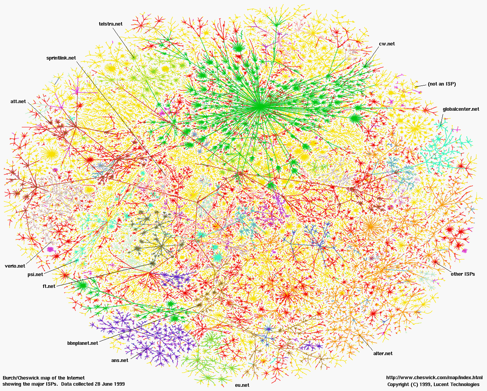

https://hcn1519.github.io/articles/2018-03/networkbasic1
클로바 노트 써서 녹취록 해 

# 컴퓨터 네트워크 (한양대학교 이석복 교수님)


## 1강 컴퓨터 네트워크 소개
### 1- 인터넷의 구성 요소
최초의 인터넷은 실험실에서 사용된 4개의 컴퓨터이다. 하지만 이제는 수많은 컴퓨터가 연결되어 있다.


  
**인터넷의 구성 요소**  
네트워크 엣지 : Applications and hosts. 위 그림의 가장자리에 위치하는 노드와 링크들, 랩탑, 데스크탑, 어플리케이션, 그리고 서버 등이다.  
네트워크 코어 : 라우터. 네트워크들을 위한 네트워크. 위 그림의 가운데에는 라우터들이 위치한다.   

**네트워크 엣지**  
클라이언트는 자기가 원할 때 서버에 연결해서 정보를 가져오는 것. 웹 브라우저가 대표적인 클라이언트.  
서버는 24시간 작동하며 클라이언트의 요청을 받아준다.  
그 밖에 p2p 모델이 있다.  

**네트워크 엣지와 연결 지향 서비스(connection-oriented service)**    
클라이언트/서버 모델은 둘 간의 연결을 통해 데이터를 주고 받는 것을 의미한다.  
연결 : 데이터를 주고 받기 위해 준비하는 것. 데이터를 주고 받는 과정에서는 '요청request', '응답respond',' 커뮤니케이팅 주체 간의 네트워크 상태 정의set up state' 등이 발생한다.  
이를 위해 사용되는 프로토콜이 TCP(Transmission Control Protocol)이다. 

**TCP가 제공하는 서비스TCP service**  
- reliable, in-order byte-stream data transfer : 유실되지 않고, 메시지를 발송한 순서를 지키며 도착지 서버로 도달
- flow control : reciver가 받아들일 수 있는 데이터 속도에 맞게금 sender의 발송 속도를 조절하는 것.
- congestion control(혼합 제어) : 회선이 받을 수 있는 만큼, 네트워크가 받을 수 있는 만큼 senders의 속도(sending rate)들을 Congested 상황에서 조절하는 것. 
  

**비연결 서비스(connetionless service)**  
'연결'이라는 과정 없이 사용되는 서비스를 비연결 서비스라고 하며, UDP(User Datagram Protocal)라는 프로토콜이 사용된다.

**UDP의 특징**  
- conntionless
- unreliable data transfer
- no flow control
- no congestion control
  

**TCP와 UDP의 비교**  
TCP를 사용하는 App : HTTP(Web), FTP(file transfer), Telnet(remote login), SMTP(email) / 인터넷의 대부분  
UDP를 사용하는 APP : Streaming media, Teleconferencing, DNS, Internet telephony  

인터넷은 TCP라고 볼 수 있다.  HTTP 등 대부분의 웹과 파일 전송 시스템, 이메일 등에서 사용된다.   

UDP는 아무런 기능이 없어 보이지만, '커넥션'이 없다라는 점에서 Sender가 전송속도를 제한하지 않아도 된다는 장점이 있다.(물론 전부 유실된다.) UDP가 실용적으로 사용되는 분야는 인터넷 전화와 스트리밍이다. 이러한 매체는 패킷이 유실되어도 사람이 쉽게 감지하지 못한다.    

한편 TCP 방식은 '비용'이 든다. 여기서 비용은 컴퓨팅 리소스, 네트워크 리소스를 의미한다.  

**프로토콜의 이해**   
전화를 한다고 생각해보자. '여보세요?' '여보세요?' 이처럼 서로 인사말을 주고 받는다.    
외국어로 하면 못알아 듣는다. 인사 안하고 용건만 바로 말해도 받아들이기 힘들다.   

발신자: 여보세요?  
수신자: 여보세요??
발신자: 내일 무슨 요일이지?? 
수신자: 내일은 목요일!  


데이터를 주고 받을 때에도 이와 같은 암묵적인 약속이 존재한다.  
  
All communication in internet - coordinted by protocols    
1) Client: TCP Conntion request  
2) Server: TCP Conntion response  
3) Cliend: Get https://api.themoviedb.org/3/credit/기생충?/  
4) Server: <file>  
  
통신을 위해서는 프로토콜이 서로 일치해야 한다. UDP는 UPD끼리, TCP는 TCP끼리 연결이 된다. 마찬가지로 HTTP도 데이터를 주고 받는 방식이다. 결국 '프로토콜'은 '방식'이라고 정의할 수 있다.  

**Circuit switching과 Packet-switching**  
라우터: 데이터 패킷을 전송하는 네트워크 장치  
  
데이터를 주고 받을 때 '라우터'를 거친다. 그렇다면 '라우터'는 어떻게 데이터를 주고 받는가?  

**서킷 스위칭**  
```
link bandwidth, switch capacity  
dedicated resources: no sharing  
circuit-like (guaranteed) performance  
call setup required  
링크 대역폭, 스위치 용량
전용 리소스: 공유 안 함
회로 수준 (보장된) 성능
통화 설정 필요
```
특정 사용자와 특정 사용자 사이의 망을 지정하여 연결하는 것. 이러한 망을 '회로(서킷)'이라 볼 수 있다. 초기의 유선 전화망이 이러한 회로 방식이었으며, 회로를 지정하고 연결해주는 call setup 과정이 사전에 발생한다.  

**패킷 스위칭**  
고정된 패턴이 없음.  
패킷을 전달받으면 수요에 따라 도착지로 패킷을 전달한다.  
(statistical multiplexing - 통계적으로 다중화)  

**인터넷과 패킷 스위칭**  
1Mb/s의 링크가 필요한 유저가 있다고 가정하자.  
10Mbps를 수용할 수 있는 라우터는   
서킷스위칭으로 10명을 수용할 수 있다.  
패킷스위칭으로는? 사용자의 통계적인 사용 패턴에 따라 무한히 많은 사용자를 수용할 수 있다.  
  
인터넷은 데이터를 요청하고, 데이터를 받는 과정이 끝나면, 그 이후엔 연결이 필요하지 않다. 때문에 패킷 스위칭을 이용해 라우터를 효율적으로 사용할 수 있다.  
반면 서킷 스위칭을 사용하는 유선 전화라면 라우터를 통해 수용할 수 있는 인원은 제한적일 것이다.  

**라우터와 패킷 스위칭**  
패킷이 발송되면 패킷이 라우터 내부까지 들어오고 처리된다. Nodal Processing  
다음 라우터로 발송되기 전 패킷 내부에 있는 임시 버퍼, 즉 Queue에서 대기한다. Queueing  
대기를 라우터에서 발송된다. Transmission  
다음 라우터까지 Link를 통해 이동한다. Propagation(전파, 번식, 퍼짐)  

**패킷 딜레이의 4가지 원인**  
1. Nodal Processing: 라우터(각 노드)에서 작업을 처리하는 시간을 의미한다.  bit error(비트 오류 - 비트가 일치하지 않는 것)를 체크하는 시간, 목적지에 따라 Output link를 결정하는 시간.
2. **Queueing**: 각 노드의 작업Queue에서 대기하면서 걸리는 시간.
3. Transmission Delay: Queue를 끝내고 발송을 할 때에, 패킷의 첫번째 비트에서 마지막 비트까지 통과하는 시간. (패킷 길이bits / 링크 밴드위스bps). 링크의 밴드위스를 늘리면 해결되는 딜레이이다. (광케이블을 다 깔아버리면 된다.)  
4. Propagation: 패킷의 마지막 비트까지 Link에 올라온 후, 패킷의 마지막 비트까지 도착지 Router로 전달되는 시간. Link의 전송속도는 빛의 속도에 가깝게 고정되므로 링크의 물리적 길이에 비례한다.  

나머지 딜레이는 라우터의 성능에 의해서 결정되거나(Nodal Processing Delay) 물리적인 법칙에 의해 결정된다(Transmission Delay, Propagation Delay).  
  
네트워크 딜레이의 핵심이 되는 부분은 Queueing Delay이다.  
패킷의 발생은 불규칙적이다. 또한 Queue의 수용량을 넘어서는 경우 해당 패킷은 Queue에 수용하지 못하고 유실된다.  
(TCP는 유실된 패킷을 Sender측에서 재전송하는 방식으로 Reliability를 유지한다.)  


**수업 요약**  
Router는 Dumbcore이다. 즉 아무런 기능이 없다.(패킷을 전달하는 데에만 집중한다.)
네트워크 엣지의 Server와 Client에서 기능을 구현한다. 네트워크와 인터넷에 대해 이해한다는 것은 네트워크 엣지에서의 기능구현을 통해 Router를 거쳐 패킷을 주고 받는 것을 이해하는 것이다.  


## 2강 컴퓨터 네트워크 소개
### 1 - 응용 계층

**네트워크의 5가지 레이어 (TCP/IP updated)**  
[](https://velog.io/@jakeseo_me/OSI-7%EA%B3%84%EC%B8%B5-%EC%8B%9C%EB%A6%AC%EC%A6%88-5-%EC%84%B8%EC%85%98-%ED%91%9C%ED%98%84-%EC%9D%91%EC%9A%A9-%EA%B3%84%EC%B8%B5)

네트워크엔 5가지 계층이 있으며, 본 수업의 목적은 상단의 계층부터 하단의 계층으로 학습하며 프로토콜을 이해하는 것이다.   
상단의 레이어는 하단의 레이어로부터 서비스를 제공받는다. 또한 이러한 서비스는 프로토콜을 통해 이루어 진다.  


```
응용 계층 : HTTP
전송 계층 : TCP, UDP
네트워크 계층 : IP
링크 계층 : WIFI, LTE, Ethernet
```

**클라이언트와 서버**  
서버 : 항상 가동, 불변하는 IP  

클라이언트: 변동 IP, 서버와의 통신, 클라이언트 간의 직접 연결 없음.  

  
**프로세스**  
프로세스: 호스트를 통해 실행되는 프로그램   
  
메시지 : 프로세스간에 통신communication을 위해 교환하는 정보  

<br>

클라이언트 프로세스 : 다른 프로세스와 세션을 시작하려고 통신을 초기화하는 프로세스  

서버 프로세스 : 세션을 시작하기 위해 접속을 기다리는 프로세스  


  

**소켓**  
프로세스는 '소켓'을 이용해 메시지를 주고 받는다.  


*두 프로세스 간의 통신은 하위 계층들과 라우터를 거쳐 발생한다.*

소켓은 응용 계층으로 진입하기 위한, 또 응용 계층에서 하위 레이어로 나가기 위한 '문door'에 비유된다.  
  

<br>

클라이언트가 서버에 의사소통, 통신을 하기 위해서 서버의 ip와 포트넘버를 알아야 한다. 775.666.342:80   
해당 IP는 '도메인' 서비스(가령 www.naver.com)의 형태로 제공될 수 있으며, 포트 넘버를 80으로 통일하는 경우 생략될 수 있다. 따라서 www.naver.com를 통해 사용자는 네이버의 소켓에 접속할 수 있다. 네이버의 서버에는 사용자들을 위한 각기 다른 소켓을 가지고 있다.  

  
**응용 계층에게 필요한 전송 서비스**
응용 계층은 전송 계층으로부터 기능을 제공받는다. 

응용 계층의 응용 프로그램들이 원하는 서비스들은 다음과 같다.
  
- Data integrity : 무결성, 데이터의 유실이 없고 reliable

- Timing : Low Delay

- Throughput(처리율) : 많은 데이터 처리량

- Security : 보안, 데이터 무결성 등.

 
 실제 전송 계층으로부터 제공되는 서비스는 TCP를 이용한 Data Intergrity 밖에 없다. (나머지는 응용 계층에서 구현)


**응용 프로그램과 전송 프로토콜**  
|인터넷 응용 프로그램| 응용 계층 프로토콜| 기저의 전송 프로토콜|
|--|--|--|
|e-mail|SMTP|TCP|
|remote terminal access|Telnet|TCP|
|Web|HTTP|TCP|
|file transfer|FTP|TCP|
|streaming multimedia|HTTP(유튜브 등), RTP|TCP or UDP|
|Internet telephony|SIP, RTP, proprietaty(스카이프 등)| TCP or UDP|

대부분의 인터넷 응용프로그램들은 TCP를 사용한다.

**HTTP란?**
- Hypertext Transfer Protocol  
응용 계층의 프로토콜 중 가장 중요한 것은 HTTP 이다.  


- 클라이언트/서버 모델:  
클라이언트는 서버로부터 Request를 보내고 response로 메시지를 받는다.  
서버는 클라이언트의 Requeset를 받고, 객체를 Response로 발송한다.  

<br>
- HTTP는 TCP를 사용한다. 
클라이언트는 서버의 80번 포트에 연결(소켓을 만드는 것)한다.
이 과정을 위해 TCP Connection이 발생하고 소멸한다.  

- HTTP는 Stateless하다.  
서버는 클라이언트의 요청을 처리할 뿐, 클라이언트의 요청에 대한 과거 정보를 보관하지 않는다.  

**non-persistent HTTP vs persistent HTTP**
non-persistent HTTP : TCP 커넥션이 발생한 후 하나의 객체를 전달하고 TCP 커넥션을 Closed함. (즉 1번의 requset - 1번의 connection)  

persistent HTTP : TCP 커넥션이 발생한 후, 하나 이상의 객체를 주고 받음.  

가령 non-persistent HTTP의 예시에서는  
연결 - HTML 받음 - closed -   
HTML 평가 - 연결 - 리소스 파일 받음 - closed

persistent HTTP의 예시에서는  
연결 - HTML 받음 - HTML 평가 - 리소스 파일 받음 - 페이지 이동 - HTML 받음 - 리소스 받음 - 페이지 이동 - Closed  

## 3강 응용 계층
### 2- Socket Programming
소켓이란 무엇이며,
소켓의 타입(Protocols)
Associated Function
코딩 스타일 Styles

소켓은 OS에서 제공하는 API의 일종이기 때문에 다양한 기능들을 제공하며, 코딩 스타일이 있다.

**소켓은 무엇인가?**
결국 통신이란 어플리케이션과 어플리케이션을 연결하는 것이다.

소켓이란,
- 어플리케이션과 네트워크 간의 인터페이스  
  네트워크 레이어와 하부 레이어들에서 제공하는 다양한 기능들, 통신의 방식 등을 어플리케이션에서 활용할 수 있도록 하는 것. 
- 어플리케이션이 할 수 있는 것들  
  소켓으로 데이터를 넘겨준다.   
  소켓으로 데이터를 받는다.

소켓의 종류  
SOCK_STREAM : 소켓 스트림, TCP에 쓰임
SOCK_DGRAM : 소켓 데이터 그램. UDP에 쓰임

**TCP 소켓 펑션**


소켓을 생성하면 그 이후앤 Read and Write 과정이 이어진 후 close 된다.

C언어에서 각각의 함수와 파라미터는 다음과 같다. 

include file **<sys/socket.h>**

<br>

**Create** a socket  
TCP 소켓을 생성한다. 파라미터를 세 개 받는다.  
두번째 파라미터인 type을 통해 UDP를 위한 소켓인지 TCP를 위한 소켓인지 결정한다.  
*소켓의 아이디(file descript)를 반환한다.*  

`int socket (int domain, int type, int protocol);`  
int domain 인터넷 혹은 같은 시스템 내에서 프로세스 끼리 통신할 지의 여부  
int type 데이터의 전송 형태 지정  
int protocol 특정 프로토콜을 사용을 지정 보통 0  

<br>

**Bind** a socket  
sockfd를 특정 소켓을 바인딩 한다. 보통 80번 포트.

`int bind(int sockfd, struct sockaddr *myaddr, socklen_t addrlen);`  
int sockfd 소켓 디스크립터  
struct sockaddr *myaddr 주소 정보  
socklen_t addrlen myadd 구조체의 크기  

<br>

Passive state로 소켓을 전환하기 (연결을 시작하지 않고 **wait for connetions**)  
소켓을 리슨 용도로 대기 시켜둠. backlog를 통해 몇 개의 리퀘스트까지 처리할지를 결정한다.  

`int listen (int sockfd, int backlog);`  
backlog : 수신 대기열의 갯수  


**Accept** connetions  
클라이언트의 요청을 받아들일 수 있는 상태. *두번째 파라미터인 addr을 통해서 클아이언트의 아이피와 포트넘버를 연결하여 반환한다.*  

`int accept (int sockfd, struct sockaddr* cliaddr, int* addrlen);`

sockfd : socket함수로 생성된 듣기소켓으로, 클라이언트의 연결 요청을 받아들이는 소켓이 된다.

addr : accept함수가 성공하게 되면, 연결된 클라이언트의 정보를 이 구조체에 넘겨주게 된다.  
addr은 연결한 클라이언트의 정보를 확인하거나 로그를 남기기 위한 목적 등으로 사용할 수 있다.  

addrlen : sockaddr 구조체의 크기.


<br>
<br>
<br>
클라이언트가 서버로 connect to another socket.  

inet_addr() 함수는 숫자와 점으로 이루어진 IP 문자열을 long형의 숫자 IP 주소로 바꾸어 줍니다. struct sockaddr_in 에서 .sin_addr.s_add 값을 long형의 숫자 IP값을 넣어 주어야 하는데 이 때 사용됩니다.


`int connect(int sockfd, const struct sockaddr *serv_addr, socklen_t addrlen)`
인수: int sockfd 소켓 디스크립터
struct sockaddr *serv_addr 서버 주소 정보에 대한 포인터
socklen_t addrlen struct sockaddr *serv_addr 포인터가 가르키는 구조체의 크기


당연히 클라이언트의 connect 함수에는 서버의 주소와 포트넘버가 들어가겠지. 클라이언트는 왜 바인드라는 펑션을 쓰지 않을가? 바인드라는 것은 특정 포트를 특정 소켓에 바인드하겠다는 것인데, 클라이언트는 특정포트일 이유가 없잖아. 아무 남는 소켓 쓰면 되잖아.


`int write (int sockfd, char* buf, size_tnbytes);`  
`int read (int sockfd, char* buf, size_tnbytes);`  
`int close (int sockfd);`  
close를 한 상태에서도 binding이 된 채로 남아있다. exit()나 ctrl+c를 눌러 소켓을 release할 수 있다.  

한편 UDP에서는 connect가 없이(소켓 생성 없이) sendto로 서버에 보낸다. 
<br>
<br>
<br>

요약: 
TCP conntion이 이루어 지기 위해  
서버는 socket, bind, listen, accept를 수행  
클라이언트는 socket, connect 실행  
연결 요청이 받아들여지면 handshaking  
read, write로 요청을 request하고 response를 get한다.  
과정이 끝나면 close로 연결 종료.  

## 3강 응용 계층
### 전송 계층 - Multiplexing/Demultiplexing
[](http://blog.naver.com/netrance/110112688107)

다른 프로세스의 여러 소켓들로부터 하나의 호스트로 데이터를 받으면, 이것을 전송 계층에서 응용 계층의 적절한 프로세스와 소켓에 맞게 세그먼트를 나누는 것이 멀티플렉싱,  

특정 소켓에서 다른 프로세스의 특정 소켓으로 데이터를 보내는 것을 디멀티플렉싱.  

**디멀티플렉싱**

*TCP 세그먼트의 구조.*
헤더에서 source port#을 16비트, destination port #을 16비트. 이를 통해 적절한 ip로 발송한다.  

**Connection-oriented demultiplexing**

source port, destination port, source ip, destination ip. 이 네가지의 튜플를 통해서 특정 소켓에 도달한다. 이처럼 TCP는 모든 사용자를 위해 각각의 소켓을 준비해준다.  


**Connectionless demultiplexing**  ConnecUDP 방식은 DP, D-IP만을 가지고 통신한다. 따라서 출발 프로세스가 달라도 같은 소켓에 도달한다. 반면 TCP는 출발프로세스가 다르면 도착하는 소켓도 다르다.)


<br>
<br>

UDP, TCP, IP 이 세가지 프로토콜은 네트워크의 근간이 되므로 이들의 해더 정보를 잘 알아야 한다. 
**UDP : User Datagram Protocol**
  
UDP 세그먼트의 헤더는 TCP에 비해 단순하다.

이때 source port는 16비트를 차지한다. 2의 16승, 즉 0번부터 65536번까지의 포트가 어사인먼트 될 수 있다. 소스 포트에 맞게 배치하는 멀티플렉싱 디멀티플렉싱이 중요한 이유.  

Checksum은 에러가 있었는지 없었는지를 판단해준다.  

UDP는 Connectionless라서 단순해보이지만 기본적인 멀티플렉싱, 디멀티플렉싱, checksum의 기능은 제공한다고 볼 수 있다.  

## 4강 - 어플리케이션 계층 2
### 전송계층 - Realiable Transfer Protocol
사고 실험을 통해 간단한 릴라이어블 데이터 프로토콜(RDT를 만들어 보자.)

패킷은 한 번에 하나 씩 보낸다고 가정한다.  

**RDT 버전 1** 
- 완벽하게 Reliable 한 채널
  Packet 에러도 Packet 유실도 없다.

이 상황에서  
sender : 보낸다  
receiver : 받는다.  

끝.

**RDT 버전 2** 
- 에러가 발생하는 채널
  패킷 유실은 없다.

필요한 것
1) Error Detection : Checksum을 헤더에 추가한다.
2) Feedback : Acknowledgements(ACKs), Negative acknowledgements(NAKs)를 피드백으로 Sender에게 보내 에러 여부를 알린다.
3) Retransmission : NAKs를 받은 Sender는 파일을 재전송한다.

이 상황에서  
sender : 보낸다. 피드백을 받는다. 피드백에 따라 기존 패킷을 다시 보내거나 새로운 패킷을 보낸다.  
receiver : 받는다. 에러를 체킹한다.  sender에게 피드백을 보낸다.  

**만약 피드백에 에러가 발생한다면? RDT 2.1**
피드백에 에러가 발생한다면 ACK인지 NAK인지 Sender 입장에선 구분할 수 없다.  
따라서 Sender는 NAK로 간주하고 재전송한다.  

이때 Receiver의 입장에서 새로운 패킷인지 재전송된 패킷인지 구분할 수 있도록 매번 시퀀스#를 붙여 구분한다.

그렇다면 이때 필요한 시퀀스 헤더의 크기는...? 파일을 무한히 주고 받으면 시퀀스 헤더가 무한히 커지나...?

답은? 
0과 1, 단 1비트!

```
#0 파일1 전송 ->
<- #0 ACK 전송
#1 파일 2 전송
<- #1 ACK 전송
#0 파일3 전송->
```


**NAK가 없는 방식 RDT2.2**  
시퀀스#이 있다면 NAK가 없이도 통신이 가능하다.  

무조건 ACK를 보내되 마지막으로 수신한 파일의 시퀀스#를 보내면 된다.  


```
#0 파일1 전송 ->
<- #0 ACK 전송
#1 파일 2 전송
<- #1 ACK 전송
#0 파일 3 전송-> (에러발생)
<- #1 ACK 전송
#0 파일 3 재전송
<- #0 ACK 전송
#1 파일 4 전송
<- #1 ACK 전송
```

1비트의 시퀀스헤더를 통해 Receiver와 Sender는 파일의 에러에 대처할 수 있게 됐다.  

**유실이 발생한다면?  RDT 3.0**  
유실된다면 Sender 혹은 Receiver는 상대방이 피드백 혹은 패킷을 보냈는지 확인할 수 없다.  

해결법은 Timer를 설정하는 것이다.  
가령 5초 동안 ACK가 오지 않을 경우 Sender는 패킷 혹은 피드백이 유실된 것으로 간주하고 패킷을 재전송한다.  

이때 '적절한 Timer'를 설정하는 추후 TCP 시간에 다시 학습하기.  
(Timer가 너무 짧으면 중복된 패킷이 발생하여 네트워크 오버헤드 유발. Timer가 너무 길면 Sender의 대응속도나 네트워크 퍼포먼스에 문제가 발생한다.)


<br>

**요약**  
패킷 에러 대응법? : 에더 탐지, feedback, 재전송, 시퀀스 넘버  

패킷 유실 대응법? : 타임아웃  


