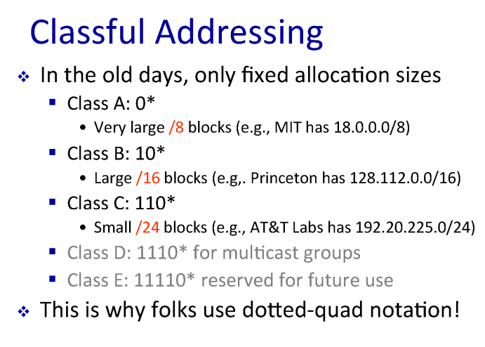

# 컴퓨터 네트워크 (한양대학교 이석복 교수님)

## 9강 네트워크 계층1

### 네트워크 계층 소개

App의 메시지를, Transport의 세그먼트를 어떻게 보낼것인가.  
핵심은 Transport 레이어에서 부터 배운다. 이런 기능을 위해 필요한 것이 그 유명한 IP이다.

그리고 이러한 것을 Routing 알고리즘으로, 다익스트라 알고리즘 등을 이용할 것이다.

### 네트워크 레이어

  
피지컬 레이어에서 패킷을 받아서,  
링크-네트워크 레이어로 올려보내고, 네트워크 레이어에서 목적지를 확인한 후  
피지컬 레이어로 내려보낸다.

### Fowarding과 Routing

라우터는 대표적으로 포워딩, 라우팅의 두 가지 작업을 한다.

fowrding : 패킷을 인접한 라우터로 이동시킨다.

routing : Source에서 목적지로 패킷의 경로를 결정한다.

#### 포워딩 테이블

  
포워딩 : 헤더를 확인한 후 다음 라우터로 전달한다.  
포워딩 테이블 : 헤더값과 내보낼 인터페이스 번호를 매칭시킨 것. 라우팅 알고리즘의 결과값으로 만들어진다.  
들어온 패킷의 목적지 주소(헤더)와 포워딩 테이블의 엔트리를 매칭시켜서 발송시키는 것.

(이때 dest 값은 범위로 구성한다.)

#### Longest Prefix Matching

  
첫번째 DA는 2번 인터페이스
두번째 DA는 1번 인터페이스도 매칭되고 2번 인터페이스도 매칭될 때에, 가장 길게 매칭되는 1번 인터페이스로 이동된다. Longest Prefix Matching

## 10강 네트워크 계층2

### 패킷(IP Datagram Format)

  
length - 패킷의 전체 길이  
source IP address, destination IP address  
time to live(TTL) - : 각 router를 거칠 때마다 -1. 무한루프 등이 일어날 때에 빠져나가게  
upper layer - 상위 레이어의 정보를 기입(receiver 측에서 사용. TCP인지 APPLICATION 인지 등)

TCP의 헤더는 20바이트, IP패킷의 Overhead는 20바이트 = Overhead는 총 40바이트  
(대부분의 패킷들이 최소한의 데이터만 가지고 40바이트로 끝나는 경우가 많음. 즉, ACK가 40바이트)

### IP Address (IPv4)

- ip는 고유한 32비트의 번호.  
  이를 8비트 단위로 끊어서 12.34.158.5로 표기 (0~255)
- IP주소는 NIC, 네트워크 인터페이스를 지칭하는 주소임(랜 카드가 여러개면 IP주소도 여러개 / 대표적으로 라우터는 여러개의 인터페이스를 가지고 있어 IP가 여러개임.)

#### Hierarchical Addressing: IP Prefixed (IP주소의 배정)

  
Grouping Related Hosts - 하나의 라우터에 여러개의 호스트가 연결되어 있음.

  
Hierarchical Addressing:  
라우터에서의 관리가 용이하도록(IP의 Prefix를 서로 다르게 하여 알고리즘의 처리 효율이 높도록) 계층화를 시켰음  
(12.34.158.0/24는 네트워크ID, 프리픽스, 서브넷ID 등으로 불림.

  
Subnet Mask : 어디까지가 Subnet인지를 표시.

<br>


#### 과거의 ip주소 배정방식 Classful Addressing

각 각의 네트웍은 자기 자신의 prefix를 가진다. prefix의 크기가 각기 다르다.

과거에는 클래스별로 ip주소를 배정하였다.  
  
ClassA는 /8블록을 가지며 `2**24`개(16777216개)의 호스트가 연결된다.  
8개의 블록, 시작값은 0으로 고정, 따라서 `2**7`개(128개)의 기관이 이 레이어를 가질 수 있다.(MIT, UCLA 등 인터넷을 선도한 기관이 선점.)  
<br>
ClassB는 /16블록(약 6만개), `2**16`개의 호스트.  
<br>
ClassC는 /24블록, `2**8`개(255개)의 호스트.
<br>
클래스 시스템의 문제는 배정할 수 있는 기관의 수와 배정할 수 있는 호스트의 수가 반비례.  
즉 Class A는 특정 소수의 기관이 사용할 수 있지만 호스트 수는 너무 많고,  
클래스 C는 사용할 수 있는 기관은 많지만 호스트 수가 너무 적다.

#### CIDR(싸이더) : Classless Inter-Domain Routing

  
클래스를 사용하지 않고 Subnet Mask를 사용하여 Prefix의 길이를 조절할 수 있음.  
한 기관이 갖고 있는 프리픽스의 갯수도 줄기 때문에 라우터의 포워딩 테이블의 크기도 줄어듬.

ex) Prefix가 24블록 - 255개의 호스트.  
Prefix가 22블록 - 1023개의 호스트.

#### Longest Prefix Match Forwarding

  
Fowarding Table에서 가장 길게 매칭되는 것.  
201.10.6.0중 블록의 크기/21, /23중 /23이 Longest Prefix이다.

#### 요약

현재의 IP는 CIDR(Classless InterDomain Routing) 방식.  
IP주소 32비트 중 24비트가 Subnet.  
이때 subnet의 크기는 네트워크의 크기에 따라 조절된다.
(subnet이 23비트면 호스트는 2\*\*9개)

### Subnet

  
Subnet : 같은 prefix를 가진 디바이스의 집합 (라우터를 쓰지 않고 물리적 접근이 가능한 호스트들의 집합)  
위의 예시는 총 3개의 서브넷을 가지고 있다. 라우터는 3개의 인터페이스와 3개의 ip주소/24를 가지고 있다.

라우터도 ip를 가진다. 인터페이스의 갯수만큼 지닌다.

아래의 예시에서 서브넷은? 총 6개 - 라우터와 라우터 간이 하나의 서브넷.


### Network Address Translation(NAT)

IPv4는 32비트. 2의 32개의 호스트(40억개)  
IPv6(1996년)는 128비트. 2의 128개의 호스트(지구의 모래알 갯수보다 많음)

근데 어떻게 아직도 IPv4를 씀...??


네트워크 내부에서는 고유한 IP를 쓰고, 네트워크의 외부로 진행할 때에는 NAT를 거쳐서 네트워크를 대표하는 IP(라우터의 ip)로 와 각 호스트를 대표하는 포트번호로 Translation함.

```
LAN side addr: 10.0.0.1, 3345
WAN side addr: 138.76.29.7, 5001
```


각각의 포트번호로 특정 Host를 추정함.

**NAT의 문제점**

1. 계층을 침범함 : 네트워크의 라우터가 TCP 헤더에 있는 포트번호를 참조하여 변경함.
2. 포트번호 지정 불가 : IP는 라우터를 찾아할 때 사용하고, 포트넘버는 프로세스를 찾아갈 때 사용함. 즉 다양한 포트를 사용하는 프로세스(서버 등)은 NAT를 사용할 수 없음.

- 또한 IPv4는 보안 문제 등이 발생하기에 IPv6이 더욱 확실한 해결책임.(단, 먼저 도입된 프로토콜이 생태계에 고착화되는 경향 + 미래에 새로운 요구사항 혹은 새로운 유연한 프로토콜이 등장할 수 있음.)

## 11강 네트워크 계층 3

### DHCP (Dynamic Host Configuration Protocol)

호스트가 네트워크로부터 고유한 IP를 할당받는 방법. 동적 주소(호스트가 구성(configuration)될 때마다 변경되는 주소)를 일정기간 할당하는 프로토콜.

(동적 주소와 대비되는 개념은 Static IP. 고정IP의 경우 10000개의 학생에게 10000개의 IP를 부여해야 하는 문제.  
DHCP는 Address Pool을 활성화된 호스트에게 배분하고 회수하면서 효율적으로 관리할 수 있음. )

```
IP : 192.168.1.47
Mask : 255.255.255.0
Router : 192.168.1.1
DNS : 192.168.1.1
```

Router: Router와 IP는 같은 네트워크를 사용하고 있다. (이때 라우터가 네트워크의 가장 앞에 위치한다. )  
DNS: 로컬 네임 서버(IP와 도메인명을 연결시키는 정보를 가진 서버)의 IP주소. 보통 라우터 안에 위치한다.

#### DHCP Client-Server Scenario

클라이언트는 서버도 모르고 아무 것도 모른다. 어떻게 서버를 찾고 DHCP를 할당 받는가.

클라이언트는 68번 포트를 리스닝한다.  
서버는 67번 포트를 리스닝한다.  


1. Client가 0.0.0.0. 목적지가 11111111 11111111 11111111 11111111 이다. 모든 비트가 1인 경우는 브로드캐스트를 의미함. 서브넷의 모든 호스트가 해당 메시지를 받게 됨.
2. 이때 항상 네트워크의 67번 포트는 서버인 호스트이다. 따라서 다른 호스트는 해당 메시지를 무시하고 서버인 호스트만 받아들이게 된다.
3. 서버는 68번 포트를 지정하여 브로드캐스트하여 yiaddrr(쌔로운 IP주소)를 Lifetime(3600초 = 1시간)와 함께 제안함
4. 클라이언트는 제안을 수락하는 의미의 Request를 transation id++로 전송함.
5. ACK는 IP, Mask, Router, DNS 등의 모든 정보를 가지고 있어 ACK의 정보를 통해 클라이언트는 Configuration이 됨.

한 네트워크에 여러개의 DHCP 서버가 있을 수 있어서, 때문에 브로드캐스트 된 Discover에 대해 여러 개의 offer가 발생할 수 있어서, 4-Way로 진행한다. 마찬가지로 Request 역시 여러 서버가 있을 경우를 대비해 브로드캐스트 하여 클라이언트가 선택한 Offer를 알려준다.


(위 사진과 달리) 일반적으로, 하나의 네트워크는 DHCP서버와 DNS서버, NATs, Firewall의 기능을 라우터에서 함께 처리한다.

통신사의 라우터에서 준 것은 IP주소가 하나인데, 어떻게 무선 공유기에 여러 디바이스를 연결...? 무선 공유기에도 NATs와 DHCP, DNS Server를 가짐. 즉 무선 공유기도 라우터.  
(즉, 무선 공유기와 NAT의 세상에서는 아이피가 같다는 것은 같은 네트웍에 있었다는 것 말고는 의미하지 않음.  
아이피는 고유한 것이 아니다...심지어 통신사의 라우터에서 NAT를 쓸지도 모르잖아..? )

#### IPv4: IP fragmentation and reassembly( Identifier, Flags, Offset)

Network Links별(이더넷, 와이파이, 3G, 옵틱, 광케이블 등)로 MTU(max.transfer size), 즉 최대로 보낼 수 있는 양이 정해져 있음.

MTU를 초과한 패킷나누기 위해 Fragmentation을 진행해야 함.


id : 기존 패킷 고유의 아이디를 공유
fragflag : 해당 패킷의 뒤에 frag된 패킷이 있는지. (마지막 패킷의 플래그가 0)

length:  
데이터그램이 4000바이트.  
이때 헤더가 20, 데이터가 3980.

해당 데이터그램을 MTU 1500bytes에 맞게 3개로 Fragmentation한다면,  
length는 1500, 헤더가 20이니 데이터는 1480.

offset: 각 패킷이 전체 패킷에서 시작하는 지점.
1번 패킷 : 데이터 0~1479  
2번 패킷 : 데이터 1480 - 2959  
3번 패킷 : 데이터 2960 - 3999  
1480의 비트를 <<<3 하면 185. 헤더의 크기를 줄일 수 있음.

## 12강 네트워크계층4

### ICMP internet control message protocol

사용자의 메시지를 운반하기 위한 프로토콜. 이벤트가 발생하는 경우 어떤 라우터에서 어떤 이벤트가 발생했는지 Source에게 리포트함(네트워크 진단에 유용함)

가령 Source가 보낸 패킷이 Time To Live가 만료되어 IP Packet이 드랍되는 경우, TTL expired로 Source에게 Control Message를 전달하게 됨.

### IPv6


address가 128bits라는 점이 특징임.

**Tunneling**
  
IPv4와 IPv6의 공생을 위해 IPv4와 IPv6를 모두 이해하는 라우터의 존재가 필요.  
버전을 다르게 쓰는 라우터에 packet을 보낼 때, 알아볼 수 있는 header에 감싸서 보냄

### Routing Algorithm

라우터는 fowarding table에서 Longest Prefix를 lookup만 하면 됨.  
즉 라우터의 성능을 위해서는 fowarding table을 만들어내는 라우팅 알고리즘이 중요함.

**Graph abstraction(그래프 추상화)**
node: router  
edge: link  
value: link cost(거리 혹은 트래픽 양)  
=> 최소 비용을 구하는 문제와 동일

**알고리즘의 종류**
알고리즘에 사용되는 정보의 종류로 구분된다.  
link state : 모든 라우터가 모든 정보를 알고 있음. 즉 전체 네트워크의 Topology(네트워크의 구성을 의미)를 알고 있으며, 각각의 비용을 알고 있음.  
distance ventor: 이웃한 노드와 정보를 교환.

#### Link State

전체 네트워크 정보를 알기 위해서 모든 라우터들이 자신들의 정보를 브로드캐스트함. (즉 각 링크(Link)의 정보(State)를 브로드캐스트함)

최단경로를 구하기 위해 '다익스트라' 알고리즘을 시행

##### 데이크스뚜라 알고리즘

**출발지 U**  
**Fowarding 테이블**  
|destination | 경로|
|---|---|
|v| ?|
|w|?|
|x|?|
|y|?|
|z|?|


1. 출발 노드를 설정한다.
2. 최단 거리 테이블을 초기화한다.
3. 방문하지 않은 노드 중 최단 거리가 가장 짧은 노드를 선택한다.
4. 해당 노드를 거쳐 다른 노드로 가는 비용을 계산해, 최단 거리 테이블을 갱신한다.
5. 위 과정에서 3번과 4번 과정을 반복한다.

다익스트라 알고리즘의 복잡도는 `O(n^2)`이며, 효과적인 시행은 `O(nlogn)`으로 실행한다.


최소힙 : 가장 작은 값을 선택하기 위해 사용되는 자료구조.
위 그림은 완전 이진트리 형태로 구성되어 있으며, min-Heapify()를 실행하면, 가장 작은 원소를 반환하고 O(logN)의 시간복잡도로 트리를 갱신한다.

모든 비용이 같을 때에 : 비용이 업데이트 될 때마다 경로가 시계, 반시계로 순환하게 된다. (0인 라우트에 1인 파일을 전송하고 있다면..... 비용이 1110, 0111 이렇게 업데이트 됨.)  
  
현실적으로 : 브로드캐스트의 범위는 하나의 네트웍으로 제한된다. 네트웍 내부에서는 다익스트라 알고리즘을 쓴다. 그렇다면 네트웍과 네트웍을 이을 때에는...? Distance vector algorithm(벨만-포드 알고리즘)을 쓴다.
  
x 노드가 경로가 2개 이상 떨어진 y에 갈 때에, 인접한 노드를 거친다.  
그렇다면 x에서 인접한 노드 a, b, c중 하나를 만날 때인데,
이때 a에서 y, b에서 y, c에서 y까지의 최단 경로가 있을 것이다.
그리고 a, b, c는 각각 인접한 노드가 있고, 해당 인접한 노드에서 y로 가는 최단 경로가 있고...
최단경로의최단경로가되고최단경로의최단경로가최단경로의최단경로가되고드듸어나와나의아버지와나의아버지의아버지와나의아버지의아버지의아버지노릇을한꺼번에하면서살아야하는것이냐

