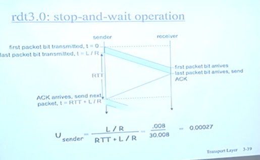
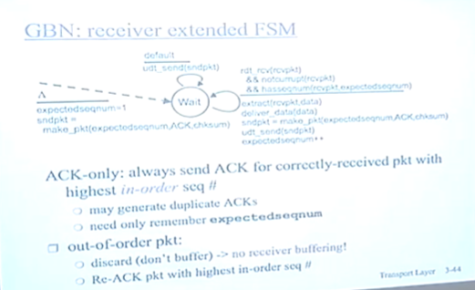
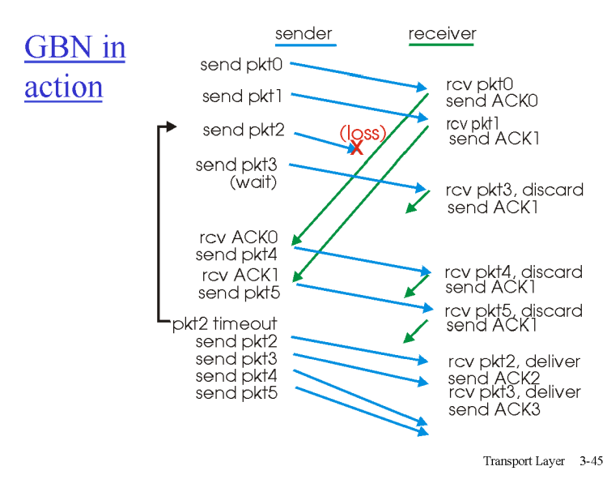
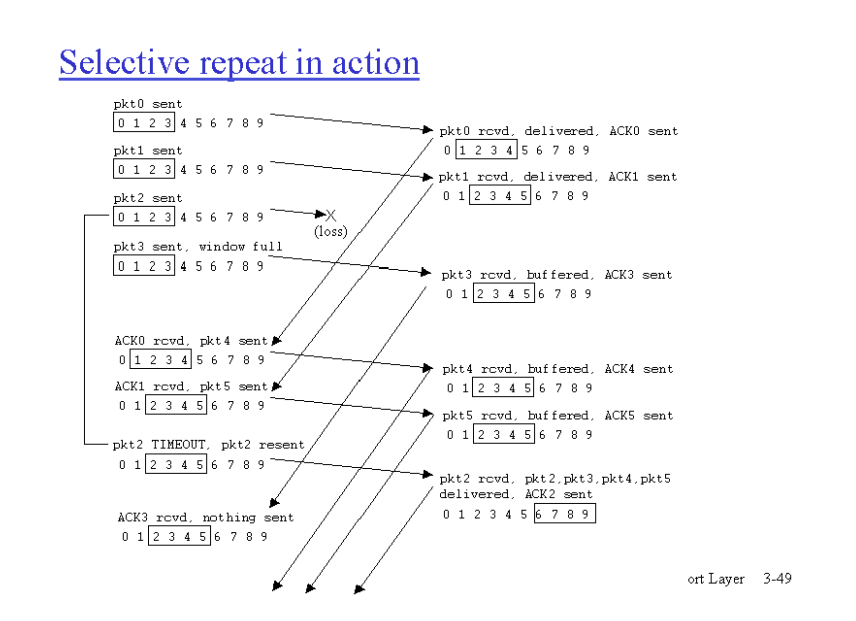
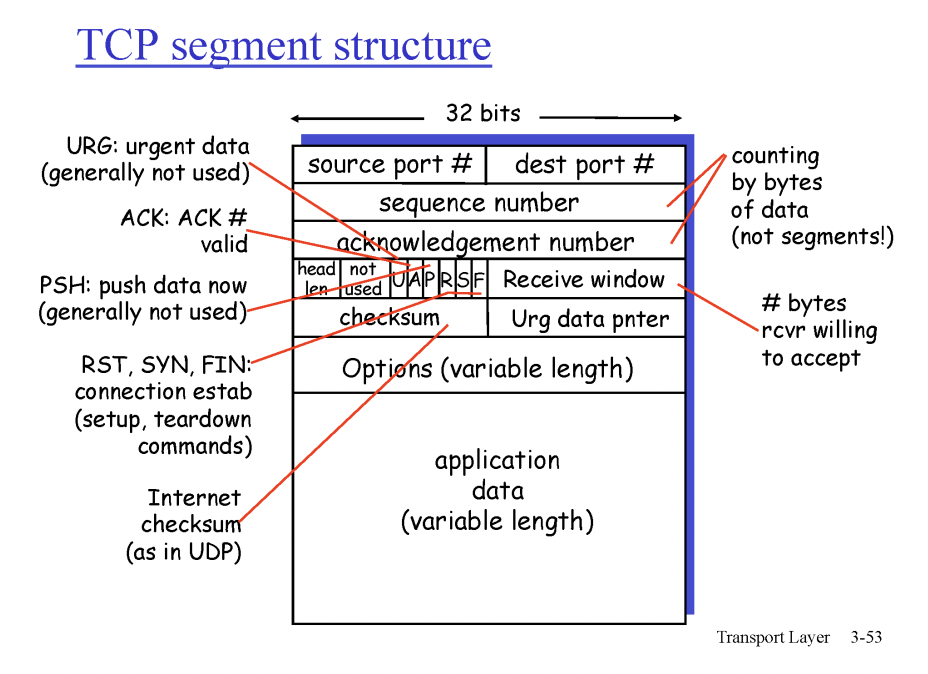
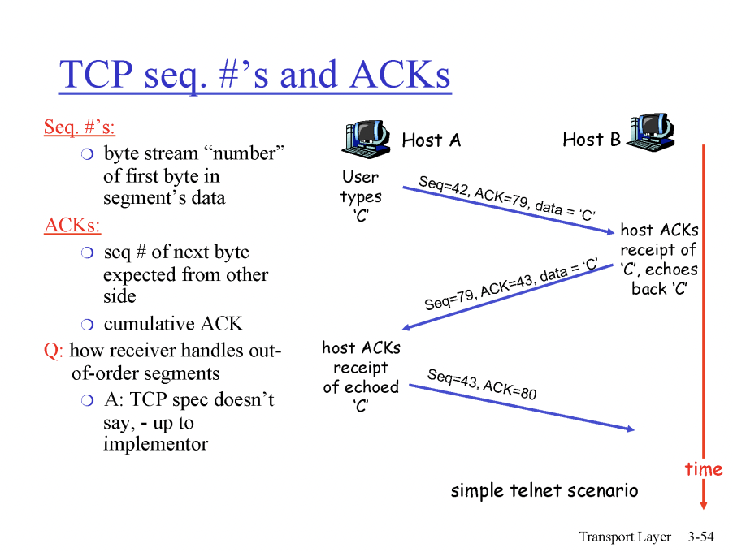

# 컴퓨터 네트워크 (한양대학교 이석복 교수님)

## 5강 전송계층 1

### RDT3.0 모델의 효율문제
전체 시간 중에 네트웍을 사용하는 시간이 클 수록 네트워크의 효율이 좋다.  
  
   
  
패킷을 하나 전송하고 하나 피드백 하나를 받는 모델의 경우, 패킷을 보내고 기다리는 시간이 길다. 
U(Utilization)을 구해보면, (패킷의 길이/패킷을 전송하는데 걸리는 속도) / 패킷을 하나 보내고 나서 대기하는 속도+(패킷의 길이/패킷을 전송하는데 걸리는 속도)  = 0.027 수준.  
  
### 네트워크 효율 개선방안 : 파이프라인 전송
패킷을 한 번에 여러개 보내면 Utilization이 증가한다. 

**파이프 라인 전송의 접근법 : GBn, SR**
- 파이프라인 두가지 일반적인 접근방법 - go-Back-N, selective repeat.

### go-Back-N 방식
- 한 번에 많은 패킷을 발송한다.   
- 패킷의 갯수를 정하는 기준 - window size.  
가령 winodow size가 4라면 0,1,2,3를 보낸다.    
ACK는 cumulative ACK이다. ACK #11은 11번까지 받았다는 의미.  
- Sender는 각 패킷에 대한 타이머를 가진다.  
1번 패킷이 Time Out되면 1, 2, 3을 모두 재전송한다.  

**GBN 모델에서의 Sender의 행동 FSM**  

   

- Window Size 설정,
- **전송**: Window Size만큼 #base, #base+1, ... , #base+windowSize-1 만큼 전송, 타이머 작동. 
- **추가전송**: 전송이 끝나면 #base+windowSize부터 추가로 전송, 타이머 작동  
- **Time Out** : #base를 Time Out이 발생한 시퀀스 번호로 하여 windowSize만큼 재전송  

**GBN 모델에서의 RECEIVER의 행동 FSM**  
RECEIVER의 행동은 상대적으로 단순하다.   

- ACK#i에 대해, 
1) `도착한 패킷# == i` => `i++`
2) `도착한 패킷# != i` => 패킷 폐기

ACK #0 이면 #1패킷을 기다리고, 먼저 도착한 #2, #3은 버린다.   

**GBN 모델 예시**  

  
   
 

- Time Out이 발생한 #N로 window를 되돌려서 go-back-N
- window 안에 있는 애들은 아직 cumulative ACK를 받지 않았기 때문에 재전송을 대비해 buffer에 저장해야 한다.  

**장점**  
구조가 단순  
Reciver는 데이터를 폐기하기 때문에 버퍼가 필요 없음.  

**문제점**  
현실에서는 windowSize가 거대하다.  
손상/분실된 프레임 이후의 프레임을 모두 재전송하는 GBn ARQ는 windowSize만큼의 패킷 재전송이 빈번하게 일어난다.  

### Sective Repeat
문제가 발생한 패킷만 재전송한다.   
이를 위해서 버퍼가 필요하며, 각 패킷에 타이머가 있다.   
Receiver는 받은 패킷에 대한 ACK를 전송한다.    

**SR 모델 예시**
 

  

패킷 2번이 Loss 나는 경우, 2~5에서 대기.   
0~5번 모두 ACK를 받고, 2번 패킷만 TimeOut 나는 경우,   
2번 재전송하고, 6,7,8,9 전송  

**장점**  
네트워크 부하가 적음  

**단점**
Receiver의 구조가 복잡해짐.  

**SR 모델의 딜레마 : Sequence 넘버를 몇으로 설정할 것인가?**  
RDT 3.0에서는 시퀀스 넘버가 0~1이었다.  
SR모델은 버퍼를 사용하기 때문에 (windowSize+1)보다 큰 시퀀스 넘버가 필요하다.   

얼마가 필요한가? 대~충..두 배 언저리?  

## 6강 전송계층 2
### TCP 개론
- Point-to-point : 1 sender - 1 receiver 소켓 한 쌍 끼리의 통신.
- reliable, in-order byte stream : 순서대로, 유실 없이. / message boundary 방식이 아닌 byte단위의 순서대로.
- pipelined : TCP congestion and flow control set window size
- send & receive buffers : 각 소켓은 버퍼를 가진다. (윈도우 크기만큼의 버퍼 - 센더는 재전송을 위해, 리시버는 SR을 위해 - 즉 각 소켓은 sender이자 receiver, 전송과 수신을 위한 버퍼를 가진다.)
- full duplex data : 양방향 통신(각 소켓은 센더이자 리시버이다.) 
- connection-oriented : 데이터교환 전 handshaking(exchange of control messages)를 통한 연결
- flow controlled : sender는 receiver의 버퍼 능력에 맞게 보낸다.
- congestion controlled: 네트워크의 상황에 맞는 영량 만큼.

#### TCP 세그먼트 구조

**레이어 별 전송 단위**  
APP - 메시지  
TCP - 세그먼트 (헤더와 데이터(메시지를 포함한))  
네트워크 레이어 - 패킷 (헤더와 데이터(세크먼트를 포함한))  
링크 레이어 - 프레임 (헤더와 데이터(패킷을 포함한))  

전송에서 중요한 부분은 헤더이다.  

**TCP 세그먼트 헤더**

  

포트 번호 : 각 각 16비트  
(한 컴퓨터에서 2의 16승만큼(6만5천...)의 응용프로그램을 동시에 작동시킬 수 있다.)  
시퀀스 넘버 :    
ACK 넘버 :    
checksum : 에러 감지    
Receive Window : 버퍼에 남아 있는 공간을 알려주기 위한.   
등등..

### TCP의 동작 원리

 
  

 
에코서버(클라이언트의 요청에 따라 클라이언트의 요청을 리스폰스로 에코하는 서버)  
Seq# : 각 세그먼트의 데이터(앱의 메시지) 별 가장 앞에 있는 바이트의 번호.(메시지를 10바이트씩 쪼갰다면 0, 10, 20순으로 Seq# 진행)   
cumulative ACKs : 현재 기다리고 있는 메시지의 번호 (ACK#10 = 10번 못 받았다.(9번까지 받았음))    
(위 모델은 자신의 데이터와 함께 자신의 ACK를 보내는 상황.
자신이 보낼 데이터가 없이 ACK만 해야하는 경우는 추후에 다룸. (Timing))

### 타임아웃의 설정
**Round Trip Time과 타임아웃 관계**
- RTT가 각 세그먼트별로 다르다. (각 세그먼트별로 경로가 다르고, 큐잉 딜레이가 변화하기 때문에)
- EstimatedRTT = (1-a) * EstimatedRTT + a * SampleRTT
a = 0.125  
현재의 네트워크 값을 일부 반영하여 보정하는 RTT  
타임 아웃의 기준값이 된다.  
**해당 기준값에 일부 마진을 더한다.**  
TimeoutInterval = EstimatedRTT + 4 * DevRTT
이때 DevRTT 는 "Safety Margin"이다. 
DevRTT = (1-b) * DevRTT + b*(SampleRTT - EstimatedRTT)  
b = 0.25  

#### TCP Realiable Data Transfer
- 파이프 라인 방식
- Cumulative Acks
- 하나의 retransmission Timer
(GBn과 마찬가지로 타임아웃은 하나지만 SR과 마찬가지로 누락된 것만 재전송.)

**TCP 재전송 시나리오**
63페이지  

   

   

세번째 시나리오가 ACK를 늦게 보내도 되는 이유. **TCP에서는 Delayed ACK를 권장한다.**   

한편, Timer 시간이 길다. Timer가 초과되기 전에 유실된 번호를 알 수 있다. 0, 10, 20, 30, 40, 50, 60, 70, 80, 90 세그먼트를 보냈는데 Timer가 expired되기 전에 AKC10, ACK10이 계속해서 들어온다면 10번 패킷이 유실되었을 것이라 예상할 수 있다.  
**TCP에서는 중복된 ACK이 3개 연속 들어온다면(즉, 4번째 ack10을 받을 때에) 재전송을 권고하고 있다.(fast retransmit)**

## 7장 전송계층
TCP에서 중요한 것 3가지 rdt, flow control, congestion control.

### TCP : Flow Control
데이터 전송 속도를 Receiver가 수용할 수 있는 양을 넘기지 않도록 조절.  
TCP에서는 Receiver가 자신의 수용가능량을 세그먼트의 헤더에 담고있기 때문에 단순하게 구현된다.  

각 소켓는 Send buf와 recv buf를 가지고 있음.  
(recv buf는 read()를 이용해 응용계층으로 전달됨.)  

Sender는 send buf에 있는 데이터를 receiver의 recv buf의 available space만큼만 보낸다.  

이를 위해 receiver는 TCP 세그먼드의 HDR에 자신의 available space 정보를 담아 전달한다.  

#### Flow Control 원리
세그먼트의 RcvWindow 값으로 남은 버퍼 용량을 전달한다.  
`spare room in buffer = RcvWindow = RcvBuffer-[LastByteRcvd] - [LastByteRead]`  

Flow Control은 Read() 속도에도 영향을 받는다.  
만일 Receiver의 마지막 피드백에서 RcvWindow가 0이었다면?   
TCP에서 Sender는 Receiver가 새로운 피드백을 보내도록 Header만 담은(데이터가 1비트 정도인) 세그먼트를 Receiver에세 전송해서 Receiver의 RcvWindow 정보를 갱신한다.  

    flow control의 Flow는 보내는 양? 보내는 속도? - 속도는 단위시간당 보내는 양을 의미한다. flow control은 보내는 양을 제한하지만, 속도를 조절한다고 표현하는 것은 큰 관점에서 볼 때에는 보내는 양을 제한하면 속도가 줄어들기 때문에.  

### Connection Management
#### Connection Establishment(3-way handshake)
통신을 위해서는 두 개의 소켓이 자신들이 보낼 seq#s와 RcvWindow를 전달하고, 상대방의 seq#과 buffer 정보를 알아야 함. 이 과정dl Connection Establishment. 3-way handshake 총 3번 정보를 전달받음.  

    

     

1) SYN : TCP 커넥션을 열겠다는 의사표시 - 세그먼트 해더의 syn을 1로 전달함.    
2) SYNACK : TCP 커넥션 요청에 대한 응답 - syn을 1로, ack에 seq#x+1을   
3) ACK : SYNACK에 대한 응답. 이 단계부터 어플리케이션 데이터 전달 가능.  

SYNACK에 대한 ACK가 있어야 client is live인지 확인할 수 있다. (만약 무책임한 sender가 무차별적으로 syn을 브로드캐스트 한다면...?) 그래서 SYNACK에 대한 ACK가 들어와야 Receiver는 버퍼를 만든다.  

이를 HTTP와 결합하여

1) 클라이언트: SYN   
2) 서버: SYNACK  
3) 클라이언트: ACK + HTTP REQUEST
의 방식으로 주고받는다.  

#### Connection Closing
1) 클라이언트: FIN  
2) 서버: ACK + FIN   
3) 클라이언트: ACK  
4) Timed Wait  
5) 클라이언트(close)  

이때 클라이언트는 ACK를 보낸 후에도 Timed Wait(약 3초)를 갖는다. 3)에서 보낸 ACK가 유실된 경우에 대비하기 위함이며, 만일 해당 ACK가 유실됐다면 Server는 Timed Wait 기간 동안 2)의 ACK+FIN을 재전송 할 것이다. (이때 server의 타임아웃 시간을 모르니까 널널하게 충분히 기다렸다가 포트를 release하는 것.)  

#### TCP Lifecycle

### TCP Congestion Control 개요
네트웍의 속도는 Receiver와 Network 중 더 적은 쪽에 맞추어 전송해야 한다.  
Recv의 상태는? 세그먼트에 담겨 있다.(flow control)  
Network의 상태는?...  

네트워크는 하나의 집합체이며, 소유주가 없는 Public, 또한 사용자는 속도를 최대한으로 높이고 싶어 함. congestion 발생.   
TCP의 관점에서 Congestion의 의미 : network이 막혔다는 것은 패킷의 유실, 재전송양 증가, congestion 악화, TCP의 실패.  

결국 TCP는 독립적으로 동작하되, Public을 위해서 congestion을 control해야 작동가능한 프로토콜.   

그렇다면 Congestion여부는 어떻게 알 것인가?  

Network-assisted congestion control : 라우터들의 현재 상태를 피드백 하는 것(불가능.... 라우터 성능 더 떨어짐.)  

End to end constion control : 네트워크는 피드백이 없음. Server/Client에서 네트워크 상황을 유추. ACK가 안오는 경우 혹은 ACK가 오는 속도 등을 통해 네트워크 상황을 유추.  

## 8장 전송계층
### TCP : Congestion Control
발송자의 최대 속도만큼 정확하게 수신자가 받는 것이 이상적.
TCP에서 발송자가 많이 보내면 네트워크에 과부화 + 네트워크의 수용양을 파악할 수 없는 문제.   

네트워크 상에서 병목현상이 발생하는 부분을 중점적으로 해결해야 함. 발송자와 수신자가 서로 소통하며 네트워크 상황을 파악해야 함.  

발송자가 조심스럽게 발송 속도를 높여나가는 것도 중점 중 하나.  

#### 3 main phases
1) Slow Start
2) Additive increase
3) Multiplicative decrease

MSS(Maximum segment size) : 세그먼트 하나의 최대 크기는 500bytes.  

Slow Start 구간에서는 1MMS로 시작
WindowSize를 2MMS, 4, 8, 16, 32로 두 배씩 증가시킴. (급수로 증가하니까 Slow가 아닌거 같기도..?)   

Additive Increase 구간에서는 Threshold 지점을 넘어서부터 Linear하게 신중하게, 32, 33, 34로 증가.  

Multiplicative Decrease 구간에서는 패킷 유실이 발생했을 때 34->17로 속도를 절반으로 줄이고 다시 increase.  

병목현상을 줄이기 위해서는 모든 사용자가 속도를 확 줄여야만 해결할 수 있음. 그래서 Multiplicative하게 Derease.  

  
네트워크의 최대 수용속도를 알지 못하고, 최대 수용 속도가 지속적으로 변하기 때문에, 톱니바퀴와 같은 모양으로 찾아가야함.   

#### Congestion Control : 전송 속도
Sender의 limits transmission : `LastByteSent - LastByteAcked <= CongWin`  
`rate = (CongWin / RTT)byte/sec`   
이때 RTT(Round Trip Time)은 비교적 안정되어 있음. 따라서 Congestion Window의 변동에 영향을 받으며, Congestion Window는 네트웍의 영향을 받음.  

#### 패킷 유실의 탐지와 TCP의 대응 : TAP Tahoe와 TCP Reno
  
가로가 RTT, 세로가 CongWin (그림이 잘못됨)  

패킷 유실이 감지되면 Thre.값을 8에서 6으로(패킷 유실이 탐지된 값의 1/2로)  
80년대 초의 Tahoe는 1부터 시작하여 6을 Thre.로 하는 모델이었으나,  
두 번째 버전인 Reno는 Thre.부터 Linear Start.  

**패킷 유실을 탐지하는 방법**
1) Timeout
2) 1ACK 3dupACK

이때 Timeout인 경우, 네트워크 상황 : 패킷이 줄줄히 유실된 경우. 즉 네트워크 상황이 좋지 않은 경우. 

1ACK 3dupACK : 네트워크는 잘 운영되나 하나의 패킷만 유실된 경우. (유실된 패킷 이후의 패킷은 잘 갔기 때문에 3dupACK)

**TCP Reno는 3dupACK상황에서 CongWin을 절반으로만 줄인다.**  
만일 Timeout인 경우엔 CongWin을 1로 줄인다.  

 
첫 Thre.는 어떻게 잡을까?... 구현하는 사람 마음. 첫 Thre.없이 진행하는 것이 현실적.  

#### TCP 공정성
Bandwidth가 R일 때.  
TCP Connection 1이 R만큼 전송하고 있다.  

TCP Connection 2가 Router에 접속한다면,  

TCP Connection 1과 TCP Connection 2가 R/2씩 Fair하게 나눠 가질까?  

  

TCP Connection 2가 패킷 유실이 일어날 때에 TCP Connection 1도 함께 패킷 유실이 일어나 동시에 CongWin을 절반으로 줄인다.  
이 과정이 반복되며 두 TCP가 Fair한 위치로 수렴한다.  
(물론 한 사용자가 TCP Connection을 N개 열면 그 사람은 전송속도가 더 빠르다.)
