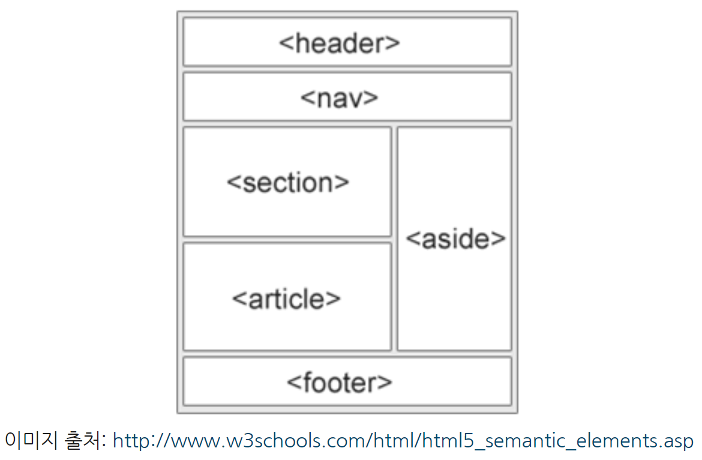
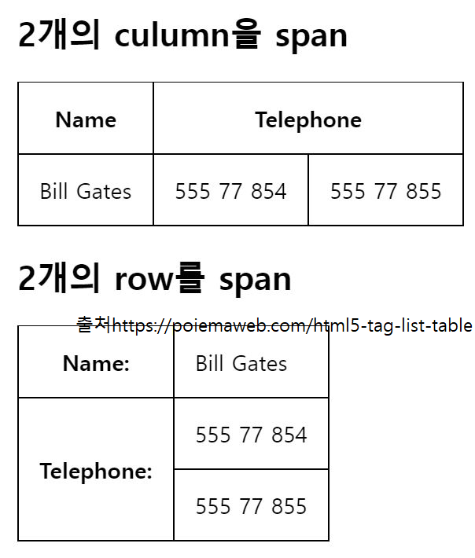

# 1 HTML
HTML은 하이퍼텍스트 '마크업 랭귀지'이다. '프로그래밍 랭귀지'와는 다르다...!  
본 문서에서는 'Do it! 웹 표준의 정석' 내용과 Poiemaweb을 심적표상을 위해 요약한 내용이다.

## 1. HTML의 기본 구조

```html
<!DOCTYPE html>                 <!--웹문서 유형을 지정-->
<html lang="en">                <!--웹문서의 시작-->
<head>                          <!--브라우저가 알아야하는 정보 및 메타데이터-->
    <meta charset="UTF-8">
    <title>Document</title>     <!--브라우저 탭에 표시될 제목-->
    
                                <!--스타일 삽입 구간-->
    <link rel="stylesheet" href="css/style.css">            <!--link 태그는 외부 리소스(주로 스타일 시트)와 연결을 정의함-->
    <style>                     

    </style>
</head>

<body>                          <!--본문의 시작 (실제 렌더링 될 내용)-->
    
                                <!--자바스크립트 삽입 구간(관습적으로 바디 태그가 끝나기 직전 위치-->
    <script src="js/change-color.js"></script> 
</body>
</html>                         <!--웹문서의 끝-->
```

## 2. 시맨틱 태그
웹브라우저 리더기, 검색크롤링봇 등을 위해서 사용하며, 시멘틱을 준수하는 것이 좋다.


`<header></header>` 머릿글  
`<nav></nav>`링크 모음  
`<main></main>`핵심 콘텐츠. 섹션이 여러개일때 묶는 용도  
`<section></section>`여러 아티클을 포함하는 공간  
`<article></article>`본문의 주 내용이 들어가는 공간   
`<footer></footer>`사이트 하단에 사업자 정보 등 기입란

## 3. 텍스트 관련 태그

### 제목
`<h1>~<h6> </h6>~</h1>` 제목 관련 태그(시멘틱함)  

### 포맷팅
`<b></b>` 볼드체  
`<strong></strong>` 볼드체 (시멘틱함)  
`<i></i>` 이탤릭체  
`<em></em>` 이탤릭체(시멘틱함, emphasized)  
`<small></small>` 작은 글씨  
`<mark></mark>` 형광펜칠  
`<del></del>` 취소선  
`<ins></ins>` 글자 추가 (밑줄로 렌더링)
`<sub></sub>` 아랫첨자
`<sup></sup>` 윗첨자

### 본문
```
<p></p>: 단락  
<br>: 줄바꿈
&nbsp; : 공백
<pre></pre> : 형식화 (코드박스 등)
<hr> : 수평선
<q></q> : 인용문(""로 감싸짐)
<blockquote> </blockquote> : 큰 인용문. (들여쓰기 됨)
```

## 4. 하이퍼 텍스트(a태그)

`<a></a>` : 하이퍼링크. anchor tag 내지는 a tag라 불림


**href 어트리뷰트** : 파일 경로(path)를 받는다. 


href 어트리뷰트가 경로로 받는 값은 절대 url, 상대 url, #id(fragment identifier라 불림), 메일(mailto:  ), 자바스크립트(href=”javascript:alert(‘Hello’);”)

target 어트리뷰트:   
`target="_self"` 기존창에 열기(기본값)
`target="_blank" rel="noopener noreferrer"` 새창에서 열기 (noopener noreferrer 어트리뷰트로 피싱공격에 대비하는 모습)

```HTML
<a href="http://www.google.com" target="_blank" rel="noopener noreferrer">Visit google.com!</a>
```

그 밖의 어트리뷰트: download, medea, type 등


## 5 리스트와 테이블
**순서없는 목록**
<ul>
      <li>Coffee</li>
      <li>Tea</li>
      <li>Milk</li>
</ul>

```html
<ul>
      <li>Coffee</li>
      <li>Tea</li>
      <li>Milk</li>
</ul>
```
<br>

**순서있는 목록과 어트리뷰트**
<ol type="a">
  <li value="2">Coffee</li>
  <li value="4">Tea</li>
  <li>Milk</li>
</ol>
<br>

```html
<ol type="a">
  <li value="2">Coffee</li>
  <li value="4">Tea</li>
  <li>Milk</li>
</ol>
```
type 어트리뷰트: "1", "A", "a", "I", "i"  
start 어트리뷰트: 시작값 지정 (start="3")  
`<ol reversed>` : 거꾸로 표현


목록은 중첩 가능하며 네비게이션 만들때 주로 쓴다.


**테이블의 태그**
```html
    <table border="1">
      <tr>
        <th>First name</th>
        <th>Last name</th>
        <th>Score</th>
      </tr>
      <tr>
        <td>Jill</td>
        <td>Smith</td>
        <td>50</td>
      </tr>
      <tr>
        <td>Eve</td>
        <td>Jackson</td>
        <td>94</td>
      </tr>
      <tr>
        <td>John</td>
        <td>Doe</td>
        <td>80</td>
      </tr>
    </table>
```

heading을 의미하는 th는 선택이다.    
하지만 tr와 td는 하나 이상 필수다.  

border 어트리뷰트 : 표 테두리 지정 (하지만 css의 border 프로퍼티를 보통 사용한다)  

rowspan : 위 아래로 행 병합  

colspan : 좌 우로 열 병합 

```html
    <style>
table, th, td {
        border: 1px solid black;
        border-collapse: collapse;
      }
...

    </style>

<body>
...
<th colspan="2">Telephone</th>
...
<th rowspan="2">Telephone:</th>
      
```


## 6 이미지, 동영상, 음악, 멀티미디어
``: 그림 넣기.  
어트리뷰트는 src, alt, width, height  
``

<br>

`<audio></audio>` : 오디오 넣기  
src, controls, preload, autoplay, loop
<audio src="assets/audio/Kalimba.mp3" controls></audio>
`<audio src="assets/audio/Kalimba.mp3" controls></audio>`

<br>

`<video></video>` : 비디오 넣기  
src, poster, preload, autoplay, loop, controls, width, height

`<video width="240" height="180" controls>`

## 7 Form
```html
<form>
nput, textarea, button, select, checkbox, radio button, submit button 등의 입력 양식 태그를 포함
</form>
```

form태그의 어트리뷰트 action, method 

**action = "URL"** : 입력되이터가 전송될 주소  
**method =** "get" 혹은 "post" : get은 쿼리스트링으로 보낸다. (....com/posts?userId=1&id=1) post는 request body에 담아서 보낸다(...com/posts)

```html
    <form action="http://jsonplaceholder.typicode.com/users" method="get">
      ID: <input type="text" name="id" value="1"><br>
      username: <input type="text" name="username" value="Bret"><br>
      <input type="submit" value="Submit">
    </form>
```
http://jsonplaceholder.typicode.com/users?id=1&uername=Bret 으로 보내진다.

### input태그의 type어트리뷰트
input태그는 주로 form안에 포함된다.
button  
checkbox  
color : #000000형식으로 으로 된 컬러 선택창  
date : 년월일 생성
datetime-local : 지역 년월일시분초 생성  
email : 이메일 폼. submit시 자동 검증함.  
file  
hidden : 감추어진 입력폼. submit할 때 필요한 정보들을 숨겨두는 역할로 많이 씀.  
image : 이미지로 된 submit버튼
month  
number  
password  
radio  
range  
reset  
search  
submit  
tel  
text  
time  
url  
week  

### 기타 전송태그
form태그 없이도 사용되는 전송태그 들이다.


Select태그: 서버에 전송되는 데이터는 select 요소의 name 어트리뷰트를 키로, option 요소의 value 어트리뷰트를 값으로하여 key=value의 형태로 전송된다.  

```html
    <select name="cars1">
      <option value="volvo" selected>Volvo</option>
      <option value="saab" disabled>Saab</option>
      <option value="fiat">Fiat</option>
      <option value="audi">Audi</option>
    </select>

    <select name="cars2" size="4" multiple>
      <option value="volvo">Volvo</option>
      <option value="saab">Saab</option>
      <option value="fiat">Fiat</option>
      <option value="audi" selected>Audi</option>
    </select>

    <select name="cars3">
      <optgroup label="Swedish Cars">
        <option value="volvo">Volvo</option>
        <option value="saab">Saab</option>
      </optgroup>
      <optgroup label="German Cars" disabled>
        <option value="mercedes">Mercedes</option>
        <option value="audi">Audi</option>
      </optgroup>
    </select>
```


textarea태그: 여러줄의 값을 입력할때 사용한다. 사이에는 기본값을 줄 수 있다.

  <body>
    <textarea name="message" rows="10" cols="30">Write something here</textarea>
  </body>

```html
  <body>
    <textarea name="message" rows="10" cols="30">Write something here</textarea>
  </body>
```


button태그 : type 어트리뷰트는 반드시 지정하는 것이 바람직하며 어트리뷰트값으로 button, reset, submit를 지정할 수 있다.  

```html
    <button type="button" onclick="alert('Hello World!')">Click Me!</button>

    <input type="button" value="Click Me!" onclick="alert('Hello world!')">
```

<button type="button" onclick="alert('Hello World!')">Click Me!</button>

<input type="button" value="Click Me!" onclick="alert('Hello world!')">

fieldset / legend : fieldset으로 그룹화하는데에 사용된다.
      <fieldset>
        <legend>Login</legend>
        Username <input type="text" name="username">
        Password <input type="text" name="password">
      </fieldset>

```html
      <fieldset>
        <legend>Login</legend>
        Username <input type="text" name="username">
        Password <input type="text" name="password">
      </fieldset>
```
