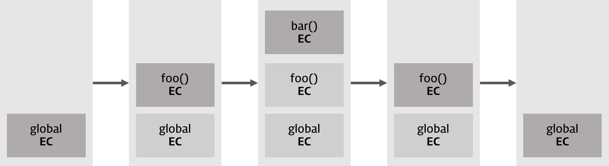

## 23. 실행 컨텍스트
우리가 어떠한 할 일을 관리할 때에 할 일 계획을 만든다. 아래는 회사에 출근하여 퇴근할 때까지 할 일들의 계획이 추가되고 완료되는 모습이다.  


이처럼 나중에 생긴 일을 먼저 처리하는 것, 즉 후입선출하는 방식을 프로그래밍에서는 '스택' 자료구조라 한다.   

<br>
자바립트엔진도 코드를 실행하기 위해 필요한 정보들을 미리 수집하고 추상화한다. 자바스크립트 엔진이 만들어내는 추상화된 할 일 계획을 '실행 컨텍스트'라고 한다. 이러한 실행 컨텍스트는 자바 스크립트를 처음 실행할 때(전역), 함수를 만날 때, 그리고 es6부터는 `{블록문}`을 만날 때 생성된다.  

### 실행 컨텍스트 스택
https://poiemaweb.com/ 의 예시를 살펴보자.

```js
var a = 1
function foo(){
    function bar(){
    }
}
foo()
```

함수를 만날 때마다 실행 컨텍스트가 생성되며, 해당 컨텍스트들이 스택 자료구조로 관리되는 것을 볼 수 있다.   
스택에 Push되는 순서는 상위 컨텍스트 -> 하위 컨텍스트 순이고,   
실행이 완료되고 Pop되는 순서는 하위 컨텍스트 -> 상위 컨텍스트 순이다.  

### 실행 컨텍스트의 구성
실행 컨텍스트는 세가지로 구성된다. VariableObject컴포넌트, LexicalEnvironment컴포넌트, thisBinding.  
이 중 this binding은 해당 구문이 실행될 때에 어느 것과 연결되어 실행되는지를 결정하는 요소이며, 연결된 것이 없다면 자연스레 전역를 의미하게 된다.  

 
실행컨텍스트의 VariableObject와 LexicalEnvironment는 렉시컬 환경을 참조하여 만들어진다.  


실행 컨텍스트의 생성 단계에서는 VariableObject와 LexicalEnvironment의 값이 같지만, ES6+부터는 VariableObject는 값을 스냅샷 해두는 용도이며, 실제로 참조되고 실시간으로 값이 변경되는 것은 LexicalEnvirionment이다.

### 소스코드의 평가와 실행
자바스크립트의 실행은 평가단계와 실행단계로 나뉜다.  
스크립트를 최초에 실행했을 뿐만 아니라, 함수, 블록문 등을 만났을 때에도 평가-실행 단계를 거친다.  
   
평가단계 : 평가 단계에서 `var a`와 같은 선언문들을 먼저 실행한다. 이를 바탕으로 자신의 스코프에 어떠한 식별자들이 있는지를 담는다.(Lexical Environment의 Environment 레코드에 담는다.) 평가가 끝나면 이 평가 결과를 바탕으로 실행 컨텍스트가 생성된다.  

실행단계 : 평가단계가 끝나면 소스코드를 순차적으로 실행하는 Runtime이 시작된다. 이때 소스코드에 필요한 정보, 즉 어디를 참조해야 하는지를 실행 컨텍스트의 정보를 바탕으로 진행한다.  

평가 단계에서는 선언문만 실행된다. 따라서 var x = 1; 은 평가단계에서 var x;만 실행되어 `실행컨텍스트{x : undefined}` 상태이다.   
실행 단계에서는 변수 할당문 x = 1; 만 실행된다. 이에 따라 `실행컨텍스트{x : 1}`이 된다.


### 렉시컬 환경
Environment는 스크립트, 함수, 블록문(es6+)이 '어디에서 만들어졌는지'를 의미한다. 

Lexical environment란 해당 객체가 어디에서 만들어졌고 어떻게 실행되는지를 '언어적, 의미적'으로 담아놓은 (숨겨진) 프로퍼티라 할 수 있다.   

자바스크립트에서는 Lexical environment를 기준으로 객체가 만들어진 계층을 기준삼아 객체를 실행한다.   

Lexical environment는 환경레코드(EnvironmentRecord)와 외부 렉시컬 환경에 대한 참조(OuterLexicalEnvironmentReference)라는 두 개의 컴포넌트로 이루어져 있다.  

<br>

EnvironmentRecord 컴포넌트는 스코프에 포함된 식별자를 등록하고, 등록된 식별자에 바인딩 된 값을 관리하는 저장소이다. 우리가 '변수'라고 부르는 것들은 환경 레코드 안에 들어가 있다. 즉 '변수'는 환경 레코드의 프로퍼티이다.  

<br>
EnvironmentRecord컴포넌트는 변수(variable)
매개변수(parameter, 인수를 할당받는 변수), 인수(argument, 함수를 선얼할 때의 할당되는 실질적인 값), 함수선언(함수 표현식은 제외)와 함께 Scope Chin(활성화 되어있는 함수 객체에서부터 전역 객체까지의 리스트)을 갖는다.

OuterLexicalEnvironmentReference는 외부의 렉시컬 환경과 연결된다. 전역 렉시컬 환경(Global Lexical Environment)은 당연히 OuterLexicalEnvironmentReference값이 null이다.

```js
let say = 'hello world!';
```
전역 변수를 선언하고 할당했다.

EnvironmentRecord는 `{say : 'hello world!'}`, OuterLexicalEnvironmentReference는 `null`이다.


### 실행 컨텍스트의 생성과 식별자 검색 과정
#### 전역 객체 생성
가장 먼저 전역객체가 생성된다. 전역코드가 평가되기 이전에 생성된다. 전역 객체도 프로토타입을 상속받는다.   
전역객체는 동작 환경, Web Api, Object.Prototype 등을 갖고 있다. 

전역객체 Window가 만들어 졌다.

#### 전역코드 평가
소스코드가 로드되면 전역코드를 평가한다. 아래의 순서대로 진행된다.  

##### 전역 실행 컨텍텍스트 생성
실행 컨텍스트 스택에 전역실행 컨텍스트가 푸쉬되며 실행된다.


##### 전역 렉시컬 환경 설정
전역 렉시컬 환경을 생성하고 전역 실행 컨텍스트에 바인딩 된다.

##### 전역 환경 레코드 생성
전역 렉시컬 환경에 전역 환경 레코드가 생성된다.  


전역 환경 레코드는 객체 환경 레코드와 선언적 환경 레코드를 갖게 된다.


###### 객체 환경 레코드 생성
객체 환경 레코드는 BindingObject를 통해 전역객체 Window와 연결된다.  
var를 통해 선언한 식별자와 함수 선언문을 통해 생성된 함수를 전역 객체에 추가한다. var 키워드로 선언된 변수는 선언과 초기화가 동시에 이루어져 `x : undefined`라는 프로퍼티가 된다. 함수 선언문을 통해 생성된 함는 문의 평가가 이루어저 함수명을 식별자로, 평가된 결과값을 값으로 갖는 `foo : <function object>`라는 프로퍼티가 된다.  
이를 변수 호이스팅, 함수 호이스팅이라 하며, 호이스팅된 var키워드의 변수는 undefined를 갖고, 호이스팅된 함수선언문의 함수는 실행이 가능한 이유이다.  


###### 선언적 환경 레코드 생성
let과 const를 통해 선언된 변수는 선언적 환경 레코드에 따로 관리된다. 이때 let과 const로 만들어진 식별자는 초기화 되지 않아 아무런 값이 없어 활성화되지 않는다. 이 상태가 Temprop Dead Zone의 원리이다.


###### this 바인딩
전역 환경 레코드와 함수 환경 레코드는 this바인딩을 가지고 있다. 전역 코드에서 this는 전역객체의 GlobalThisValue라는 숨겨진 프로퍼티와 연결된다. 


##### 외부 렉시컬 환경에 대한 참조 결정
외부 렉시컬 환경에 대한 참조 결정은 기존의 스코프 체인 역할을 대신한다고 볼 수 있다.  
전역 객체는 값으로 null을 가진다.


---
결과적으로 전역 실행 컨텍스트 하나는 아래의 표와 같이 나타낼 수 있다.


---
- 함수 실행 컨텍스트 생성과정  
  Object Environment Record와 Declative Environment Record를 가졌던 전역 렉시컬 환경과 달리 함수 렉시컬 환경은 Function Environment Record를 갖는다.

1) 함수 실행 컨텍스트가 스택에 생성된다


2) 함수 렉시컬 환경이 생성된다. 
  


3) 함수 환경 레코드가 생성된다.  
    매개변수, arguments 객체, 지역변수, 중첩함수 등
  


4) thisBinding  
this가 없어 전역 thisValue를 바인딩 한다.


5) 외부 렉시컬 환경에 대한 참조 결정  
    전역 실행 컨텍스트가 실행중일 때 함수 foo가 선언되었다. 이에 따라 함수 foo는 전역 렉시컬 환경을 참조하게 된다.


---
이를 표로 나타내면 다음과 같다.

  

  
따라서 현재 실행 컨텍스트 스택은 아래와 같이 2개가 쌓이게 되며, foo 실행 컨텍스트가 '실행중인 실행 컨텍스트'가 된다.  

  

