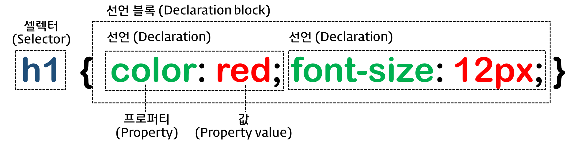
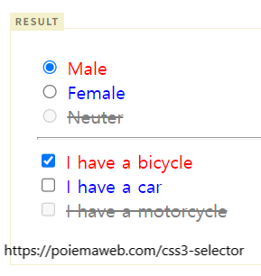
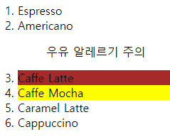

# CSS
렌더링의 방법을 결정하는 언어이다.
https://poiemaweb.com/css3-syntax 의 내용을 따라 정리한다.

## 1 기본 문법


### 선택자(selector)

기본  
```
* : Universal Selector. 문서의 모든 요소.  
태그명 : Type Selector. 특정 태그. (p {} 등)  
#id값 : ID Selector. id어트리뷰트의 값으로 지정  
.class값 : Class Selector. class어트리뷰트의 값으로 지정  
```

속성값  
```
셀렉터[어트리뷰트]: Attribute Selector. 특정 어트리뷰트를 가진 특정 요소를 선택. 가령 a[herf], p[class] 등  
셀렉터[어트리뷰트=”값”] : 특정 어트리뷰트 값을 가진 특정 요소를 선택. a[herf="http://www.naver.com"] 등  
셀렉터[어트리뷰트^=”값”] : '값-'으로 시작.
셀렉터[어트리뷰트|=”값”] : "값"이거나 "값-"으로 시작,a[href|="http://www.naver.com"], p[lang|="en"] 등
셀렉터[어트리뷰트$=”값”] : '-값'으로 끝
셀렉터[어트리뷰트*=”값”] : '값'이라는 문자열이 포함 div[class*="test"] -> <div class="first_test">, <div class="test">
셀렉터[어트리뷰트*=”값”] : '값'을 '(공백으로 구분된) 단어'로 포함
```

복합 선택자Combinator  
```
부모요소 후손요소 : 후손Descendant 선택자. div p { color: red; }   
부묘요소 > 자식요소 : 자식Child 선택자. div > p { color: red; }   
동위요소 + 인접한선택될요소 : 인접 형제Adjacent Sibling 선택자   
동위요소 ~ 선택될요소 : 일반 형제General Sibling 선택자   
```

#### 가상 클래스 셀렉터 (Pseudo-Class Selector)   
선택자의 뒤에 붙어서 선택자가 특정 상태 혹은 이벤트일 때 선택함   

링크 셀렉터(Link pseudo-classes), 동적 셀렉터(User action pseudo-classes)
```css
    /* a 요소가 방문하지 않은 링크일 때 */
    a:link { color: orange; }

    /* a 요소가 방문한 링크일 때 */
    a:visited { color: green; }

    /* a 요소에 마우스가 올라와 있을 때 */
    a:hover { font-weight: bold; }

    /* a 요소가 클릭된 상태일 때 */
    a:active { color: blue; }

/* text input 요소와 password input 요소에 포커스가 들어와 있을 때 */
    input[type=text]:focus,
    input[type=password]:focus {
      color: red;
    }
```
UI 요소 상태 셀렉터(UI element states pseudo-classes)
```css
    /* input 요소가 사용 가능한 상태일 때,
       input 요소 바로 뒤에 위치하는 인접 형제 span 요소를 선택 */
    input:enabled + span {
      color: blue;
    }

        /* input 요소가 사용 불가능한 상태일 때,
       input 요소 바로 뒤에 위치하는 인접 형제 span 요소를 선택 */
    input:disabled + span {
      color: gray;
      text-decoration: line-through;
    }

        /* input 요소가 체크 상태일 때,
       input 요소 바로 뒤에 위치하는 인접 형제 span 요소를 선택 */
    input:checked + span {
      color: red;
    }
```



구조 가상 클래스 셀렉터(Structural pseudo-classes)   
:first-child 셀렉터가 처음으로 자식이 되는 경우들을 선택    
:last-child   
```css  
p:first-child { color: red; }
---
<body>
  /* 이거 선택됨 */
  <p>This paragraph is the first child of its parent (body).</p>

  <h1>Welcome to My Homepage</h1>
  <p>This paragraph is not the first child of its parent.</p>

  <div>
    /* 이거 선택됨 */
    <p>This paragraph is the first child of its parent (div).</p>
    <p>This paragraph is not the first child of its parent.</p>
  </div>
```
:nth-child(n) 셀렉터에 해당하는 모든 요소 중 앞에서 n번째   
:nth-last-child(n)    
:first-of-type 셀렉터에 해당하는 요소의 부모 요소의 자식 요소 중 첫번째 등장하는 요소를 선택   
:last-of-type   
:nth-of-type(n) 셀렉터에 해당하는 요소의 부모 요소의 자식 요소 중 앞에서 n번째에 등장하는 요소를 선택한다.   
:nth-last-of-type(n)   

```css
<head>
  <style>
    ol > li:nth-child(4)  { background: brown; }
    li:nth-of-type(4){ background: yellow; }
  </style>
</head>
<body>
  <ol>
    <li>Espresso</li>
    <li>Americano</li>
    <ol>
      <p>우유 알레르기 주의</p>
    </ol>
    <li>Caffe Latte</li>
    <li>Caffe Mocha</li>
    <li>Caramel Latte</li>
    <li>Cappuccino</li>
  </ol>
```

  


div:not(:nth-of-type(3n+1)) div 중 3의배수 빼고 다 선택   
input[type="text"]:valid  정합성 검증에 성공한 input 또는 form에 대하여 선택   
input[type="text"]:invalid  

`
<input type="text" value="010-1111-2222" pattern="^\d{3}-\d{3,4}-\d{4}$" required>
`

#### 가상 요소 셀렉터
::first-letter 콘텐츠의 첫글자   
::first-line 블록요소인 컨텐츠의 첫줄   
::after 콘텐츠 뒤의 공간    
::before 콘텐츠의 앞의 공간   
::selection 드래그한 콘텐츠   


요약정리
```
* : 전체
이름 : 유형선택자라 불리며 <input>을 선택하려면 input이라 이름짓는다.
.클래스명
#아이디명
특성 선택자: [어트리뷰트=값]. 가령 [autoplay]는 autoplay특성을 가진 모든 요소를 선택

선택자1, 선택자2 : 그룹선택자는 여러 선택자를 쉼표로 나누어 한번에 선택한다.

ul > li : 자식결합자 >로 바로 아래의 자식을 선택한다

p ~ span : 일반 형제 결합자 ~로 같은 부모를 공유하는 형제 요소를 선택한다

h2 + p : 인접형제 선택자 +로 같은 부모를 공유하는 인접한 형제를 선택한다.

col || td : 열 결합자 ||로 col과 같은 열인 요소를 선택한다.

선택요소:가상클래스 : 가상클래스 혹은 의사클래스는 요소의 상태에 따라 선택한다. (https://developer.mozilla.org/ko/docs/Web/CSS/Pseudo-classes) 'botton:hover' 'textarea:active' 등
```

### 크기 단위(unit)
```
px
% 상속된 값이나 디폴트에 대한 상대적인 사이즈
em ~에 대한 배수 단위의 상대적인 사이즈. 1em = 기본값, 2em = 200%
rem 최상위 요소에 대한 배수 단위의 상대적인 사이즈. 상속받는 값의 영향을 받는 em과 달리 최상위 요소를 기준으로 일관된 것이 특징.
```

### 색상
색상 이름 [여기 참조](https://www.w3.org/TR/css-color-3/)  

HEX 코드 단위 (Hexadecimal Colors) : #000000  
RGB (Red, Green, Blue)  rgb(255, 255, 0)
RGBA (Red, Green, Blue, Alpha/투명도)   rgba(255, 255, 0, 1)
HSL (Hue/색상, Saturation/채도, Lightness/명도)  hsl(0, 100%, 25%)
HSLA (Hue, Saturation, Lightness, Alpha) hsla(60, 100%, 50%, 1)


## 박스 모델
content와 border가 있다.   
그리고 이 사이에 padding   
border 바깥에 margin   


- width:, height:
- box-sizing: border-box

가로, 세로의 값을 결정하는 box-sizing이 기본적으로는 content-box로 설정되어 있다.  
`box-sizing: border-box`를 박스 모델에 넣어주면 border를 기준으로 한다.  
문서 전체에 적용하기 위해서는 아래와 같이 상속을 해준다.  
```css
html {
  box-sizing: border-box;
}
*, *:before, *:after {
  box-sizing: inherit;
}
```

content-box인 경우, 박스 모델의 가로 크기는
가로 + (패딩 * 2) + (border 두께 *2) + (margin * 2) 라면   

border-box인 경우  
가로 + (margin * 2) 가 된다.  

```css
    div {
      box-sizing: border-box;
      width: 300px;
      height: 100px;
    }
```

- margin / padding 프로퍼티
```css
        margin-top: 40px;
        margin-right: 30px;
        margin-bottom: 20px;
        margin-left: 10px;

        padding-top: 10px;
        padding-right: 20px;
        padding-bottom: 30px;
        padding-left: 40px;
        
```
margin: , padding: 으로 축약하여 쓸 수 있으며,   
시계방향으로 인자를 받는다.

```css
  div{
  margin : 40px 30px 20px 10px;
  padding : 10px 20px 30px 40px;
  }
```

인자의 수가 부족하면 대칭으로 한다.
가령 3개 받으면 상, 우, 하를 지정하여 죄는 우와 대칭되게 한다.
2개를 받으면 상, 우를 지정하고 하, 좌는 대칭
하나를 받으면 4곳 모두에 적용

margin 프로퍼티에 auto 키워드를 설정하면 해당 요소를 브라우저 중앙에 위치 시킬 수 있다.

```css
  div{
    /* 좌우정렬 */
    margin : 0 auto;

    /* 웹 브라우저 크기에 따라 변화할 때 최대, 최소 값을 지정*/
    max-width: 600px;
    min-width: 300px;
  }
```

- border style
```css
      p.dotted { border-style: dotted; }
      p.dashed { border-style: dashed; }
      p.solid  { border-style: solid; }
      p.double { border-style: double; }
      p.groove { border-style: groove; }
      p.ridge  { border-style: ridge; }
      p.inset  { border-style: inset; }
      p.outset { border-style: outset; }
      p.none   { border-style: none; }
      p.hidden { border-style: hidden; }
      p.mix    { border-style: dotted dashed solid double; }
```
마찬가지로 시계방향으로 지정이 가능하다

```css
    p {
      background: palegreen;
      padding: 10px;
    }
    p.d1 {
      /* four sides */
      border-style: dashed;
    }
    p.d2 {
      /* horizontal | vertical */
      border-style: dotted solid;
    }
    p.d3 {
      /* top | horizontal | bottom */
      border-style: hidden double dashed;
    }
    p.d4 {
      /* top | right | bottom | left */
      border-style: none solid dotted dashed;
```

- border-width, border-color

border-width, border-color프로퍼티는 border-style과 함께 사용하지 않으면 적용되지 않는다.
```css
      p.one {
        border-width: thin; /* 1px */
      }
      p.two {
        border-width: medium; /* 3px */
      }
      p.three {
        border-width: thick; /* 5px */
      }
      p.four {
        border-width: 15px;
      }
      p.five {
        border-width: 2px 10px 4px 20px;
      }
      p.one {
        border-color: red;
      }
      p.three {
        border-color: red green blue yellow;
      }
        
```

- border-radius
단위(px, em 등)와 %를 사용한다. 최대 50%를 넘어갈 수 없다.  
왼쪽 탑부터 시계방향으로 적용된다.  
```css
.border-rounded {
  border-radius: 20px;

  /* 위 코드는 아래의 shorthand이다.
  border-top-left-radius:     20px;
  border-top-right-radius:    20px;
  border-bottom-right-radius: 20px;
  border-bottom-left-radius:  20px;
  */
}
```

한 개의 코너에 두 개의 반지름을 사용할 수도 있다.  
``` css
.border-rounded {
  border-top-left-radius: 50px 25px;
}
```
위의 방식을 여러개의 코너에 shorthanded하려면 아래와 같이 쓴다.  
``` css
.border-rounded {
  border-radius: 50px 50px 0 0 / 25px 25px 0 0;
}
```
``` css
border-radius: 10px 20px 30px 40px / 5px 10px 15px 20px;
border-top-left-radius: 10px 5px;
border-top-right-radius: 20px 10px;
border-bottom-right-radius: 30px 15px;
border-bottom-left-radius: 40px 20px;
```

- border
border 프로퍼티는 border-width, border-style, border-color를 한번에 설정하기 위한 shorthand 프로퍼티이다.  
border: border-width border-style border-color;  
```css
p {
  /* border-width border-style border-color */
  border: 5px solid red;
}
```
## display, visibility, opacity
### display
HTML의 각각의 요소는 기본값으로 block 혹은 inline의 특성이 있다. 이를 display 프로퍼티를 이용하여 레이아웃을 정의할 수 있다.  
display:의 프로퍼티 값
block, inline, inline-block, none

display 프로퍼티는 상속되지 않는다.


display: block 을 기본값으로 가지는 예
```
block 레벨 요소 예

div

h1 ~ h6

p

ol

ul

li

hr

table

form
```
화면 크기 전체의 가로폭을 차지한다. (width: 100%)   

width, height, margin, padding 프로퍼티 지정이 가능하다.   

block 레벨 요소 내에 inline 레벨 요소를 포함할 수 있다   


display: inline을 기본값으로 가지는 예
```
inline 레벨 요소 예

span

a

strong

img

br

input

select

textarea

button
```
width, height, margin-top, margin-bottom 프로퍼티를 지정할 수 없다. 상, 하 여백은 line-height로 지정한다.   

inline 레벨 요소 뒤에 공백(엔터, 스페이스 등)이 있는 경우, 정의하지 않은 space(4px)가 자동 지정된다.   

inline 레벨 요소 내에 block 레벨 요소를 포함할 수 없다. inline 레벨 요소는 일반적으로 block 레벨 요소에 포함되어 사용된다.    


inline-block 레벨 요소는 한 줄로 표현되는(inline의 특성을 가진) 블록 요소(width, height, margin 프로퍼티를 지정할 수 있는 요소)이다. inline-block레벨 요소의 뒤에 공백이 있는 경우 4px(space)가 자동 지정되기에 인라인블록을 여러개 사용할 때 필요에 따라 수정해야 한다. 


### visibility 
visible(기본값), hidden, collapse(테이블 요소의 행과 열을 보이지 않게), none(브라우저에 따라 collapse와 같은 역할)

display="None" : 아에 렌더링이 되지 않음
visibility="hidden" : 공간은 차지 하지만 시각적으로 보이지 않음


### opacity
0.0 ~ 1.0의 값을 입력하며 0.0은 투명, 1.0은 불투명을 의미한다.


## backgorund
`background-image: url("http://poiemaweb.com/img/bg/dot.png"), url("http://poiemaweb.com/img/bg/paper.gif");`  
이미지 값을 여러개 넣는 경우 먼저 설정된 이미지가 출력된다.
<br>

`background-repeat: repeat-x;`
`background-repeat: no-repeat;`  
x축으로만 배경 이미지를 반복할 경우, background-repeat 프로퍼티값에 repeat-x, y축으로만 배경 이미지를 반복할 경우, repeat-y를 설정한다.
<br>


`  background-size: 700px 500px;`  
px, %, cover, contain  
100% 100%;를 값으로 사용하면 화면에 따라서 사진 비율이 달라지며, cover를 사용하면 사진 비율이 유지된다. contain은 비율을 유지한 채로 사진이 잘리지 않게 축소하여 넣는다.  
<br>


`background-attachment: fixed;`  
스크롤 시에도 배경이 고정되도록 하기 위해 사용한다.  
<br>

`background-position: 0% 0%;`  
배경의 x,y좌표를 지정한다. left, top 등의 값도 가능하다.

`background-color: rgb(255, 255, 255);`

### background Shorthand
background: color || image || repeat || attachment || position  
```css
    div {
      /* background: color || image || repeat || attachment || position */
      background: #FFEE99 url("http://poiemaweb.com/img/bg/dot.png") no-repeat center;
    }
```

## font
`font-size-40 { font-size: 40px; }`  
`font-family: "Times New Roman", Times, serif;` 폰트명이 여러 단어인 경우 따옴표 필수  
`font-style: italic;` normal / italic / oblique  
`font-weight: lighter;` 100 ~ 900 or normal / bold / lighter / bolder  

### font Shorthand
font : font-style(optional) font-variant(optional) font-weight(optional) font-size(mandatory) line-height(optional) font-family(mandatory)
```css
/* size | family */
font: 2em "Open Sans", serif;

/* style | size | family */
font: italic 2em "Open Sans", sans-serif;

/* style | variant | weight | size/line-height | family */
font: italic small-caps bolder 16px/1.2 monospace;

/* style | variant | weight | size/line-height | family */
/* font-variant: small-caps; 소문자를 대문자로 만든다. 단 크기는 일반 대문자에 비해 더 작다.*/
font: italic small-caps bolder 16px/3 cursive
```

## line, text-align , 
- line
대부분 브라우저의 default line height는 약 110% ~ 120%.   
`line-height: 70%; /* 16px * 70% */`
```css
/* Keyword value */
line-height: normal;

/* Unitless values: use this number multiplied
by the element's font size */
line-height: 3.5;

/* <length> values */
line-height: 3em;

/* <percentage> values */
line-height: 34%;

/* Global values */
line-height: inherit;
line-height: initial;
line-height: revert;
line-height: revert-layer;
line-height: unset;
```

- text-align  
```css
    h1 { text-align: center; }
    h3 { text-align: right; }
    p.left  { text-align: left; }
    p.justify  { text-align: justify; }
    a  { text-align: center; }
```
 inline 요소는 width 프로퍼티가 없으므로 중앙 개념이 존재하지 않는다.   
 a 요소에 display: block;을 지정한다면 중앙 정렬이 가능할 것이다.  


- text-decoration
언더라인을 제거하거나, 윗줄 취소줄 밑줄을 추가할 수 있다.  
```css
    a { text-decoration: none; }
    p:nth-of-type(1) { text-decoration: overline; }
    p:nth-of-type(2) { text-decoration: line-through; }
    p:nth-of-type(3) { text-decoration: underline; }
```


- white-space
기본적으로 줄바꿈(line break)은 무시되며 공백(space/tab)은 한 번만 적용된다. 그리고 영역을 벗어난 텍스트는 자동줄바꿈(wrapping(자동줄바꿈))된다. white-space로 이 세가지 요소를 제어할 수 있다.  

nowrap - 자동 줄바꿈 제거
pre - 자동 줄바꿈 제거, 라인브레이크 스페이스 그대로 반영
pre-wrap - 자동 줄바꿈 적용. 라인브레이크 스페이스 그대로 반영
pre-line - 자동 줄바꿈 적용. 라인브레이크 그대로 반영. 스페이스 1번만 반영

```css
    .normal { white-space: normal; }
    .nowrap { white-space: nowrap; }
    .pre    { white-space: pre; }
    .pre-wrap { white-space: pre-wrap; }
    .pre-line { white-space: pre-line; }
```
no-wrap 상태일 때 `text-overflow` 프로퍼티가 적용될 수 있으며, text-overflow는 `width` 프로퍼티를 필요로 한다.

컨텐츠 요소에 wrap를 적용할 때에는 단어 기준의 `word-wrap` 프로퍼티 혹은 단어를 무시하고 강제개행하는 `word-break` 프로퍼티를 사용한다.

## position 프로퍼티
relative:상대적인 위치. 공간은 차지하지만 시각적으로는 상대적으로 다른 위치로 간다. 움직일 때에도 기존에 차지해야 했던 공간을 기준을 움직인다.
absolute:절대적인 위치. 공간을 아에 차지하지 않고 노말플로우에서 벗어난다. 상위 요소의 레프트 탑을 기준으로 움직인다.
fixed: absolute와 마찬가지로 노말플로우를 벗어나지만 fixed는 뷰포트의 레프트 탑을 기준으로 움직인다. 
sticky: 노말플로우를 따르다가, 스크롤이 움직임에 따라 fixed처럼 움직인다.

- z-index 프로퍼티
큰 값을 적용할 수록 앞으로 보인다. positon 프로퍼티가 static 이외인 요소에만 적용된다.

```css
    .absolute-box {
      width: 100px; height: 100px;
      position: absolute;
      z-index: 1;
    }
```

- overflow 프로퍼티
overflow 프로퍼티는 자식 요소가 부모 요소의 영역를 벗어났을 때 처리 방법을 정의한다.
```css
    .visible { overflow: visible; }
    .hidden  { overflow: hidden; }
    .scroll  { overflow: scroll; }
    .auto    { overflow: auto; }
```

## Float (이미지와 텍스트를 정렬하기)
float 프로퍼티는 본래 이미지와 텍스트가 있을 때, 이미지 주위를 텍스트로 감싸기 위해 만들어진 것이다.
`float:left;`
`float:right;`
`float:none;` - 해제하기(기본값)

## 스타일의 상속
```프로퍼티와 상속 여부
width/height	no
margin	no
padding	no
border	no
box-sizing	no
display	no
visibility	yes
opacity	yes
background	no
font	yes
color	yes
line-height	yes
text-align	yes
vertical-align	no
text-decoration	no
white-space	yes
position	no
top/right/bottom/left	no
z-index	no
overflow	no
float	no
```

캐스케이딩은 css의 적용 순서를 의미한다. 적용 순서에 따라 충돌되는 내용은 하나만 적용된다.
중요도  
CSS가 어디에 선언 되었는지에 따라서 우선순위가 달라진다.  
명시도    
대상을 명확하게 특정할수록 명시도가 높아지고 우선순위가 높아진다.  
선언순서  
선언된 순서에 따라 우선 순위가 적용된다. 즉, 나중에 선언된 스타일이 우선 적용된다.  

- 선언 순서에 따른 중요도
1순위: head 요소 내의 style 요소   
head 요소 내의 style 요소 내의 @import 문  
<link> 로 연결된 CSS 파일  
<link> 로 연결된 CSS 파일 내의 @import 문  
브라우저 디폴트 스타일시트  

- 명시도에 따른 중요소
!important > 인라인 스타일 > 아이디 선택자 > 클래스/어트리뷰트/가상 선택자 > 태그 선택자 > 전체 선택자 > 상위 요소에 의해 상속된 속성  

- 선언순서  
나중에 선언된 스타일이 우선 적용된다.


```기타
**viewprt 단위**
% 단위이다.

vh 높이, vw 너비, vmin 높이너비 중 작은쪽, vmax 큰쪽

뷰포트 높이가 1080px이라면 vh10은 108px이다.


Normal flow : 왼쪽에서 오른쪽으로, 위에서 아래로 렌더링 됨. 인라인 블록은 왼쪽에서 오른쪽으로, 블록은 위에서 아래로 렌더링 되겠지?
display="None" : 아에 렌더링이 되지 않음
visibility="hidden" : 공간은 차지 하지만 시각적으로 보이지 않음

relative:상대적인 위치. 공간은 차지하지만 시각적으로는 상대적으로 다른 위치로 간다. 움직일 때에도 기존에 차지해야 했던 공간을 기준을 움직인다.
absolute:절대적인 위치. 공간을 아에 차지하지 않고 노말플로우에서 벗어난다. 상위 요소의 레프트 탑을 기준으로 움직인다.
fixed: absolute와 마찬가지로 노말플로우를 벗어나지만 fixed는 뷰포트의 레프트 탑을 기준으로 움직인다. 
sticky: 노말플로우를 따르다가, 스크롤이 움직임에 따라 fixed처럼 움직인다.
```


## 그 밖에
이 밖에 css에는 그림자, 그라데이션, 애니메이션, 트랜지션 등의 요소가 있다.