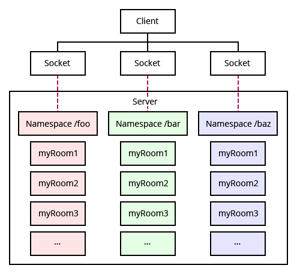

|구분|진행상태|학습시간|단계|분야|과제명|제출 경로|
|----|----|----|----|----|----|----|
|`필수1`|:white_check_mark:||1. 요구사항 분석|SSAFY 생활|1학기와 2학기의 차이 & SSAFY GIT 실습|https://lab.ssafy.com/bluecoolgod/self-project/-/blob/main/con13/rep01/0842988.zip|
|`필수4`|:white_check_mark:||2. 설계|분석/설계|코딩 컨벤션 적용|https://lab.ssafy.com/bluecoolgod/self-project/-/blob/main/con02/rep02/0842988.zip|
|`필수5`|:white_check_mark:||3. 개발|구현/개발|비동기 프로그래밍|https://lab.ssafy.com/bluecoolgod/self-project/-/blob/main/con14/rep01/0842988.zip|
|`필수7`|:white_check_mark:||3. 개발|구현/개발|멀티스레드 채팅 서버 구현|https://lab.ssafy.com/bluecoolgod/self-project/-/blob/main/con16/rep03/0842988.zip|
|`필수10`|:white_check_mark:||6. 유지보수|테스트/유지보수|유지보수를 위한 로깅(Logging)|https://lab.ssafy.com/bluecoolgod/self-project/-/blob/main/con12/rep02/0842988.zip|
|선택9|:white_check_mark:||3. 개발|웹 |Create Next App + React + Typescript + next.js로 프론트엔드 프로젝트 토대 쌓기|https://lab.ssafy.com/bluecoolgod/self-project/-/blob/main/con11/rep02/0842988.zip||
|선택3|:white_check_mark:||2. 설계|프로그래밍 방법론 |효율적인 알고리즘 설계와 순서도(Flowchart), 의사코드(pseudo-code) 작성|https://lab.ssafy.com/bluecoolgod/self-project/-/blob/main/con07/rep01/0842988.zip||
|선택14|:white_check_mark:||3. 개발|infra|자바스크립트에서 Firebase 활용하기|https://lab.ssafy.com/bluecoolgod/self-project/-/blob/main/con05/rep02/0842988.zip||


## 필수 7. 멀티스레드 채팅 서버 구현
[참고 리액트 기반](https://hello-ming.tistory.com/entry/React-React%EB%A1%9C-Chat-Application-%EA%B5%AC%ED%98%84%ED%95%98%EA%B8%B0-1)

[참고 poiemaweb](https://poiemaweb.com/nodejs-socketio)

## Socket.io
HTML5에서 사용되는 웹 소켓을 지원하기 위한 라이브러리.

`var io = require('socket.io')(server);`

```
io.on('connection', function(socket) {

});
```
on메서드를 이용해 특정 상황을 핸들링할 수 있다. 위의 예시는 커넥션을 핸들링하는 예시. 

io.emit('event_name', msg); - 접속된 모든 클라이언트에게 메시지를 전송하는 메서드.

io.to(id).emit('event_name', data); - 특정 클라이언트에게만 메시지를 전송하는 메서드

```js
// namespace /chat에 접속한다.
var chat = io.of('/chat').on('connection', function(socket) {
  socket.on('chat message', function(data){
    console.log('message from client: ', data);

    var name = socket.name = data.name;
    var room = socket.room = data.room;

    // room에 join한다
    socket.join(room);
    // room에 join되어 있는 클라이언트에게 메시지를 전송한다
    chat.to(room).emit('chat message', data.msg);
  });
});
```


위와 같이 하나의 방을 하나의 소켓으로 하여 메시지를 주고 받는다.  


## 필수 10. 유지보수를 위한 로깅(Logging)
### 장고 로깅 구현하기
장고는 파이썬 logger를 사용할 수 있다.  
장고에서 로깅 기본 템플릿은 아래와 같다. (장고 공식문서 참조)

```python
DEFAULT_LOGGING = {
    'version': 1,
    'disable_existing_loggers': False,
    'filters': {
        'require_debug_false': {
            '()': 'django.utils.log.RequireDebugFalse',
        },
        'require_debug_true': {
            '()': 'django.utils.log.RequireDebugTrue',
        },
    },
    'formatters': {
        'django.server': {
            '()': 'django.utils.log.ServerFormatter',
            'format': '[{server_time}] {message}',
            'style': '{',
        },
    },
    'handlers': {
        'console': {
            'level': 'INFO',
            'filters': ['require_debug_true'],
            'class': 'logging.StreamHandler',
        },
        'django.server': {
            'level': 'INFO',
            'class': 'logging.StreamHandler',
            'formatter': 'django.server',
        },
        'mail_admins': {
            'level': 'ERROR',
            'filters': ['require_debug_false'],
            'class': 'django.utils.log.AdminEmailHandler'
        },
    },
    'loggers': {
        'django': {
            'handlers': ['console', 'mail_admins'],
            'level': 'INFO',
        },
        'django.server': {
            'handlers': ['django.server'],
            'level': 'INFO',
            'propagate': False,
        },
    }
}
```


프로젝트에 맞게 변경하여 settings.py에 삽입한다. ([점프 투 장고](https://wikidocs.net/77522) 참조)

```python
LOGGING = { #이름 변경
...

    'handlers': {
        'console': {
            'level': 'INFO',
            'filters': ['require_debug_true'],
            'class': 'logging.StreamHandler',
        },
        'django.server': {
            'level': 'INFO',
            'class': 'logging.StreamHandler',
            'formatter': 'django.server',
        },
        'mail_admins': {
            'level': 'ERROR',
            'filters': ['require_debug_false'],
            'class': 'django.utils.log.AdminEmailHandler'
        },
        # 핸들러 추가
        'file': {
            'level': 'INFO',
            'filters': ['require_debug_false'],
            'class': 'logging.handlers.RotatingFileHandler',
            'filename': BASE_DIR / 'logs/mysite.log',
            'maxBytes': 1024*1024*5,  # 5 MB
            'backupCount': 5,
            'formatter': 'standard',
        },
    },
    'formatters': {
        'django.server': {
            '()': 'django.utils.log.ServerFormatter',
            'format': '[{server_time}] {message}',
            'style': '{',
        },
        # 포맷터 추가
        'standard': {
            'format': '%(asctime)s [%(levelname)s] %(name)s: %(message)s'
        },
    },  
```

이때 logs 폴더가 없는 경우 문제가 발생할 수 있다.


views에 index 함수를 만들고 아래와 같이 내용을 추가한다.  

```js
import logging
logger = logging.getLogger('django')


def index(request):
    logger.info("INFO 레벨로 출력")  # 특정 로그를 파일로 출력
    return render(request, 'app1/index.html')
```


로그를 사용하려면 디버그 모드를 false로 바꾸어야 한다. settings.py에서 아래와 같이 수정하자.  

```python
# SECURITY WARNING: don't run with debug turned on in production!
DEBUG = False

ALLOWED_HOSTS = ['127.0.0.1']
```
ALLOWED_HOSTS를 위와 같이 설정한 경우 localhost:3000 으로 접속 시 에러가 남에 유의하자.  


이제 아래와 같이 log가 남는다.

```log
2022-12-29 20:38:22,989 [INFO] django.utils.autoreload: Watching for file changes with StatReloader
2022-12-29 20:38:58,775 [WARNING] django.request: Not Found: /
2022-12-29 20:39:04,840 [INFO] django.utils.autoreload: C:\Users\bluec\Desktop\DRF-VUE-MOVIE\final-pjt-back\myboard\settings.py changed, reloading.
2022-12-29 20:39:05,369 [INFO] django.utils.autoreload: Watching for file changes with StatReloader
2022-12-29 20:39:22,331 [WARNING] django.request: Not Found: /static/admin/css/base.css
2022-12-29 20:39:22,332 [WARNING] django.request: Not Found: /static/admin/css/nav_sidebar.css
2022-12-29 20:39:22,333 [WARNING] django.request: Not Found: /static/admin/css/responsive.css
2022-12-29 20:39:22,334 [WARNING] django.request: Not Found: /static/admin/js/nav_sidebar.js
2022-12-29 20:39:22,334 [WARNING] django.request: Not Found: /static/admin/css/login.css
2022-12-29 20:39:37,874 [ERROR] django.security.DisallowedHost: Invalid HTTP_HOST header: 'localhost:8000'. You may need to add 'localhost' to ALLOWED_HOSTS.
2022-12-29 20:39:37,906 [WARNING] django.request: Bad Request: /api/v1/users/register/
```


## 선택 9. Create Next App + React + Typescript + next.js로 프론트엔드 프로젝트 토대 쌓기
### NEXT.js의 특징
1. 프레임워크 - 지정된 위치에 지정된 이름으로 파일을 작성해야 함.  


2. Router 기능 기본 지원  


Pages 폴더에 있는 파일 명이 곧 라우트.
  
1. SSG(static site generation), SSR(server-side-rendering), CSR(client-side-rendering) 기본 지원  


SSG - 자주 업데이트할 필요가 없는 경우에 사용. getStaticProps(), getStaticPaths()
SSR - 항상 최신으로 업데이트할 경우에 사용(주식 가격을 검색결과에 노출시키는 경우 등). 서버에 부하가 걸릴 수 있으므로 유의. getServerSideProps()


### 배운 점

# Toady I Learnt
1. 넥스트 js는 리액트의 프레임워크이다.
2. 프레임워크란 대부분의 구조가 짜여져 있다는 점에서 라이브러리와 다르다. 이에 따라 리액트와는 달리 넥스트js는 정해진 위치에 정해진 파일명으로 작성해야 작동한다.
3. 넥스트js는 SSR을 지원한다. 리액트는 클라이언트 사이드 렌더링으로, 비어있는 html문서에 가상 DOM을 이용하여 렌더링하며, 이러한 방식의 문제는 검색엔진 최적화가 불가능하고, 렌더링시에 점멸 현상이 일어난다는 점이다.  
4. 반면 서버 사이드 렌더링은 HTML파일을 미리 작성한 상태로 클라이언트 사이드에 넘겨준다. 이때 자주 변하지 않은 페이지는 static하게, 자주 변하는 페이지는 ssr로 처리하는 것이 바람직 하다. 

